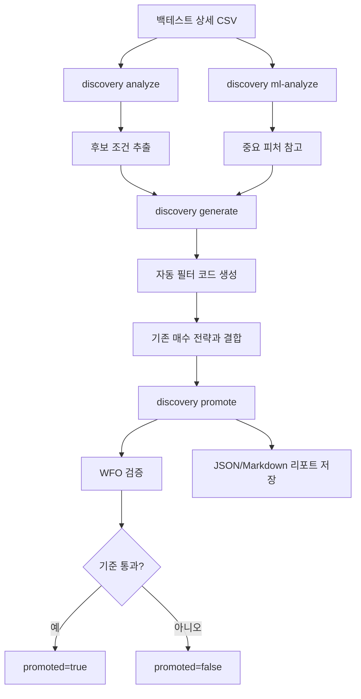
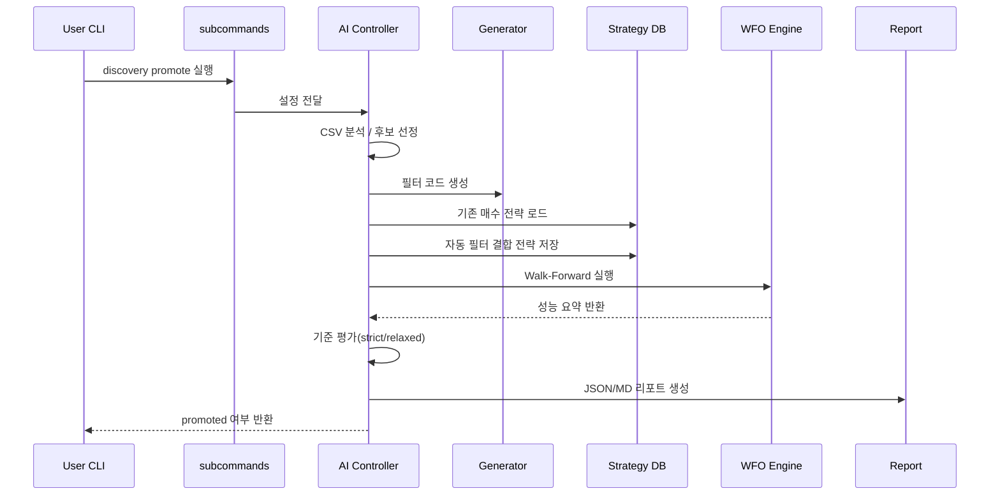

# 자동 조건식 탐색 브랜치 교육자료

- 대상 브랜치: `research/auto-condition-validation-pilot`
- 목적: 이 브랜치가 **왜 만들어졌고**, **무엇을 할 수 있으며**, **어떻게 활용하는지**를 빠르게 이해하도록 돕는 짧은 안내서

---

## 1. 이 브랜치는 왜 필요한가?

기존 전략은 사람이 직접 조건을 만들고 수정해야 합니다.
이 브랜치는 그 과정을 일부 자동화합니다.

즉,

> **백테스트 결과를 다시 분석해서, 기존 전략에 붙일 자동 필터를 찾고 검증하는 브랜치**입니다.

### 해결하려는 문제
- 어떤 조건이 성과를 깎는지 사람이 일일이 찾기 어렵다.
- 후보 조건을 만들어도 실제로 검증하기 번거롭다.
- 분석 결과와 실제 전략 반영/WFO 검증이 분리되어 있다.

---

## 2. 핵심 아이디어

이 브랜치는 “완전히 새로운 전략 발명”보다,
**기존 매수 전략에 붙일 자동 필터를 찾는 것**에 더 가깝습니다.

예:

```python
if 등락율 <= 4.14:
    매수 = False
```

이런 필터를 자동으로 찾고,
기존 전략에 결합해서,
Walk-Forward로 검증한 뒤,
통과하면 채택합니다.

---

## 3. 전체 흐름



---

## 4. 무엇을 할 수 있나?

### 4.1 결과 CSV 분석
- `B_*` 피처 기준으로 불리한 구간 탐색
- 시간대 / 시가총액 / 분위수 / t-test 후보 생성

### 4.2 ML 기반 피처 중요도 분석
- 어떤 `B_*` 피처가 중요한지 계산
- 후보 우선순위 참고 가능

### 4.3 자동 필터 코드 생성
- 분석 결과를 실제 전략 코드 형태로 변환

### 4.4 기존 전략에 자동 필터 결합
- `base_buy_strategy`를 사용해 기존 매수 전략 위에 자동 필터 삽입

### 4.5 Walk-Forward 기반 promote
- 실제 DB와 전략으로 검증
- 통과한 전략만 최종 채택
- `strict / relaxed` 기준 구분 가능

---

## 5. 가장 중요한 사용 흐름

### Step 1. analyze
```bash
python stom_backtest.py discovery analyze --input result.csv --min-samples 30 --quantiles 4
```

### Step 2. ml-analyze
```bash
python stom_backtest.py discovery ml-analyze --input result.csv --top-n 5 --n-splits 3
```

### Step 3. generate
```bash
python stom_backtest.py discovery generate --input result.csv --top-n 2 --min-samples 30 --quantiles 4
```

### Step 4. promote
```bash
python stom_backtest.py discovery promote Auto_B_Test \
  --input result.csv \
  --sell Min_S_Study_251227 \
  --start 20250407 --end 20250411 \
  --timeframe min \
  --train-window-days 3 --test-window-days 2 --step-days 3 \
  --top-n 1 \
  --base-buy-strategy Min_B_Study_251227 \
  --promotion-preset aggressive \
  --auto-relax \
  --report-json report.json \
  --report-md report.md
```

---

## 6. promote 내부 흐름



---

## 7. strict 와 relaxed 는 무엇이 다른가?

### strict
- preset 원형 기준 그대로 평가
- 예: aggressive면 원래 기준 그대로 사용

### relaxed
- `auto-relax` 또는 느슨한 override가 적용된 상태
- 보통 `min_avg_trade_count` 완화가 들어감

즉,

> **같은 promoted=true라도 strict 통과인지 relaxed 통과인지 반드시 구분해서 해석해야 합니다.**

---

## 8. 현재까지 개발된 핵심 내용

### 구현
- auto-relax 재시도 로직
- no-trade 판정 보강
- 기존 매수 전략 + 자동 필터 결합
- `criteria_mode(strict/relaxed)` 추가
- CLI 옵션 추가
  - `--auto-relax`
  - `--max-relax-steps`
  - `--base-buy-strategy`
- `DiscoveryConfig`로 설정 구조화
- ML 결측값 처리 개선 (`0` 대신 피처별 중앙값)

### 문서/검증
- strict / relaxed / exploratory baseline 정의
- strict aggressive / strict balanced 해석 정리
- 실제 테스트 보고서 작성

---

## 9. 현재 브랜치 상태를 쉽게 평가하면

### 이미 확인된 것
- analyze 동작
- ml-analyze 동작
- generate 동작
- promote 실제 실행 가능
- report 저장 가능
- 대표 테스트 통과

### 아직 더 필요한 것
- strict balanced 기준 검증
- 실전 성능 기준 재검토
- 장시간 운영형 QA
- Windows GUI 실사용 검증 보강

---

## 10. 이 브랜치를 어떻게 이해하면 좋은가?

이 브랜치는 아래처럼 이해하면 가장 쉽습니다.

> **“백테스트 결과를 다시 읽어서, 기존 전략에 붙일 자동 필터를 찾고, 실제 검증까지 연결하는 브랜치”**

즉,
- 분석 브랜치이면서
- 코드 생성 브랜치이고
- 검증 브랜치이기도 합니다.

---

## 11. 한 줄 정리

> **자동 조건식 탐색 브랜치는 ‘기존 전략을 더 낫게 만들기 위한 자동 필터 탐색 및 검증 파이프라인’이다.**

---

## 12. 같이 보면 좋은 문서

- 실제 테스트 보고서
  - `docs/research/2026-03-15_current_branch_actual_test_report.md`
- 브랜치 사용 가이드 및 평가
  - `docs/research/2026-03-14_auto_condition_validation_branch_usage_and_review.md`
