# STOM 조건식 자동 발굴 시스템 연계 09:00~09:30 복합 오더플로우 전략 보고서 v5.0

> 작성일: 2026-06-08  
> 대상: STOM 1초 Tick DB, 09:00:00~09:30:00, `strategy.db`, v4.0 HTML/Markdown 보고서, 19개 우수전략 분석, 매도 유틸리티 함수 분석  
> 목적: 기존 v4.0 조건식 문서를 **조건식 자동 발굴 시스템의 시드 라이브러리**로 전환하고, 매매기록 기반으로 조건식을 계속 진화시키는 v5.0 구조를 제안한다.

---

<div class="hero">
  <div class="hero-card"><b>핵심 전환</b><br>조건식 문서 → 자동 발굴용 전략 유전자 라이브러리</div>
  <div class="hero-card"><b>최종 조건식</b><br>v5.0 복합 매수 1개 + 복합 매도 1개</div>
  <div class="hero-card"><b>로그 기반 진화</b><br>F01~F20 전략 플래그별 성과 분석</div>
  <div class="hero-card"><b>형식</b><br>strategy.db와 유사한 STOM 조건식 포맷</div>
</div>

---

## 0. 답변: 자동 발굴 시스템을 기억하고 있는가?

네. 지금까지 논의된 사용자의 실제 개발 방향은 다음 구조로 이해하고 있다.

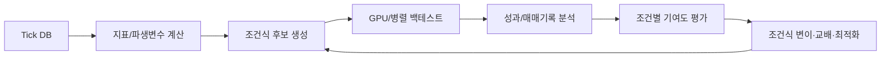

즉, 사람이 조건식을 하나씩 쓰는 방식이 아니라 다음을 자동화하는 시스템이다.

| 구성요소 | 역할 | v5.0에서의 대응 |
|---|---|---|
| 조건식 후보 생성기 | 변수·조건·전략 블록을 조합 | F01~F20 전략 플래그와 조건식 문법화 |
| 백테스트 엔진 | 조건식별 수익/손실 검증 | 시간대·시총·갭률별 분리 검증 |
| 매매기록 분석기 | 어떤 조건이 수익/손실에 기여했는지 분석 | 전략플래그, 복합점수, 위험점수 로그화 |
| 최적화기 | 임계값·가중치 탐색 | `self.vars[1]~[49]` 최적화 범위 제안 |
| 진화 루프 | 좋은 조건은 승격, 나쁜 조건은 제거 | Elite Archive + Mutator + Walk-forward |

---

## 1. v4.0 HTML 문서가 자동 발굴 시스템에 도움이 되는가?

**도움이 된다. 단, 최종 답이 아니라 시드(seed)로 써야 한다.**

v4.0 문서는 사람이 읽는 전략 보고서로서는 충분하지만, 자동 발굴 시스템에서는 아래처럼 변환해야 더 강력하다.

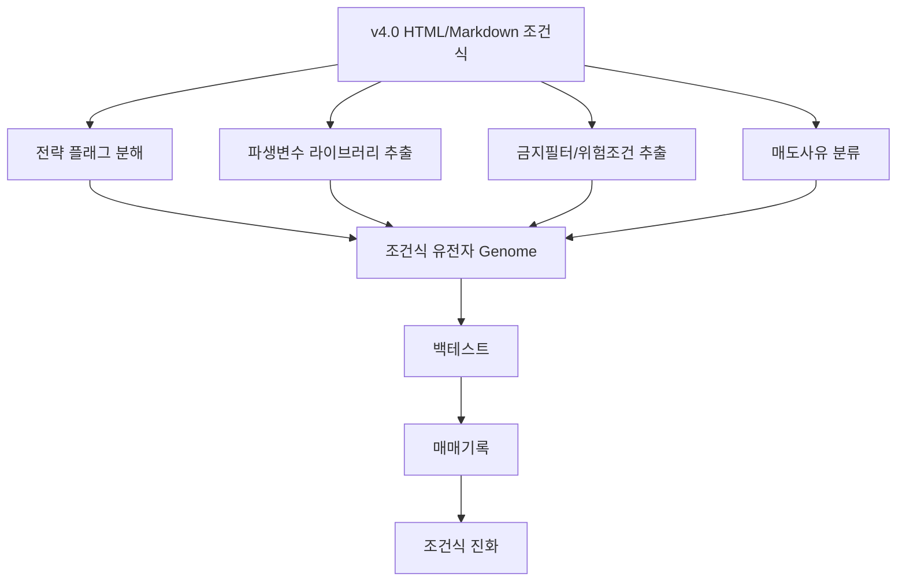

### 1.1 v4.0의 활용 가치

| v4.0 요소 | 그대로 쓰면 | 자동 발굴 시스템에서 바꾸면 |
|---|---|---|
| 전략별 B1~B8/S1~S8 | 사람이 테스트하는 후보 | 전략 플래그/유전자 블록 |
| 복합 매수식 | 단일 완성 조건식 | 베이스라인 후보 |
| 복합 매도식 | 단일 청산식 | 매도사유 라벨링 엔진 |
| 공통 금지필터 | 하드 필터 | 위험점수/페널티 조건 |
| 시간대별 조건 | 고정 분기 | 시간대별 성과를 보고 자동 가중치 조정 |
| 시총별 파라미터 | 수동 기준 | 시총별 독립 최적화 범위 |

### 1.2 v4.0에서 부족했던 점

| 부족점 | v5.0 개선 |
|---|---|
| 조건식 자체는 있으나 자동 발굴 로그 구조가 약함 | `F01~F20`, `복합점수`, `위험점수`, `매수사유`, `매도사유`를 명시 |
| 조건별 기여도 분석 기준이 부족 | 매매기록 스키마와 조건별 Lift/Expectancy 분석 제안 |
| 좋은 조건을 어떻게 진화시킬지 불명확 | 변이·교배·승격·폐기 규칙 작성 |
| 매도 조건이 결과 분석과 연결되지 않음 | `세력이탈점수`, `방어실패점수`, `매도사유` 기반 피드백 루프 추가 |
| v4.0 전략이 긴 09:00~09:30 전체 감시에는 다소 조각화 | v5.0에서 20개 전략 플래그를 하나의 긴 감시형 복합 조건식으로 통합 |

---

## 2. 근거 문서 통합 요약

### 2.1 `strategy.db` 실제 구조 확인

첨부 DB에서 확인한 주요 테이블은 다음과 같다.

| 테이블 | 레코드 수 | v5.0 활용 |
|---|---:|---|
| `stockbuy` | 88 | 기존 매수 조건식 포맷 학습 |
| `stocksell` | 36 | 기존 매도 조건식 포맷 학습 |
| `stockoptibuy` | 2 | 최적화 조건식 작성 방식 참고 |
| `stockoptisell` | 2 | 매도 최적화 포맷 참고 |
| `stockoptivars` | 5 | `self.vars` 범위 작성 방식 참고 |

샘플 전략명은 다음과 같다.

| 테이블 | 샘플 |
|---|---|
| `stockbuy` | 20250715_Study, 20250715_Study_B_2, 20250720_Study_B, 20250720_Study_B_2, AutoResearchBaselineCompare_20260418_T6, AutoResearchInspect_20260418_T6 |
| `stocksell` | 20250715_Study_S, 20250715_Study_S_2, 20250720_Study_S, 20250720_Study_S_2, C_S_3_S_902_Min, C_T_900_920_STUDY_S |
| `stockoptibuy` | C_T_902_905_U2_BO, Tick_BO_902 |
| `stockoptisell` | C_T_902_905_U2_SO, Tick_SO_902 |

### 2.2 19개 우수전략 분석에서 v5.0으로 가져온 기준

| 분석 결과 | v5.0 반영 |
|---|---|
| 19개 전략 모두 09:00~09:30 중심 | v5.0 최종 조건식도 09:00:05~09:28:00 감시 |
| 평균 간격 실틱수 30 공통 | `self.vars[0] = 30`, 30틱 지표 유지 |
| 매수 필수 변수: 현재가, 초당매도수량, 등락율, 초당거래대금, 시가총액 | 공통 게이트와 위험점수에 반영 |
| 매도 필수 변수: 현재가, 체결강도, 시가총액, 이동평균(60), 수익률 | v5 매도식의 핵심 파라미터로 반영 |
| #8은 최고 매매성능지수 1.47, 승률 51.14% | 체결강도/체결강도평균/매수·매도 수량을 핵심으로 사용 |
| #15는 최대낙폭률 1.90% | v5 매도식에 방어실패점수와 동적 손절 강화 |

### 2.3 유틸리티 함수 보고서에서 v5.0으로 가져온 기준

| 유틸리티 철학 | v5.0 반영 |
|---|---|
| 기초 메트릭 → 단일 감지 → 복합 패턴 → 동적 청산의 3~4계층 구조 | F01~F20 전략 플래그와 `세력이탈점수` 구조 |
| `횡보감지(20) and 급락감지(3, 0.5)`처럼 의미 단위 조합 가능 | 자동 발굴 문법의 Block 단위로 사용 |
| `self.vars`를 함수 파라미터와 연결해야 최적화 가능 | v5 최적화 범위 1~49 제안 |
| 시가총액 분기와 최고수익률 트레일링 보완 필요 | v5 매도식에서 시총별 동적 파라미터 + 트레일링 강화 |

---

## 3. v5.0 핵심 설계: 조건식 자동 발굴용 유전자 구조

v5.0에서는 조건식을 하나의 긴 코드로만 보지 않고, 다음 네 계층의 유전자로 본다.

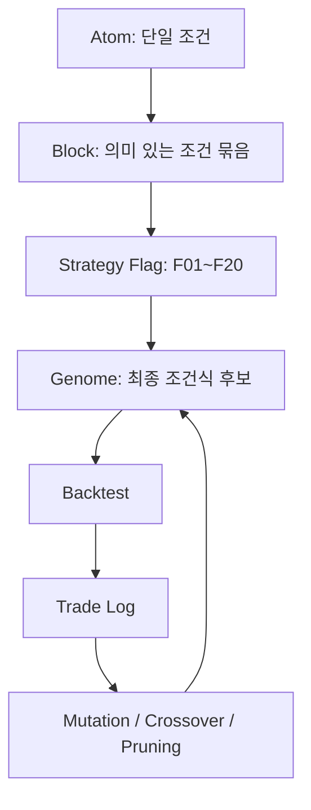

### 3.1 Atom 예시

| Atom | 의미 |
|---|---|
| `체결강도 >= 135` | 현재 매수체결 우위 |
| `초당거래대금 >= 초당거래대금평균(30,1) * 3` | 거래대금 폭발 |
| `현재가 > 최고현재가(30,1)` | 직전 구간 고가 돌파 |
| `누적초당매수수량(10) > 누적초당매도수량(10) * 1.2` | 최근 10초 매수 우위 |
| `매수총잔량 < 매수총잔량N(1) * 0.65` | 하단 호가 붕괴 위험 |

### 3.2 Block 예시

```python
거래대금고가돌파블록 = (
    현재가 > 최고현재가(30, 1) and
    초당거래대금 >= 초당거래대금평균(30, 1) * 3 and
    체결강도 >= 130 and
    누적초당매수수량(10) >= 누적초당매도수량(10) * 1.2
)
```

### 3.3 Strategy Flag 예시

```python
F05_거래대금고가돌파 = 데이터길이 >= 31 and 90200 <= 시분초 < 91000 and 거래대금고가돌파블록
```

### 3.4 Genome 예시

| Genome 요소 | 설명 |
|---|---|
| Hard Gate | 시간, 관심종목, 가격, 거래대금, VI, 스프레드 |
| Strategy Flags | F01~F20 중 어느 플래그를 사용할지 |
| Score Weights | F01=4점, F05=4점 등 가중치 |
| Risk Penalty | 허수호가, 매도우위, VI근접, 호가갭 |
| Exit Logic | 손절, 익절, 트레일링, 세력이탈, 방어실패 |

---

## 4. v5.0 추가 발굴 전략 20개

v4.0은 15개 전략 플래그였다. v5.0에서는 자동 발굴 시스템에서 성과를 분리 추적하기 위해 20개로 확장했다.

| 플래그 | 전략명 | 주요 시간 | 핵심 아이디어 | 자동 발굴 시 관찰할 지표 |
|---|---|---:|---|---|
| F01 | 시가갭즉발 | 09:00:05~09:00:40 | 갭상승 직후 매수세 지속 | 갭률별 승률, 5초 매수공격비 |
| F02 | 무갭시가돌파 | 09:00:05~09:02 | 갭은 작지만 시가를 강하게 돌파 | 시가대비등락율, 5초 고가돌파 |
| F03 | 강갭눌림회복 | 09:00:20~09:02 | 강갭 후 시가 위 회복 | 시가 이탈폭, 회복속도 |
| F04 | 매도흡수재돌파 | 09:00:30~09:05 | 매도물량 흡수 후 고가 재돌파 | 10초 매도우위 후 반등 |
| F05 | 거래대금고가돌파 | 09:02~09:10 | 표준 거래대금 폭발 돌파 | 30초 거래폭발배수 |
| F06 | 체결강도호가압력 | 09:02~09:15 | 체결강도 상승 + 호가상승압력 | 체결강도상승배수 |
| F07 | 횡보후발화 | 09:05~09:20 | 횡보 후 거래대금 발화 | 횡보감지, 거래대금급증 |
| F08 | 라운드피겨소화 | 09:02~09:15 | 심리 가격대 매도벽 소화 | 상단호가소화율 |
| F09 | VI근접강세 | 09:00~09:20 | VI 근처 강체결만 제한 허용 | VI근접 후 승률 |
| F10 | 대형주추세 | 09:05~09:25 | 대형주 이평 위 추세 지속 | 60틱 이평, 30초 누적매수 |
| F11 | 전일동시간비폭발 | 전체 | 전일 대비 거래 활성 급증 | 전일동시간비 구간별 성과 |
| F12 | 회전율초반가속 | 전체 | 초반 회전율·전일비 가속 | 회전율, 전일비각도 |
| F13 | 최고매수금액방어 | 전체 | 가격대별 매수금액 방어 | 최고매수금액/최고매도금액 |
| F14 | 매도벽소화돌파 | 전체 | 1~5호가 매도잔량 소화 | 상단1/5호가소화율 |
| F15 | 하단매수잔량방어 | 전체 | 하단 잔량 붕괴 없이 방어 | 하단1호가붕괴율 |
| F16 | 양봉성거래대금폭발 | 전체 | 거래대금 폭발이 상승틱에서 발생 | 현재가1초등락율 |
| F17 | 저가미갱신반등 | 09:02 이후 | 저가 미갱신 후 반등 | 저가미갱신지속틱수 |
| F18 | 시가상단재진입 | 09:02~09:15 | 시가 이탈 후 재진입 | 시가 재돌파 |
| F19 | 이평20지지재돌파 | 09:05~09:25 | 20틱 이평 지지 후 재돌파 | 이동평균(20) |
| F20 | 오더플로우지속 | 전체 | 1/5/10초 매수공격 지속 | 다중 구간 공격비 |

---

## 5. 매매기록 기반 조건식 발전법

조건식 자동 발굴 시스템에서 가장 중요한 것은 **백테스트 결과표 하나가 아니라 매매별 진입 당시 조건 스냅샷**이다.

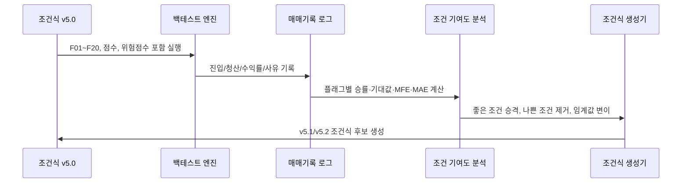

### 5.1 조건별 기여도 계산

| 지표 | 계산 | 해석 |
|---|---|---|
| `Flag WinRate` | Fxx=True 거래의 승률 | 단독 유효성 |
| `Flag Expectancy` | 평균수익률 | 기대값 |
| `Lift` | Fxx=True 기대값 - 전체 기대값 | 조건 기여도 |
| `False Break Ratio` | 진입 후 30초 내 손절 비율 | 가짜 돌파 탐지 |
| `MFE/MAE` | 최고수익률/최저수익률 | 익절·손절폭 조정 |
| `Exit Regret` | 매도 후 60초 내 추가상승률 | 너무 빠른 매도 여부 |
| `Late Loss Ratio` | 보유시간 120초 이후 손실전환 비율 | 시간청산 개선 |

### 5.2 조건 발전 규칙

| 결과 | 조치 |
|---|---|
| Fxx 기대값이 전체보다 높고 MDD 낮음 | 플래그 가중치 +1 |
| Fxx 거래수는 많으나 기대값 낮음 | 임계값 강화 또는 폐기 |
| 특정 시간대에서만 좋음 | 시간대 조건 분리 |
| 특정 시총에서만 좋음 | 시총별 파라미터 분리 |
| 손실 거래 대부분 `위험점수>=4` | 위험점수 하한 강화 |
| 수익 거래가 `복합점수 8~9`에도 많음 | 최소복합점수 완화 테스트 |
| 매도 후 계속 상승 | 트레일링폭 확대 또는 세력이탈점수 기준 강화 |
| 손실이 급격히 커짐 | 방어실패점수 조기 청산 강화 |

### 5.3 자동 발굴 시스템의 목적함수

단일 수익률만 최적화하면 과최적화 위험이 커진다. v5.0에서는 다음 다목적 점수를 권장한다.

```text
종합점수 =
    0.25 × 연간수익률_z
  + 0.20 × 매매성능지수_z
  + 0.15 × 기대값_z
  + 0.10 × 승률_z
  - 0.20 × MDD_z
  - 0.05 × 거래횟수과다패널티
  - 0.05 × 조건복잡도패널티
```

| 목표 | 권장 기준 |
|---|---|
| 매매성능지수 | 1.25 이상 |
| MDD | 4% 이하, 보수형은 3% 이하 |
| 거래수 | 연 2,000~5,000회 선호 |
| 일평균 거래수 | 6~20회 선호 |
| 평균보유기간 | 120~300초 |
| 워크포워드 통과 | 최소 3개 구간 이상 |

---

## 6. 조건식 자동 생성 문법 v5.0

### 6.1 조건 원자 Atom 라이브러리

| 카테고리 | Atom 템플릿 |
|---|---|
| 시간 | `90005 <= 시분초 < 92800` |
| 가격 | `현재가 > 최고현재가(n, 1)` |
| 갭 | `a <= 시가등락율 <= b` |
| 시가 돌파 | `현재가 >= 시가 + 호가단위 * k` |
| 거래대금 | `초당거래대금 >= 초당거래대금평균(n,1) * x` |
| 체결강도 | `체결강도 >= x`, `체결강도 >= 체결강도평균(n,1) * r` |
| 매수공격 | `누적초당매수수량(n) >= 누적초당매도수량(n) * r` |
| 매도압력 | `누적초당매도수량(n) >= 누적초당매수수량(n) * r` |
| 호가 | `구간호가총잔량비율(n) >= r` |
| 호가소화 | `상단1호가소화율 >= x` |
| 리스크 | `호가갭발생(3)`, `VI근접`, `라운드피겨위5호가이내` |
| 청산 | `최고수익률 >= a and 수익률 <= 최고수익률 - b` |

### 6.2 변이 연산자

| 변이 | 예시 |
|---|---|
| 임계값 완화 | 체결강도 135 → 125 |
| 임계값 강화 | 거래대금폭발 2.8 → 3.5 |
| 시간 구간 분리 | 09:02~09:10 → 09:02~09:05, 09:05~09:10 |
| 시총 구간 분리 | 전체 → 소형/중형/대형 |
| 갭률 구간 분리 | 전체 → 0~3%, 3~8%, 8% 이상 |
| AND 추가 | 매수공격비 조건 추가 |
| OR 추가 | F05 or F06 허용 |
| 위험조건 추가 | 매수잔량 급감 필터 추가 |
| 매도사유 강화 | 세력이탈점수 기준 5 → 4 |
| 매도사유 완화 | 트레일링폭 0.6 → 0.8 |
| 복잡도 축소 | 유효하지 않은 Atom 제거 |
| 가중치 변경 | F05 4점 → 5점 |

---

## 7. v5.0 최종 복합 매수 조건식

아래 조건식은 `strategy.db`의 기존 스타일에 맞춰 변수 정의 후 `매수 = True`, 실패 시 `매수 = False`, 마지막에 `self.Buy(...)`를 호출하는 구조다.

```python
# =============================================================================
# STOM 1초 Tick DB / 09:00~09:30 최종 복합 매수 조건식 v5.0
# 목적: v4.0 전략 플래그 + 19개 우수전략 빈도 + 매매기록 피드백용 로그 변수를 반영한 자동 발굴 시스템용 시드 조건식
# 포맷: strategy.db의 stockbuy 유사 포맷
# 핵심: 09:00:05~09:28:00 전체를 긴 시간 감시하되, 시간대/시가총액/갭률별 기준을 동적으로 적용
# =============================================================================

# -----------------------------------------------------------------------------
# 0. 공통 계산 지표
# -----------------------------------------------------------------------------
전일종가 = 현재가 / (1 + 등락율 / 100) if (1 + 등락율 / 100) != 0 else 현재가
시가등락율 = ((시가 - 전일종가) / 전일종가) * 100 if 전일종가 != 0 else 0
시가대비등락율 = ((현재가 - 시가) / 시가) * 100 if 시가 != 0 else 0
저가대비등락율_V5 = ((현재가 - 저가) / 저가) * 100 if 저가 != 0 else 0
고가대비이격_V5 = ((현재가 - 고가) / 고가) * 100 if 고가 != 0 else 0
고저범위 = 고가 - 저가
현재가위치 = (현재가 - 저가) / 고저범위 * 100 if 고저범위 > 0 else 50

스프레드틱 = (매도호가1 - 매수호가1) / 호가단위 if 호가단위 != 0 else 99

초당순매수수량 = 초당매수수량 - 초당매도수량
초당순매수금액 = 초당순매수수량 * 현재가 / 1_000_000
초당순매도금액 = (초당매도수량 - 초당매수수량) * 현재가 / 1_000_000

매수공격비_1초 = 초당매수수량 / 초당매도수량 if 초당매도수량 != 0 else 99
매도공격비_1초 = 초당매도수량 / 초당매수수량 if 초당매수수량 != 0 else 99

매수공격비_5초 = 누적초당매수수량(5) / 누적초당매도수량(5) if 데이터길이 >= 6 and 누적초당매도수량(5) != 0 else 0
매도공격비_5초 = 누적초당매도수량(5) / 누적초당매수수량(5) if 데이터길이 >= 6 and 누적초당매수수량(5) != 0 else 0
매수공격비_10초 = 누적초당매수수량(10) / 누적초당매도수량(10) if 데이터길이 >= 11 and 누적초당매도수량(10) != 0 else 0
매도공격비_10초 = 누적초당매도수량(10) / 누적초당매수수량(10) if 데이터길이 >= 11 and 누적초당매수수량(10) != 0 else 0
매수공격비_30초 = 누적초당매수수량(30) / 누적초당매도수량(30) if 데이터길이 >= 31 and 누적초당매도수량(30) != 0 else 0
매도공격비_30초 = 누적초당매도수량(30) / 누적초당매수수량(30) if 데이터길이 >= 31 and 누적초당매수수량(30) != 0 else 0

거래대금폭발배수_5 = 초당거래대금 / 초당거래대금평균(5, 1) if 데이터길이 >= 6 and 초당거래대금평균(5, 1) != 0 else 0
거래대금폭발배수_10 = 초당거래대금 / 초당거래대금평균(10, 1) if 데이터길이 >= 11 and 초당거래대금평균(10, 1) != 0 else 0
거래대금폭발배수_30 = 초당거래대금 / 초당거래대금평균(30, 1) if 데이터길이 >= 31 and 초당거래대금평균(30, 1) != 0 else 0

체결강도상승배수_5 = 체결강도 / 체결강도평균(5, 1) if 데이터길이 >= 6 and 체결강도평균(5, 1) != 0 else 1
체결강도상승배수_10 = 체결강도 / 체결강도평균(10, 1) if 데이터길이 >= 11 and 체결강도평균(10, 1) != 0 else 1
체결강도상승배수_30 = 체결강도 / 체결강도평균(30, 1) if 데이터길이 >= 31 and 체결강도평균(30, 1) != 0 else 1

상단5호가매도잔량 = 매도잔량1 + 매도잔량2 + 매도잔량3 + 매도잔량4 + 매도잔량5
하단5호가매수잔량 = 매수잔량1 + 매수잔량2 + 매수잔량3 + 매수잔량4 + 매수잔량5
오호가매수비율 = 하단5호가매수잔량 / (하단5호가매수잔량 + 상단5호가매도잔량) if (하단5호가매수잔량 + 상단5호가매도잔량) != 0 else 0.5
총호가매수비율 = 매수총잔량 / (매수총잔량 + 매도총잔량) if (매수총잔량 + 매도총잔량) != 0 else 0.5

상단1호가소화율 = (매도잔량1N(1) - 매도잔량1) / 매도잔량1N(1) * 100 if 데이터길이 >= 2 and 매도잔량1N(1) > 0 else 0
상단5호가소화율 = ((매도잔량1N(1) + 매도잔량2N(1) + 매도잔량3N(1) + 매도잔량4N(1) + 매도잔량5N(1)) - 상단5호가매도잔량) / (매도잔량1N(1) + 매도잔량2N(1) + 매도잔량3N(1) + 매도잔량4N(1) + 매도잔량5N(1)) * 100 if 데이터길이 >= 2 and (매도잔량1N(1) + 매도잔량2N(1) + 매도잔량3N(1) + 매도잔량4N(1) + 매도잔량5N(1)) > 0 else 0
하단1호가붕괴율 = (매수잔량1N(1) - 매수잔량1) / 매수잔량1N(1) * 100 if 데이터길이 >= 2 and 매수잔량1N(1) > 0 else 0

현재가1초등락율 = (현재가 / 현재가N(1) - 1) * 100 if 데이터길이 >= 2 and 현재가N(1) != 0 else 0
현재가3초등락율 = (현재가 / 현재가N(3) - 1) * 100 if 데이터길이 >= 4 and 현재가N(3) != 0 else 0

VI근접 = VI가격 > 0 and 현재가 >= VI가격 - VI호가단위 * 3
시초초반 = 90005 <= 시분초 < 90200
장초1구간 = 90200 <= 시분초 < 90500
장초2구간 = 90500 <= 시분초 < 91000
장초3구간 = 91000 <= 시분초 < 92000
종료전구간 = 92000 <= 시분초 < 92800

# -----------------------------------------------------------------------------
# 1. 시가총액·시간대별 동적 기준값
# -----------------------------------------------------------------------------
초소형주 = 시가총액 < 1500
소형주 = 1500 <= 시가총액 < 5000
중형주 = 5000 <= 시가총액 < 20000
대형주 = 시가총액 >= 20000

if 초소형주:
    최소체결강도 = 170
    최소매수공격비 = 2.10
    최소누적매수공격비 = 1.50
    최소거래폭발 = 4.50
    최대스프레드틱 = 1.50
    최대시가등락율 = 12.0
    최소복합점수 = 12
    최대위험점수 = 3
elif 소형주:
    최소체결강도 = 155
    최소매수공격비 = 1.80
    최소누적매수공격비 = 1.35
    최소거래폭발 = 3.80
    최대스프레드틱 = 2.00
    최대시가등락율 = 14.0
    최소복합점수 = 11
    최대위험점수 = 4
elif 중형주:
    최소체결강도 = 135
    최소매수공격비 = 1.50
    최소누적매수공격비 = 1.20
    최소거래폭발 = 2.80
    최대스프레드틱 = 2.00
    최대시가등락율 = 16.0
    최소복합점수 = 10
    최대위험점수 = 4
else:
    최소체결강도 = 115
    최소매수공격비 = 1.18
    최소누적매수공격비 = 1.05
    최소거래폭발 = 1.80
    최대스프레드틱 = 3.00
    최대시가등락율 = 10.0
    최소복합점수 = 9
    최대위험점수 = 5

# 09:00~09:02는 데이터가 짧으므로 5초/10초 지표 가중, 09:20 이후는 종료 리스크 때문에 강화
if 시초초반:
    최소복합점수 = 최소복합점수 + 1
    최대위험점수 = max(2, 최대위험점수 - 1)
elif 종료전구간:
    최소복합점수 = 최소복합점수 + 3
    최대위험점수 = max(2, 최대위험점수 - 1)

# -----------------------------------------------------------------------------
# 2. 전략 플래그 20개: 자동 발굴 시스템에서 각각 독립 성과 추적 가능
# -----------------------------------------------------------------------------

F01_시가갭즉발 = 데이터길이 >= 6 and 90005 <= 시분초 < 90040 and 2 <= 시가등락율 <= 최대시가등락율 and 현재가 >= 시가 + 호가단위 * 2 and 체결강도 >= 최소체결강도 and 매수공격비_1초 >= 최소매수공격비 and 매수공격비_5초 >= 최소누적매수공격비 and 거래대금폭발배수_5 >= 최소거래폭발 * 0.55
F02_무갭시가돌파 = 데이터길이 >= 6 and 90005 <= 시분초 < 90200 and -1 <= 시가등락율 <= 6 and 시가대비등락율 >= 0.50 and 현재가 > 최고현재가(5, 1) and 매수공격비_5초 >= 최소누적매수공격비 and 체결강도 >= 최소체결강도 - 15
F03_강갭눌림회복 = 데이터길이 >= 11 and 90020 <= 시분초 < 90200 and 4 <= 시가등락율 <= 최대시가등락율 and 현재가 >= 시가 - 호가단위 and 현재가 >= 최저현재가(10) + 호가단위 * 3 and 현재가 > 최고현재가(5, 1) and 매수공격비_1초 >= 최소매수공격비
F04_매도흡수재돌파 = 데이터길이 >= 31 and 90030 <= 시분초 < 90500 and 누적초당매도수량(10) >= 누적초당매수수량(10) * 0.75 and 현재가 >= 시가 - 호가단위 * 2 and 현재가 > 최고현재가(10, 1) and 초당거래대금 >= 초당거래대금평균(10, 1) * 2 and not 호가하락압력(10, 0.35)
F05_거래대금고가돌파 = 데이터길이 >= 31 and 90200 <= 시분초 < 91000 and 현재가 > 최고현재가(30, 1) and 거래대금폭발배수_30 >= 최소거래폭발 and 체결강도 >= 최소체결강도 - 5 and 매수공격비_10초 >= 최소누적매수공격비
F06_체결강도호가압력 = 데이터길이 >= 31 and 90200 <= 시분초 < 91500 and 체결강도상승배수_30 >= 1.10 and 체결강도 >= 최소체결강도 - 5 and 구간호가총잔량비율(30) >= 0.52 and 매수공격비_10초 >= 최소누적매수공격비
F07_횡보후발화 = 데이터길이 >= 61 and 90500 <= 시분초 < 92000 and 횡보감지(30, 0.50) and 현재가 > 최고현재가(30, 1) and 거래대금급증(30, 2.5) and 체결강도급등(30, 1.05)
F08_라운드피겨소화 = 데이터길이 >= 31 and 90200 <= 시분초 < 91500 and 라운드피겨위5호가이내 and 상단1호가소화율 >= 25 and 초당매수수량 >= 초당매도수량 * 최소매수공격비 and 현재가 >= 현재가N(1)
F09_VI근접강세 = 데이터길이 >= 11 and VI근접 and 체결강도 >= max(150, 최소체결강도) and 매수공격비_5초 >= 최소누적매수공격비 and 현재가 >= 현재가N(1) and 상단1호가소화율 >= 15
F10_대형주추세 = 데이터길이 >= 61 and 대형주 and 90500 <= 시분초 < 92500 and 현재가 > 이동평균(60, 1) and 거래대금폭발배수_30 >= 1.6 and 누적초당매수수량(30) >= 누적초당매도수량(30) * 1.05 and 체결강도 >= 110
F11_전일동시간비폭발 = 데이터길이 >= 31 and 전일동시간비 >= 200 and 전일비각도(30) >= 5 and 초당거래대금 >= 초당거래대금평균(30, 1) * 2 and 현재가 > 이동평균(20, 1)
F12_회전율초반가속 = 데이터길이 >= 31 and 회전율 >= 1.0 and 전일비 >= 100 and 당일거래대금각도(30) >= 8 and 현재가 > 최고현재가(10, 1)
F13_최고매수금액방어 = 데이터길이 >= 11 and 최고매수금액 > 최고매도금액 * 1.15 and 현재가 >= 최고매수가격 - 호가단위 * 2 and 매수공격비_5초 >= 1.10
F14_매도벽소화돌파 = 데이터길이 >= 6 and 상단1호가소화율 >= 35 and 상단5호가소화율 >= 12 and 현재가 >= 현재가N(1) and 초당매수수량 > 초당매도수량
F15_하단매수잔량방어 = 데이터길이 >= 6 and 하단1호가붕괴율 <= 10 and 총호가매수비율 >= 0.45 and 현재가 >= 최저현재가(5) + 호가단위
F16_양봉성거래대금폭발 = 데이터길이 >= 11 and 현재가 >= 시가 and 현재가1초등락율 >= 0 and 거래대금폭발배수_10 >= 2.5 and 매수공격비_1초 >= 1.3
F17_저가미갱신반등 = 데이터길이 >= 31 and 저가미갱신지속틱수() >= 20 and 현재가 > 최고현재가(10, 1) and 체결강도 >= 체결강도평균(10, 1) and 초당매수수량 > 초당매도수량
F18_시가상단재진입 = 데이터길이 >= 31 and 90200 <= 시분초 < 91500 and 현재가N(5) < 시가 and 현재가 >= 시가 + 호가단위 and 거래대금폭발배수_10 >= 2 and 매수공격비_5초 >= 1.2
F19_이평20지지재돌파 = 데이터길이 >= 61 and 90500 <= 시분초 < 92500 and 현재가 > 이동평균(20, 1) and 최저현재가(30) <= 이동평균(20, 1) + 호가단위 * 2 and 현재가 > 최고현재가(10, 1) and 체결강도 >= 체결강도평균(30, 1)
F20_오더플로우지속 = 데이터길이 >= 31 and 매수공격비_1초 >= 1.2 and 매수공격비_5초 >= 1.15 and 매수공격비_10초 >= 1.10 and 체결강도 >= 체결강도평균(10, 1) and 현재가 >= 현재가N(3)

# -----------------------------------------------------------------------------
# 3. 위험 점수: 자동 발굴 시스템에서 패배 패턴으로 별도 기록할 것
# -----------------------------------------------------------------------------
위험점수 = 0

if 스프레드틱 > 최대스프레드틱:
    위험점수 += 3
if 호가갭발생(3):
    위험점수 += 3
if 시가등락율 > 최대시가등락율:
    위험점수 += 2
if 시초초반 and 현재가 < 시가 - 호가단위 * 2:
    위험점수 += 4
if 초당매도수량 > 초당매수수량 * 2:
    위험점수 += 3
if 데이터길이 >= 6 and 매도공격비_5초 >= 1.8:
    위험점수 += 3
if 매수총잔량 < 매수총잔량N(1) * 0.65:
    위험점수 += 3
if 매수총잔량 > 매도총잔량 * 2 and 체결강도 < 110:
    위험점수 += 2
if 최고매도금액 > 최고매수금액 * 1.5 and 체결강도 < 100:
    위험점수 += 2
if VI근접 and 체결강도 < 150:
    위험점수 += 2
if 라운드피겨위5호가이내 and 초당매도수량 > 초당매수수량:
    위험점수 += 1
if 종료전구간 and 현재가 < 이동평균(20, 1):
    위험점수 += 2

# -----------------------------------------------------------------------------
# 4. 복합 점수: 전략 플래그 + 공통 오더플로우 보조 점수
# -----------------------------------------------------------------------------
복합점수 = 0

if F01_시가갭즉발: 복합점수 += 4
if F02_무갭시가돌파: 복합점수 += 4
if F03_강갭눌림회복: 복합점수 += 3
if F04_매도흡수재돌파: 복합점수 += 4
if F05_거래대금고가돌파: 복합점수 += 4
if F06_체결강도호가압력: 복합점수 += 3
if F07_횡보후발화: 복합점수 += 3
if F08_라운드피겨소화: 복합점수 += 2
if F09_VI근접강세: 복합점수 += 2
if F10_대형주추세: 복합점수 += 3
if F11_전일동시간비폭발: 복합점수 += 2
if F12_회전율초반가속: 복합점수 += 2
if F13_최고매수금액방어: 복합점수 += 2
if F14_매도벽소화돌파: 복합점수 += 2
if F15_하단매수잔량방어: 복합점수 += 1
if F16_양봉성거래대금폭발: 복합점수 += 2
if F17_저가미갱신반등: 복합점수 += 2
if F18_시가상단재진입: 복합점수 += 2
if F19_이평20지지재돌파: 복합점수 += 2
if F20_오더플로우지속: 복합점수 += 2

# 공통 보조 점수
if 관심종목 == 1: 복합점수 += 1
if 현재가위치 >= 70: 복합점수 += 1
if 고저평균대비등락율 >= 0: 복합점수 += 1
if 초당순매수금액 >= 50: 복합점수 += 1
if 당일거래대금 >= 100: 복합점수 += 1
if 당일거래대금각도(30) >= 5: 복합점수 += 1
if 등락율각도(10) >= 3: 복합점수 += 1
if 오호가매수비율 >= 0.48: 복합점수 += 1
if 총호가매수비율 >= 0.45: 복합점수 += 1
if 상단1호가소화율 >= 15: 복합점수 += 1
if 체결강도상승배수_10 >= 1.05: 복합점수 += 1

전략플래그수 = 0
if F01_시가갭즉발: 전략플래그수 += 1
if F02_무갭시가돌파: 전략플래그수 += 1
if F03_강갭눌림회복: 전략플래그수 += 1
if F04_매도흡수재돌파: 전략플래그수 += 1
if F05_거래대금고가돌파: 전략플래그수 += 1
if F06_체결강도호가압력: 전략플래그수 += 1
if F07_횡보후발화: 전략플래그수 += 1
if F08_라운드피겨소화: 전략플래그수 += 1
if F09_VI근접강세: 전략플래그수 += 1
if F10_대형주추세: 전략플래그수 += 1
if F11_전일동시간비폭발: 전략플래그수 += 1
if F12_회전율초반가속: 전략플래그수 += 1
if F13_최고매수금액방어: 전략플래그수 += 1
if F14_매도벽소화돌파: 전략플래그수 += 1
if F15_하단매수잔량방어: 전략플래그수 += 1
if F16_양봉성거래대금폭발: 전략플래그수 += 1
if F17_저가미갱신반등: 전략플래그수 += 1
if F18_시가상단재진입: 전략플래그수 += 1
if F19_이평20지지재돌파: 전략플래그수 += 1
if F20_오더플로우지속: 전략플래그수 += 1

# 자동 발굴 시스템 로그용
매수사유 = ""
if F01_시가갭즉발: 매수사유 = 매수사유 + "F01|"
if F02_무갭시가돌파: 매수사유 = 매수사유 + "F02|"
if F04_매도흡수재돌파: 매수사유 = 매수사유 + "F04|"
if F05_거래대금고가돌파: 매수사유 = 매수사유 + "F05|"
if F07_횡보후발화: 매수사유 = 매수사유 + "F07|"
if F10_대형주추세: 매수사유 = 매수사유 + "F10|"
if F20_오더플로우지속: 매수사유 = 매수사유 + "F20|"

# -----------------------------------------------------------------------------
# 5. 최종 매수 판단: strategy.db 유사 순차 필터 포맷
# -----------------------------------------------------------------------------
매수 = True

if not (90005 <= 시분초 < 92800):
    매수 = False
elif not (데이터길이 >= 6):
    매수 = False
elif not (관심종목 == 1):
    매수 = False
elif not (1000 <= 현재가 <= 100000):
    매수 = False
elif not (-2 <= 등락율 <= 25):
    매수 = False
elif not (당일거래대금 >= 30):
    매수 = False
elif not (시가등락율 <= 최대시가등락율):
    매수 = False
elif not (스프레드틱 <= 최대스프레드틱):
    매수 = False
elif not (위험점수 <= 최대위험점수):
    매수 = False
elif not (전략플래그수 >= 1):
    매수 = False
elif not (복합점수 >= 최소복합점수):
    매수 = False
elif 시초초반:
    if not (복합점수 >= 최소복합점수 + 1):
        매수 = False
    elif not (매수공격비_5초 >= 최소누적매수공격비):
        매수 = False
    elif not (현재가 >= 시가 - 호가단위):
        매수 = False
elif 장초1구간:
    if not (F04_매도흡수재돌파 or F05_거래대금고가돌파 or F06_체결강도호가압력 or F18_시가상단재진입):
        매수 = False
    elif not (복합점수 >= 최소복합점수):
        매수 = False
elif 장초2구간:
    if not (F05_거래대금고가돌파 or F06_체결강도호가압력 or F07_횡보후발화 or F19_이평20지지재돌파 or F20_오더플로우지속):
        매수 = False
    elif not (현재가 > 이동평균(20, 1)):
        매수 = False
elif 장초3구간:
    if not (F07_횡보후발화 or F10_대형주추세 or F19_이평20지지재돌파 or F20_오더플로우지속):
        매수 = False
    elif not (데이터길이 >= 61):
        매수 = False
    elif not (현재가 >= 이동평균(20, 1)):
        매수 = False
elif 종료전구간:
    if not (대형주 or 중형주):
        매수 = False
    elif not (F10_대형주추세 or F19_이평20지지재돌파 or F20_오더플로우지속):
        매수 = False
    elif not (복합점수 >= 최소복합점수 + 3):
        매수 = False
    elif not (위험점수 <= 2):
        매수 = False
else:
    매수 = False

if 매수:
    self.Buy(종목코드, 종목명, 매수수량, 현재가, 매도호가1, 매수호가1, 데이터길이)

```

---

## 8. v5.0 최종 복합 매도 조건식

```python
# =============================================================================
# STOM 1초 Tick DB / 09:00~09:30 최종 복합 매도 조건식 v5.0
# 목적: 최고수익률 대비 하락 + 고점대비 하락 + 세력자금 이탈 + 변동성/시간 적응형 청산
# 포맷: strategy.db의 stocksell 유사 포맷
# 핵심: 매매기록에 매도사유/세력이탈점수/방어실패점수를 남겨 다음 조건식 자동 발굴에 사용
# =============================================================================

# -----------------------------------------------------------------------------
# 0. 공통 계산 지표
# -----------------------------------------------------------------------------
시가대비등락율 = ((현재가 - 시가) / 시가) * 100 if 시가 != 0 else 0
스프레드틱 = (매도호가1 - 매수호가1) / 호가단위 if 호가단위 != 0 else 99

매도공격비_1초 = 초당매도수량 / 초당매수수량 if 초당매수수량 != 0 else 99
매수공격비_1초 = 초당매수수량 / 초당매도수량 if 초당매도수량 != 0 else 99
매도공격비_5초 = 누적초당매도수량(5) / 누적초당매수수량(5) if 데이터길이 >= 6 and 누적초당매수수량(5) != 0 else 0
매도공격비_10초 = 누적초당매도수량(10) / 누적초당매수수량(10) if 데이터길이 >= 11 and 누적초당매수수량(10) != 0 else 0
매도공격비_30초 = 누적초당매도수량(30) / 누적초당매수수량(30) if 데이터길이 >= 31 and 누적초당매수수량(30) != 0 else 0

초당순매도수량 = 초당매도수량 - 초당매수수량
초당순매도금액 = 초당순매도수량 * 현재가 / 1_000_000
현재가1초등락율 = (현재가 / 현재가N(1) - 1) * 100 if 데이터길이 >= 2 and 현재가N(1) != 0 else 0
현재가3초등락율 = (현재가 / 현재가N(3) - 1) * 100 if 데이터길이 >= 4 and 현재가N(3) != 0 else 0

거래대금폭발배수_10 = 초당거래대금 / 초당거래대금평균(10, 1) if 데이터길이 >= 11 and 초당거래대금평균(10, 1) != 0 else 0
거래대금폭발배수_30 = 초당거래대금 / 초당거래대금평균(30, 1) if 데이터길이 >= 31 and 초당거래대금평균(30, 1) != 0 else 0

하단1호가붕괴율 = (매수잔량1N(1) - 매수잔량1) / 매수잔량1N(1) * 100 if 데이터길이 >= 2 and 매수잔량1N(1) > 0 else 0
상단1호가재공급률 = (매도잔량1 - 매도잔량1N(1)) / 매도잔량1N(1) * 100 if 데이터길이 >= 2 and 매도잔량1N(1) > 0 else 0
상단5호가매도잔량 = 매도잔량1 + 매도잔량2 + 매도잔량3 + 매도잔량4 + 매도잔량5
하단5호가매수잔량 = 매수잔량1 + 매수잔량2 + 매수잔량3 + 매수잔량4 + 매수잔량5
오호가매수비율 = 하단5호가매수잔량 / (하단5호가매수잔량 + 상단5호가매도잔량) if (하단5호가매수잔량 + 상단5호가매도잔량) != 0 else 0.5
총호가매수비율 = 매수총잔량 / (매수총잔량 + 매도총잔량) if (매수총잔량 + 매도총잔량) != 0 else 0.5

고점대비하락_10 = 구간고가대비현재가등락율(10) if 데이터길이 >= 11 else 0
고점대비하락_30 = 구간고가대비현재가등락율(30) if 데이터길이 >= 31 else 0
VI근접 = VI가격 > 0 and 현재가 >= VI가격 - VI호가단위 * 3

# -----------------------------------------------------------------------------
# 1. 시가총액·시간대별 동적 매도 파라미터
# -----------------------------------------------------------------------------
if 시가총액 < 1500:
    손절률 = -0.60
    기본익절률 = 1.20
    트레일링시작 = 0.80
    트레일링폭 = 0.30
    최대보유시간 = 60
    매도수량배수 = 1.20
    고점하락률10 = -0.35
    고점하락률30 = -0.50
elif 시가총액 < 5000:
    손절률 = -0.75
    기본익절률 = 1.50
    트레일링시작 = 1.00
    트레일링폭 = 0.40
    최대보유시간 = 90
    매도수량배수 = 1.30
    고점하락률10 = -0.45
    고점하락률30 = -0.65
elif 시가총액 < 20000:
    손절률 = -0.95
    기본익절률 = 2.00
    트레일링시작 = 1.20
    트레일링폭 = 0.60
    최대보유시간 = 150
    매도수량배수 = 1.50
    고점하락률10 = -0.60
    고점하락률30 = -0.85
else:
    손절률 = -1.20
    기본익절률 = 2.40
    트레일링시작 = 1.50
    트레일링폭 = 0.80
    최대보유시간 = 240
    매도수량배수 = 1.70
    고점하락률10 = -0.80
    고점하락률30 = -1.00

# 09:00~09:02 진입분은 실패 속도가 빠르므로 더 빨리 자른다.
if 시분초 < 90200:
    손절률 = 손절률 + 0.10
    기본익절률 = 기본익절률 - 0.20
    트레일링폭 = max(0.25, 트레일링폭 - 0.10)
    최대보유시간 = min(최대보유시간, 70)

# 09:20 이후 보유분은 데이터 종료 리스크 때문에 보유시간을 줄인다.
if 시분초 >= 92000:
    최대보유시간 = min(최대보유시간, 90)
    트레일링폭 = max(0.25, 트레일링폭 - 0.10)

# -----------------------------------------------------------------------------
# 2. 세력 이탈 점수와 방어 실패 점수
# -----------------------------------------------------------------------------
세력이탈점수 = 0
방어실패점수 = 0

if 최고수익률 >= 1.5 and 수익률 <= 최고수익률 - 0.70:
    세력이탈점수 += 3
if 최고수익률 >= 1.0 and 시가총액 < 5000 and 수익률 <= 최고수익률 - 0.40:
    세력이탈점수 += 2
if 데이터길이 >= 11 and 고점대비하락_10 <= 고점하락률10:
    세력이탈점수 += 2
if 데이터길이 >= 31 and 고점대비하락_30 <= 고점하락률30:
    세력이탈점수 += 2
if 최고수익률 >= 1.0 and 고가미갱신지속틱수() >= 10 and 데이터길이 >= 11 and 체결강도 < 체결강도평균(10, 1):
    세력이탈점수 += 2
if 최고수익률 >= 1.5 and 고가미갱신지속틱수() >= 15:
    세력이탈점수 += 2
if 데이터길이 >= 11 and 체결강도 < 체결강도평균(10, 1) * 0.85:
    세력이탈점수 += 2
if 데이터길이 >= 31 and 체결강도급락(30, 0.90) and 체결강도 < 체결강도평균(30, 1):
    세력이탈점수 += 2
if 매도공격비_1초 >= 매도수량배수:
    세력이탈점수 += 2
if 데이터길이 >= 6 and 매도공격비_5초 >= 매도수량배수:
    세력이탈점수 += 2
if 데이터길이 >= 11 and 매도공격비_10초 >= 매도수량배수:
    세력이탈점수 += 2
if 데이터길이 >= 11 and 거래대금폭발배수_10 >= 3 and 현재가 < 현재가N(1) and 초당매도수량 > 초당매수수량:
    세력이탈점수 += 3
if 최고매도금액 > 최고매수금액 * 1.3 and 체결강도 < 100:
    세력이탈점수 += 2
if 최고매도금액 > 최고매수금액 * 1.5 and 현재가 <= 최고매도가격:
    세력이탈점수 += 2
if 당일매도금액 > 당일매수금액 * 1.05 and 체결강도 < 100:
    세력이탈점수 += 1
if VI근접 and 체결강도 < 140:
    세력이탈점수 += 2
if 라운드피겨위5호가이내 and 초당매도수량 > 초당매수수량 * 1.2:
    세력이탈점수 += 1

if 시분초 <= 90200 and 현재가 < 시가 - 호가단위:
    방어실패점수 += 3
if 데이터길이 >= 11 and 현재가 < 최저현재가(10, 1):
    방어실패점수 += 2
if 데이터길이 >= 31 and 현재가 < 최저현재가(30, 1):
    방어실패점수 += 2
if 하단1호가붕괴율 >= 35 and 현재가 <= 현재가N(1):
    방어실패점수 += 2
if 총호가매수비율 <= 0.35:
    방어실패점수 += 1
if 호가갭발생(3):
    방어실패점수 += 2
if 데이터길이 >= 21 and 시가총액 < 20000 and 현재가 < 이동평균(20, 1):
    방어실패점수 += 1
if 데이터길이 >= 61 and 시가총액 >= 20000 and 현재가 < 이동평균(60, 1):
    방어실패점수 += 1

매도사유 = ""

# -----------------------------------------------------------------------------
# 3. 최종 매도 판단: strategy.db 유사 순차 조건 포맷
# -----------------------------------------------------------------------------
매도 = False

if 시분초 >= 92900:
    매도 = True
    매도사유 = "시간강제청산"
elif 등락율 >= 29.5:
    매도 = True
    매도사유 = "상한가근접"
elif 수익률 <= 손절률:
    매도 = True
    매도사유 = "동적손절"
elif 수익률 >= 기본익절률 and 세력이탈점수 >= 1:
    매도 = True
    매도사유 = "익절+이탈"
elif 최고수익률 >= 트레일링시작 and 수익률 <= 최고수익률 - 트레일링폭:
    매도 = True
    매도사유 = "최고수익률트레일링"
elif 세력이탈점수 >= 5:
    매도 = True
    매도사유 = "세력이탈점수"
elif 방어실패점수 >= 4:
    매도 = True
    매도사유 = "방어실패점수"
elif 수익률 > 0 and 세력이탈점수 >= 3 and 방어실패점수 >= 2:
    매도 = True
    매도사유 = "수익구간복합이탈"
elif 수익률 <= 0 and 세력이탈점수 >= 3:
    매도 = True
    매도사유 = "손실구간이탈"
elif 데이터길이 >= 11 and 고점대비하락_10 <= 고점하락률10 and 매도공격비_5초 >= 1.2:
    매도 = True
    매도사유 = "10초고점대비하락"
elif 데이터길이 >= 31 and 고점대비하락_30 <= 고점하락률30 and 체결강도 < 체결강도평균(30, 1):
    매도 = True
    매도사유 = "30초고점대비하락"
elif 데이터길이 >= 31 and 횡보감지(30, 0.50) and 보유시간 >= min(최대보유시간, 120) and 수익률 < 0.5:
    매도 = True
    매도사유 = "횡보시간청산"
elif 보유시간 >= 최대보유시간:
    매도 = True
    매도사유 = "최대보유시간"
else:
    매도 = False

if 매도:
    self.Sell(종목코드, 종목명, 매도수량, 현재가, 매도호가1, 매수호가1, 강제청산)

```

---

## 9. v5.0 최적화 변수 범위

```python
# =============================================================================
# STOM v5.0 자동 발굴/최적화 변수 범위 초안
# 사용 목적: v5.0 복합 매수/매도 조건식의 핵심 임계값을 GA/Optuna/랜덤서치로 탐색
# 규칙: self.vars[0]은 고정 평균틱수, 매수 변수 1~24, 매도 변수 25~49
# =============================================================================

# 고정값
self.vars[0] = [[30], 30]  # 평균틱수/기준틱수

# -----------------------------------------------------------------------------
# 매수 핵심 게이트 변수 1~12
# -----------------------------------------------------------------------------
self.vars[1]  = [[1.0, 4.0, 0.5], 2.0]      # 시가등락율하한
self.vars[2]  = [[8.0, 18.0, 2.0], 14.0]     # 시가등락율상한
self.vars[3]  = [[0.2, 1.2, 0.2], 0.6]       # 시가대비등락율하한
self.vars[4]  = [[2.0, 5.0, 0.5], 3.0]       # 거래대금폭발배수_30 기준
self.vars[5]  = [[1.2, 2.2, 0.1], 1.5]       # 매수공격비_1초 기준
self.vars[6]  = [[1.0, 1.6, 0.1], 1.2]       # 누적매수공격비 기준
self.vars[7]  = [[110, 170, 10], 135]        # 체결강도 기준
self.vars[8]  = [[0.45, 0.60, 0.03], 0.52]   # 구간호가총잔량비율 기준
self.vars[9]  = [[1.0, 3.0, 0.5], 2.0]       # 최대스프레드틱
self.vars[10] = [[6, 14, 1], 10]             # 최소복합점수
self.vars[11] = [[2, 5, 1], 4]               # 최대위험점수
self.vars[12] = [[1, 3, 1], 1]               # 최소전략플래그수

# -----------------------------------------------------------------------------
# 매수 세부 전략 가중치 변수 13~24
# -----------------------------------------------------------------------------
self.vars[13] = [[2, 5, 1], 4]               # F01 시가갭즉발 가중치
self.vars[14] = [[2, 5, 1], 4]               # F02 무갭시가돌파 가중치
self.vars[15] = [[2, 5, 1], 4]               # F04 매도흡수재돌파 가중치
self.vars[16] = [[2, 5, 1], 4]               # F05 거래대금고가돌파 가중치
self.vars[17] = [[1, 4, 1], 3]               # F07 횡보후발화 가중치
self.vars[18] = [[1, 4, 1], 3]               # F10 대형주추세 가중치
self.vars[19] = [[10, 40, 5], 15]            # 상단1호가소화율 기준
self.vars[20] = [[0.5, 2.0, 0.25], 1.0]      # 회전율 기준
self.vars[21] = [[50, 250, 50], 100]         # 전일동시간비 기준
self.vars[22] = [[0.8, 2.0, 0.2], 1.2]       # 저가대비등락율 제한
self.vars[23] = [[20, 80, 10], 50]           # 초당순매수금액 하한(백만원)
self.vars[24] = [[60, 85, 5], 70]            # 현재가위치 하한

# -----------------------------------------------------------------------------
# 매도 핵심 변수 25~39
# -----------------------------------------------------------------------------
self.vars[25] = [[-1.5, -0.5, 0.1], -0.9]    # 손절률
self.vars[26] = [[1.0, 3.0, 0.25], 2.0]      # 기본익절률
self.vars[27] = [[0.8, 2.0, 0.2], 1.2]       # 트레일링시작
self.vars[28] = [[0.3, 1.0, 0.1], 0.6]       # 트레일링폭
self.vars[29] = [[60, 240, 30], 150]         # 최대보유시간
self.vars[30] = [[1.1, 2.0, 0.1], 1.5]       # 매도수량배수
self.vars[31] = [[-1.0, -0.3, 0.1], -0.6]    # 고점하락률10
self.vars[32] = [[-1.3, -0.5, 0.1], -0.85]   # 고점하락률30
self.vars[33] = [[3, 7, 1], 5]               # 세력이탈점수 청산 기준
self.vars[34] = [[2, 6, 1], 4]               # 방어실패점수 청산 기준
self.vars[35] = [[8, 20, 2], 10]             # 고가미갱신지속틱수 기준
self.vars[36] = [[0.75, 0.95, 0.05], 0.85]   # 체결강도평균대비 하락 기준
self.vars[37] = [[20, 50, 5], 35]            # 하단1호가붕괴율 기준
self.vars[38] = [[0.30, 0.45, 0.05], 0.35]   # 총호가매수비율 하락 기준
self.vars[39] = [[2.0, 4.0, 0.5], 3.0]       # 거래대금폭발동반하락 기준

# -----------------------------------------------------------------------------
# 자동 발굴 시스템용 메타 파라미터 40~49
# -----------------------------------------------------------------------------
self.vars[40] = [[1.10, 1.50, 0.10], 1.25]   # 승격 최소 Profit Factor
self.vars[41] = [[1.20, 1.50, 0.05], 1.25]   # 승격 최소 매매성능지수
self.vars[42] = [[2.0, 5.0, 0.5], 4.0]       # 허용 MDD 상한
self.vars[43] = [[100, 500, 50], 200]        # 최소 샘플 매매수
self.vars[44] = [[0.0, 0.5, 0.1], 0.2]       # 복잡도 페널티
self.vars[45] = [[0.0, 0.5, 0.1], 0.2]       # 과매매 페널티
self.vars[46] = [[1, 5, 1], 3]               # 워크포워드 최소 통과구간 수
self.vars[47] = [[0.5, 0.9, 0.1], 0.7]       # 학습/검증 성과 비율 하한
self.vars[48] = [[0.1, 0.5, 0.1], 0.3]       # 슬리피지 민감도 페널티
self.vars[49] = [[0.0, 1.0, 0.2], 0.4]       # 전략 중복도 페널티

```

---

## 10. 매매기록/조건기여도 로그 스키마

# STOM v5.0 매매기록/조건기여도 로그 스키마

이 스키마는 조건식 자동 발굴 시스템에서 **조건식 실행 결과 → 매매기록 → 조건 기여도 분석 → 조건식 재생성** 루프를 만들기 위한 최소 로그 항목이다.

## 1. 진입 로그 컬럼

| 컬럼 | 설명 |
|---|---|
| `trade_id` | 거래 고유 ID |
| `일자` | 거래일 |
| `종목코드`, `종목명` | 종목 식별 |
| `진입시분초` | 진입 시각 |
| `시가총액구간` | 초소형/소형/중형/대형 |
| `시가등락율`, `시가대비등락율`, `등락율` | 갭·가격 위치 |
| `초당거래대금`, `거래대금폭발배수_5/10/30` | 거래대금 이벤트 |
| `체결강도`, `체결강도상승배수_5/10/30` | 체결강도 상태 |
| `매수공격비_1초/5초/10초/30초` | 오더플로우 매수 우위 |
| `매도공격비_1초/5초/10초/30초` | 역방향 매도 압력 |
| `오호가매수비율`, `총호가매수비율` | 호가 유동성 |
| `상단1호가소화율`, `상단5호가소화율`, `하단1호가붕괴율` | 호가 변화 |
| `F01`~`F20` | 전략 플래그 통과 여부 |
| `전략플래그수` | 통과한 전략 플래그 개수 |
| `복합점수`, `위험점수` | 최종 진입 판단 점수 |
| `매수사유` | 주요 플래그 문자열 |

## 2. 청산 로그 컬럼

| 컬럼 | 설명 |
|---|---|
| `청산시분초` | 청산 시각 |
| `보유시간` | 초 단위 보유시간 |
| `매수가`, `매도가` | 체결 가격 |
| `수익률`, `수익금` | 결과 |
| `최고수익률`, `최저수익률` | MFE/MAE 근사 |
| `세력이탈점수`, `방어실패점수` | 청산 점수 |
| `매도사유` | 청산 트리거 |
| `청산시_체결강도`, `청산시_매도공격비_5초` | 청산 당시 수급 |
| `청산시_고점대비하락_10/30` | 고점 대비 훼손 |

## 3. 자동 발굴용 집계 테이블

| 집계 축 | 목적 |
|---|---|
| `Fxx별 성과` | 어떤 전략 플래그가 실제 수익 기대값을 갖는지 확인 |
| `시간대×시총×갭률 성과` | 조건식을 세분화할 구간 발견 |
| `매도사유별 성과` | 너무 빠른 청산/늦은 청산 판단 |
| `위험점수 구간별 성과` | 위험점수 임계값 최적화 |
| `복합점수 구간별 성과` | 최소복합점수 조정 |
| `MFE/MAE 분포` | 손절·트레일링 폭 조정 |


---

## 11. 자동 발굴 운영 프로세스

### 11.1 1차: Trace Mode

1. v5.0 조건식을 실매매가 아닌 백테스트/모의로 실행한다.
2. 모든 거래에 대해 `F01~F20`, `복합점수`, `위험점수`, `세력이탈점수`, `방어실패점수`, `매수사유`, `매도사유`를 기록한다.
3. 조건식이 최종 진입하지 않은 종목도 상위 후보 20개 정도는 `후보로그`로 저장하면 false negative 분석이 가능하다.

### 11.2 2차: Attribution Mode

| 분석 | 질문 |
|---|---|
| 플래그별 성과 | 어떤 Fxx가 실제로 수익을 만들었는가? |
| 플래그 조합 성과 | F05 단독보다 F05+F20이 좋은가? |
| 시간대별 성과 | 09:00~09:02와 09:05~09:10의 최적 조건이 다른가? |
| 시총별 성과 | 소형주 손절폭이 너무 넓거나 좁은가? |
| 갭률별 성과 | 8% 이상 갭에서 손실이 커지는가? |
| 매도사유별 후회 | 어떤 매도사유가 너무 빠른가? |

### 11.3 3차: Mutation Mode

좋은 플래그는 복제하고, 임계값을 조금씩 바꿔 조건식 후보를 만든다.

```text
부모 조건: F05 거래대금고가돌파
변이 1: 거래대금폭발배수 2.8 → 3.3
변이 2: 체결강도 135 → 145
변이 3: 시간 09:02~09:10 → 09:02~09:05
변이 4: 시총 중형주만 허용
변이 5: 매도 S2 → 세력이탈점수 강화형
```

### 11.4 4차: Walk-forward Mode

| 구분 | 기간 | 목적 |
|---|---|---|
| Train | 2022-02~2023-01 | 후보 생성/최적화 |
| Validation | 2023-02~2023-08 | 과최적화 제거 |
| Test | 2023-09~2024-05 | 최종 평가 |
| Rolling | 월별/분기별 | 시장 변화 대응 |

---

## 12. v5.0에서 가장 먼저 테스트할 실험 10개

| 실험 | 조건 | 비교 기준 |
|---|---|---|
| E01 | v4.0 복합식 vs v5.0 복합식 | 전체 성과 |
| E02 | F05 단독 vs F05+F20 | 오더플로우 지속성 효과 |
| E03 | F01 시가갭즉발 09:00:05~09:00:40 | 시초 급등 포착력 |
| E04 | F04 매도흡수재돌파 | 가짜 돌파 감소 여부 |
| E05 | 위험점수 ≤ 3 vs ≤ 4 | 손실 회피/기회 손실 균형 |
| E06 | 중형주만 vs 전 시총 | 시총별 안정성 |
| E07 | 세력이탈점수 4/5/6 | 청산 민감도 |
| E08 | 트레일링폭 0.4/0.6/0.8 | 수익 보존 vs 수익 확장 |
| E09 | 종료전구간 진입 허용/금지 | 09:20 이후 기대값 |
| E10 | 후보로그 저장 후 false negative 분석 | 놓친 급등주 조건 발굴 |

---

## 13. v5.0 리스크 관리 규칙

| 위험 | 대응 |
|---|---|
| 09:00 첫 틱 노이즈 | 09:00:05 이후만 판단 |
| 09:28 이후 데이터 부족 | 신규매수 금지, 09:29 강제청산 |
| 허수호가 | 매수총잔량 급감, 체결강도 약함, 매도금액 우위 필터 |
| VI 근접 | 강한 체결강도 없는 VI근접 매수 금지 |
| 라운드피겨 | 매도 우위면 회피, 소화율 높을 때만 제한 허용 |
| 과최적화 | 워크포워드, 복잡도 페널티, 최소 거래수 기준 |
| 매도 지연 | 세력이탈점수와 방어실패점수 병행 |

---

## 14. v5.0 체크리스트

- [x] v4.0의 전략별 조건식과 복합 전략을 보존한다.
- [x] 09:00~09:30 전체를 최대한 긴 시간 감시한다.
- [x] 09:00~09:02 초반 급등을 별도 플래그로 유지한다.
- [x] 전략별 조건을 F01~F20으로 분해한다.
- [x] 조건식 자동 발굴 시스템이 플래그별 성과를 기록할 수 있게 한다.
- [x] 매매기록 기반으로 조건식 발전 방향을 제시한다.
- [x] `strategy.db` 유사 포맷으로 조건식을 작성한다.
- [x] HTML 보고서에 좌측 목차와 시각화 요소를 포함한다.

---

## 15. 다음 버전 v5.1 권장 개발

v5.0은 전략 문서와 조건식 업데이트다. v5.1은 실제 자동 발굴 시스템 코드 쪽으로 가야 한다.

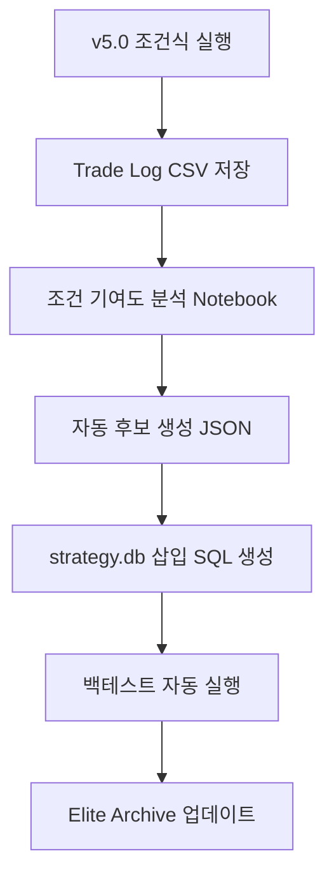

### v5.1에서 만들 파일

| 파일 | 역할 |
|---|---|
| `trade_log_analyzer.py` | F01~F20별 성과 분석 |
| `condition_mutator.py` | 조건식 후보 자동 생성 |
| `strategy_db_writer.py` | `strategy.db` 삽입 SQL 생성 |
| `walkforward_runner.py` | 기간 분할 백테스트 실행 |
| `elite_archive.csv` | 우수 조건식 저장소 |

---

# Part A. v4.0 원문 보존 아카이브

아래는 v4.0 전체 보고서 원문이다. v5.0은 이 내용을 삭제하지 않고, 위의 자동 발굴 시스템 장을 추가한 확장판이다.

# STOM 1초 Tick DB 09:00~09:30 시초 복합 오더플로우 전략 최종 보고서 v4.0

> 작성일: 2026-06-07  
> 대상: STOM 1초스냅샷 Tick DB, 09:00:00~09:30:00  
> 목적: 이전 보고서의 **각 전략별 기존 조건식 전체 보존** + 신규 발굴 전략 + 09:00~09:30 전체를 감시하는 **최종 복합 조건식** 작성  
> 포맷 기준: 첨부 `strategy.db`의 `stockbuy`, `stocksell`, `stockoptibuy`, `stockoptisell` 조건식 구조

---

## 0. v4.0에서 해결한 문제

이전 v3.2는 복합 조건식 중심으로 정리되면서, 앞선 보고서에 있던 **전략별 개별 조건식 B1~B8, S1~S8**이 충분히 재수록되지 않았다.  
v4.0은 구조를 다음처럼 재작성했다.

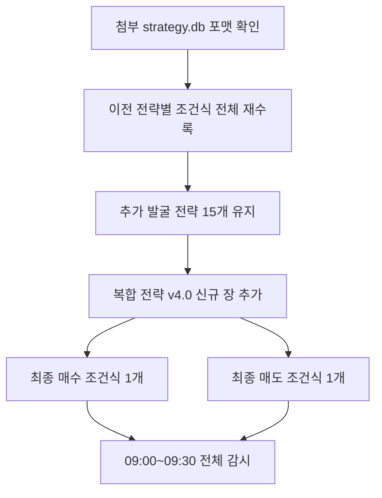

### v4.0 산출물 구성

| 구분 | 내용 |
|---|---|
| Part 1 | v4.0 신규 핵심 설계와 최종 복합 조건식 |
| Part 2 | 이전 보고서의 전략별 기존 조건식 전체 재수록 |
| Part 3 | v3.2 복합 전략 장 전체 재수록 |
| Part 4 | v2.0 조건식 아카이브 재수록 |
| 별도 파일 | 최종 복합 매수 조건식 `.py`, 최종 복합 매도 조건식 `.py`, HTML 보고서 |

---

## 1. 첨부 strategy.db 포맷 분석 요약

첨부 DB에서 확인한 테이블 개수는 다음과 같다.

| 테이블 | 레코드 수 | 의미 |
|---|---:|---|
| stockbuy | 88 | 주식 매수 전략 코드 |
| stocksell | 36 | 주식 매도 전략 코드 |
| stockoptibuy | 2 | 최적화 매수 전략 코드 |
| stockoptisell | 2 | 최적화 매도 전략 코드 |
| stockoptivars | 5 | 최적화 변수 범위 |

확인된 전략명 일부:

| 구분 | 예시 |
|---|---|
| stockbuy | Min_B_Study_251227, Test_Min_B_20250713_2, C_S_3_B_902_Min, 20250715_Study, 20250715_Study_B_2, 20250720_Study_B, 20250720_Study_B_2, Tick_B_902 |
| stocksell | Min_S_Study_251227, Test_Min_S_20250713_2, C_S_3_S_902_Min, 20250715_Study_S, 20250715_Study_S_2, 20250720_Study_S, 20250720_Study_S_2, Tick_S_902 |
| stockoptibuy | Tick_BO_902, C_T_902_905_U2_BO |
| stockoptisell | Tick_SO_902, C_T_902_905_U2_SO |

### DB 조건식 스타일 특징

```python
# 변수 정의
시가대비등락율 = ((현재가 - 시가) / 시가) * 100

매수 = True

if not (관심종목 == 1):
    매수 = False
elif not (조건):
    매수 = False
elif 시분초 < 90200:
    if not (세부조건):
        매수 = False
else:
    매수 = False

if 매수:
    self.Buy(...)
```

따라서 v4.0의 최종 조건식은 다음 원칙으로 작성했다.

| 원칙 | 적용 |
|---|---|
| 상단 파생변수 정의 | `시가등락율`, `시가대비등락율`, `매수공격비`, `거래대금폭발배수`, `상단1호가소화율` 등 |
| 전략 플래그 선계산 | 15개 전략을 boolean 플래그로 먼저 계산 |
| 공통 필터 순차 적용 | `if not`, `elif not` 형태 |
| 시간대 분기 | 09:00~09:02, 09:02~09:05, 09:05~09:10, 09:10~09:20, 09:20~09:28 |
| 최종 실행부 | DB와 동일하게 `self.Buy(...)`, `self.Sell(...)` 사용 |

---

## 2. v4.0 전략 맵: 짧은 전략을 긴 09:00~09:30 감시 전략으로 통합

이전 전략들은 각각 시간대가 짧았다. v4.0은 **각 전략을 플래그로 유지하되, 최종 조건식은 09:00:05~09:28:00 전체에서 작동**하도록 만들었다.

```mermaid
gantt
    title 09:00~09:30 복합 전략 커버리지
    dateFormat HH:mm:ss
    axisFormat %H:%M:%S

    section 초반 즉발
    시가갭즉발지속        :a1, 09:00:05, 115s
    무갭시가돌파          :a2, 09:00:05, 115s
    강갭눌림회복          :a3, 09:00:20, 160s

    section 흡수·재돌파
    매도흡수후재돌파      :b1, 09:00:30, 270s
    매도벽소화돌파        :b2, 09:00:05, 895s

    section 장초 주력
    거래대금폭발고가돌파  :c1, 09:02:00, 780s
    체결강도호가동시상승  :c2, 09:02:00, 1080s
    전일비회전율가속      :c3, 09:02:00, 1080s

    section 눌림·횡보
    횡보후발화            :d1, 09:05:00, 900s
    고가권재가속          :d2, 09:03:00, 1020s
    저가방어후상승각      :d3, 09:02:00, 1080s

    section 대형주·종료관리
    대형주장초추세        :e1, 09:05:00, 1200s
    종료전엄선추세        :e2, 09:20:00, 480s
```

### 최종 15개 전략 플래그

| 번호 | 전략 플래그 | 시간 커버 | 핵심 역할 |
|---:|---|---|---|
| 01 | 시가갭즉발지속 | 09:00:05~09:02 | 갭상승 후 즉시 수급 지속 |
| 02 | 무갭시가돌파 | 09:00:05~09:02 | 갭 없이 시가 돌파 |
| 03 | 강갭눌림회복 | 09:00:20~09:03 | 강갭 후 눌림 회복 |
| 04 | 매도흡수후재돌파 | 09:00:30~09:05 | 매도 물량 흡수 뒤 재돌파 |
| 05 | 거래대금폭발고가돌파 | 09:02~09:15 | 장초 주력 돌파 |
| 06 | 체결강도호가동시상승 | 09:02~09:20 | 체결강도와 호가압력 동반 |
| 07 | 횡보후발화 | 09:05~09:20 | 횡보 뒤 발화 |
| 08 | 라운드피겨돌파 | 09:02~09:15 | 심리 가격대 돌파 |
| 09 | VI근접전강세 | 09:00:30~09:20 | VI 전 급등 관리 |
| 10 | 대형주장초추세 | 09:05~09:25 | 대형주 장초 추세 |
| 11 | 전일비회전율가속 | 09:02~09:20 | 전일비·회전율 가속 |
| 12 | 매도벽소화돌파 | 09:00:05~09:15 | 매도1호가 소화 |
| 13 | 고가권재가속 | 09:03~09:20 | 고가권 재가속 |
| 14 | 저가방어후상승각 | 09:02~09:20 | 저가 방어 후 상승각 |
| 15 | 종료전엄선추세 | 09:20~09:28 | 데이터 종료 전 대형주 엄선 |

---

## 3. v4.0 최종 복합 매수 조건식

> 아래 코드는 기존 DB의 `stockbuy` 스타일에 맞춰 **파생변수 → 전략 플래그 → 위험점수 → 복합점수 → 순차 필터 → self.Buy** 구조로 작성했다.

```python
# =============================================================================
# STOM 1초 Tick DB / 09:00~09:30 최종 복합 매수 조건식 v4.0
# 작성 포맷: 첨부 strategy.db의 stockbuy 유사 포맷
# 핵심: 모든 시간대 전략 플래그를 만들고, 09:00~09:28 전체를 복합 점수로 감시
# =============================================================================

# -----------------------------------------------------------------------------
# 0. 공통 계산 지표
# -----------------------------------------------------------------------------

전일종가 = 현재가 / (1 + 등락율 / 100) if (1 + 등락율 / 100) != 0 else 현재가
시가등락율 = ((시가 - 전일종가) / 전일종가) * 100 if 전일종가 != 0 else 0
시가대비등락율 = ((현재가 - 시가) / 시가) * 100 if 시가 != 0 else 0

스프레드틱 = (매도호가1 - 매수호가1) / 호가단위 if 호가단위 != 0 else 99

초당순매수수량 = 초당매수수량 - 초당매도수량
초당순매수금액 = 초당순매수수량 * 현재가 / 1_000_000

매수공격비_1초 = 초당매수수량 / 초당매도수량 if 초당매도수량 != 0 else 99
매도공격비_1초 = 초당매도수량 / 초당매수수량 if 초당매수수량 != 0 else 99

매수공격비_5초 = 누적초당매수수량(5) / 누적초당매도수량(5) if 데이터길이 >= 6 and 누적초당매도수량(5) != 0 else 0
매도공격비_5초 = 누적초당매도수량(5) / 누적초당매수수량(5) if 데이터길이 >= 6 and 누적초당매수수량(5) != 0 else 0

매수공격비_10초 = 누적초당매수수량(10) / 누적초당매도수량(10) if 데이터길이 >= 11 and 누적초당매도수량(10) != 0 else 0
매도공격비_10초 = 누적초당매도수량(10) / 누적초당매수수량(10) if 데이터길이 >= 11 and 누적초당매수수량(10) != 0 else 0

거래대금폭발배수 = 초당거래대금 / 초당거래대금평균(30, 1) if 데이터길이 >= 31 and 초당거래대금평균(30, 1) != 0 else 0
거래대금폭발배수_10 = 초당거래대금 / 초당거래대금평균(10, 1) if 데이터길이 >= 11 and 초당거래대금평균(10, 1) != 0 else 0
거래대금폭발배수_5 = 초당거래대금 / 초당거래대금평균(5, 1) if 데이터길이 >= 6 and 초당거래대금평균(5, 1) != 0 else 0

체결강도상승배수 = 체결강도 / 체결강도평균(30, 1) if 데이터길이 >= 31 and 체결강도평균(30, 1) != 0 else 1
체결강도상승배수_10 = 체결강도 / 체결강도평균(10, 1) if 데이터길이 >= 11 and 체결강도평균(10, 1) != 0 else 1

상단5호가매도잔량 = 매도잔량1 + 매도잔량2 + 매도잔량3 + 매도잔량4 + 매도잔량5
하단5호가매수잔량 = 매수잔량1 + 매수잔량2 + 매수잔량3 + 매수잔량4 + 매수잔량5
오호가매수비율 = 하단5호가매수잔량 / (하단5호가매수잔량 + 상단5호가매도잔량) if (하단5호가매수잔량 + 상단5호가매도잔량) != 0 else 0.5

상단1호가소화율 = (매도잔량1N(1) - 매도잔량1) / 매도잔량1N(1) * 100 if 데이터길이 >= 2 and 매도잔량1N(1) > 0 else 0
하단1호가붕괴율 = (매수잔량1N(1) - 매수잔량1) / 매수잔량1N(1) * 100 if 데이터길이 >= 2 and 매수잔량1N(1) > 0 else 0

현재가1초등락율 = (현재가 / 현재가N(1) - 1) * 100 if 데이터길이 >= 2 and 현재가N(1) != 0 else 0
현재가3초등락율 = (현재가 / 현재가N(3) - 1) * 100 if 데이터길이 >= 4 and 현재가N(3) != 0 else 0

VI근접 = VI가격 > 0 and 현재가 >= VI가격 - VI호가단위 * 3
고가권유지 = 현재가 >= 고가 - (고가 - 저가) * 0.20 if 고가 > 저가 else True
시가위유지 = 현재가 >= 시가
시가강한돌파 = 현재가 >= 시가 + 호가단위 * 2
직전5초고가돌파 = 데이터길이 >= 7 and 현재가 > 최고현재가(5, 1)
직전10초고가돌파 = 데이터길이 >= 12 and 현재가 > 최고현재가(10, 1)
직전30초고가돌파 = 데이터길이 >= 32 and 현재가 > 최고현재가(30, 1)

# -----------------------------------------------------------------------------
# 1. 시가총액별 기준값
# 시가총액 단위는 DB 저장단위에 맞게 반드시 조정한다.
# -----------------------------------------------------------------------------

초소형주 = 시가총액 < 1500
소형주 = 1500 <= 시가총액 < 5000
중형주 = 5000 <= 시가총액 < 20000
대형주 = 시가총액 >= 20000

if 초소형주:
    최소체결강도 = 170
    최소매수공격비 = 2.2
    최소누적매수공격비 = 1.60
    최소거래폭발 = 5.0
    최대스프레드틱 = 1
    최대시가갭률 = 10
    기준점수_초반 = 8
    기준점수_일반 = 9
elif 소형주:
    최소체결강도 = 155
    최소매수공격비 = 1.8
    최소누적매수공격비 = 1.35
    최소거래폭발 = 4.0
    최대스프레드틱 = 2
    최대시가갭률 = 12
    기준점수_초반 = 7
    기준점수_일반 = 8
elif 중형주:
    최소체결강도 = 135
    최소매수공격비 = 1.5
    최소누적매수공격비 = 1.20
    최소거래폭발 = 3.0
    최대스프레드틱 = 2
    최대시가갭률 = 15
    기준점수_초반 = 6
    기준점수_일반 = 7
else:
    최소체결강도 = 115
    최소매수공격비 = 1.2
    최소누적매수공격비 = 1.05
    최소거래폭발 = 2.0
    최대스프레드틱 = 3
    최대시가갭률 = 10
    기준점수_초반 = 5
    기준점수_일반 = 6

# 09:20 이후는 09:30 데이터 종료 리스크 때문에 더 엄격하게 한다.
if 시분초 >= 92000:
    기준점수_일반 = 기준점수_일반 + 2

# -----------------------------------------------------------------------------
# 2. 추가 발굴 전략 플래그 15개
# 각 플래그는 독립 백테스트도 가능하고, 아래 복합점수에도 사용된다.
# -----------------------------------------------------------------------------

전략01_시가갭즉발지속 = (
    데이터길이 >= 6 and 90005 <= 시분초 <= 90200 and
    2 <= 시가등락율 <= 최대시가갭률 and
    시가강한돌파 and 고가권유지 and
    체결강도 >= 최소체결강도 and
    매수공격비_1초 >= 최소매수공격비 and
    매수공격비_5초 >= 최소누적매수공격비 and
    거래대금폭발배수_5 >= 최소거래폭발 * 0.60 and
    스프레드틱 <= 최대스프레드틱
)

전략02_무갭시가돌파 = (
    데이터길이 >= 7 and 90005 <= 시분초 <= 90200 and
    -1 <= 시가등락율 <= 6 and
    시가대비등락율 >= 0.6 and
    직전5초고가돌파 and
    (연속상승(3) or 가격급등(5, 0.5)) and
    체결강도 >= 최소체결강도 - 10 and
    매수공격비_1초 >= 최소매수공격비 and
    매수공격비_5초 >= 최소누적매수공격비 and
    거래대금폭발배수_5 >= 최소거래폭발 * 0.50
)

전략03_강갭눌림회복 = (
    데이터길이 >= 11 and 90020 <= 시분초 <= 90300 and
    4 <= 시가등락율 <= 최대시가갭률 and
    현재가 >= 시가 - 호가단위 * 2 and
    현재가 >= 최저현재가(10) + 호가단위 * 3 and
    직전10초고가돌파 and
    체결강도 >= 최소체결강도 - 15 and
    매수공격비_1초 >= 최소매수공격비 and
    초당순매수금액 > 1
)

전략04_매도흡수후재돌파 = (
    데이터길이 >= 31 and 90030 <= 시분초 <= 90500 and
    누적초당매도수량(10) >= 누적초당매수수량(10) * 0.80 and
    현재가 >= 시가 - 호가단위 * 2 and
    현재가 >= 최저현재가(10) + 호가단위 * 3 and
    직전10초고가돌파 and
    체결강도 >= 체결강도평균(10, 1) and
    매수공격비_1초 >= 최소매수공격비 and
    초당거래대금 >= 초당거래대금평균(10, 1) * 2
)

전략05_거래대금폭발고가돌파 = (
    데이터길이 >= 61 and 90200 <= 시분초 <= 91500 and
    직전30초고가돌파 and
    현재가 > 이동평균(20, 1) and
    초당거래대금 >= 초당거래대금평균(30, 1) * 3 and
    체결강도 >= 최소체결강도 - 5 and
    체결강도 >= 체결강도평균(30, 1) * 1.10 and
    누적초당매수수량(10) >= 누적초당매도수량(10) * 최소누적매수공격비
)

전략06_체결강도호가동시상승 = (
    데이터길이 >= 31 and 90200 <= 시분초 <= 92000 and
    체결강도급등(30, 1.1) and
    구간호가총잔량비율(30) >= 0.55 and
    초당매수수량 >= 초당매도수량 * 최소매수공격비 and
    현재가 > 최고현재가(20, 1) and
    스프레드틱 <= 최대스프레드틱
)

전략07_횡보후발화 = (
    데이터길이 >= 61 and 90500 <= 시분초 <= 92000 and
    횡보감지(30, 0.5) and
    거래대금급증및구간최고가갱신(30, 3) and
    체결강도급등(30, 1.1) and
    매수수량급증(30, 2) and
    현재가 > 이동평균(20, 1)
)

전략08_라운드피겨돌파 = (
    데이터길이 >= 31 and 90200 <= 시분초 <= 91500 and
    라운드피겨위5호가이내 and
    직전30초고가돌파 and
    상단1호가소화율 >= 20 and
    초당매수수량 >= 초당매도수량 * 최소매수공격비 and
    체결강도 >= 최소체결강도 and
    현재가1초등락율 > 0
)

전략09_VI근접전강세 = (
    데이터길이 >= 31 and 90030 <= 시분초 <= 92000 and
    VI가격 > 0 and 현재가 < VI가격 - VI호가단위 * 3 and
    현재가 >= VI가격 - VI호가단위 * 8 and
    체결강도 >= 최소체결강도 + 10 and
    매수공격비_1초 >= 최소매수공격비 and
    거래대금폭발배수_10 >= 최소거래폭발 * 0.70 and
    스프레드틱 <= 최대스프레드틱
)

전략10_대형주장초추세 = (
    데이터길이 >= 61 and 대형주 and 90500 <= 시분초 <= 92500 and
    1 <= 등락율 <= 10 and
    현재가 > 이동평균(60, 1) and
    초당거래대금 >= 초당거래대금평균(30, 1) * 1.8 and
    체결강도 >= 110 and
    누적초당매수수량(30) >= 누적초당매도수량(30) * 1.05 and
    구간호가총잔량비율(30) >= 0.48
)

전략11_전일비회전율가속 = (
    데이터길이 >= 31 and 90200 <= 시분초 <= 92000 and
    전일비 > 전일비N(1) and
    전일동시간비 > 100 and
    회전율 > 0.5 and
    당일거래대금각도(30) >= 8 and
    초당순매수금액 > 1 and
    현재가 > 최고현재가(20, 1)
)

전략12_매도벽소화돌파 = (
    데이터길이 >= 6 and 90005 <= 시분초 <= 91500 and
    상단1호가소화율 >= 30 and
    초당매수수량 >= 매도잔량1N(1) * 0.30
)

전략13_고가권재가속 = (
    데이터길이 >= 31 and 90300 <= 시분초 <= 92000 and
    현재가 >= 고가 - (고가 - 저가) * 0.15 if 고가 > 저가 else False
) and (
    현재가 > 최고현재가(10, 1) and
    체결강도 >= 체결강도평균(10, 1) * 1.05 and
    매수공격비_1초 >= 최소매수공격비 and
    초당거래대금 >= 초당거래대금평균(10, 1) * 1.8
)

전략14_저가방어후상승각 = (
    데이터길이 >= 31 and 90200 <= 시분초 <= 92000 and
    저가미갱신지속틱수() >= 10 and
    저점기준등락율각도(10) >= 5 and
    현재가 > 이동평균(20, 1) and
    초당매수수량 > 초당매도수량 * 최소매수공격비
)

전략15_종료전엄선추세 = (
    데이터길이 >= 61 and 92000 <= 시분초 <= 92800 and
    대형주 and
    현재가 > 이동평균(60, 1) and
    직전30초고가돌파 and
    체결강도 >= 120 and
    초당거래대금 >= 초당거래대금평균(30, 1) * 2.5 and
    누적초당매수수량(30) >= 누적초당매도수량(30) * 1.20
)

# -----------------------------------------------------------------------------
# 3. 위험 점수
# -----------------------------------------------------------------------------

위험점수 = 0

if 스프레드틱 > 최대스프레드틱:
    위험점수 += 3
if 호가갭발생(3):
    위험점수 += 3
if 시가등락율 > 최대시가갭률:
    위험점수 += 2
if 시분초 <= 90200 and 현재가 < 시가 - 호가단위 * 2:
    위험점수 += 4
if 초당매도수량 > 초당매수수량 * 2:
    위험점수 += 3
if 데이터길이 >= 6 and 매도공격비_5초 >= 1.8:
    위험점수 += 3
if 매수총잔량 < 매수총잔량N(1) * 0.65:
    위험점수 += 3
if 매수총잔량 > 매도총잔량 * 2 and 체결강도 < 110:
    위험점수 += 2
if 최고매도금액 > 최고매수금액 * 1.5 and 체결강도 < 100:
    위험점수 += 3
if VI근접 and 체결강도 < 150:
    위험점수 += 2
if 라운드피겨위5호가이내 and 초당매도수량 > 초당매수수량:
    위험점수 += 2

# -----------------------------------------------------------------------------
# 4. 복합 점수
# -----------------------------------------------------------------------------

복합점수 = 0
매수사유 = ''

if 전략01_시가갭즉발지속:
    복합점수 += 4
    매수사유 = 매수사유 + '|01갭즉발'
if 전략02_무갭시가돌파:
    복합점수 += 4
    매수사유 = 매수사유 + '|02시가돌파'
if 전략03_강갭눌림회복:
    복합점수 += 4
    매수사유 = 매수사유 + '|03강갭회복'
if 전략04_매도흡수후재돌파:
    복합점수 += 5
    매수사유 = 매수사유 + '|04흡수재돌파'
if 전략05_거래대금폭발고가돌파:
    복합점수 += 5
    매수사유 = 매수사유 + '|05거대폭발'
if 전략06_체결강도호가동시상승:
    복합점수 += 4
    매수사유 = 매수사유 + '|06체결호가'
if 전략07_횡보후발화:
    복합점수 += 4
    매수사유 = 매수사유 + '|07횡보발화'
if 전략08_라운드피겨돌파:
    복합점수 += 3
    매수사유 = 매수사유 + '|08라운드'
if 전략09_VI근접전강세:
    복합점수 += 3
    매수사유 = 매수사유 + '|09VI전강세'
if 전략10_대형주장초추세:
    복합점수 += 4
    매수사유 = 매수사유 + '|10대형추세'
if 전략11_전일비회전율가속:
    복합점수 += 3
    매수사유 = 매수사유 + '|11전일비가속'
if 전략12_매도벽소화돌파:
    복합점수 += 3
    매수사유 = 매수사유 + '|12매도벽소화'
if 전략13_고가권재가속:
    복합점수 += 3
    매수사유 = 매수사유 + '|13고가권재가속'
if 전략14_저가방어후상승각:
    복합점수 += 3
    매수사유 = 매수사유 + '|14저가방어'
if 전략15_종료전엄선추세:
    복합점수 += 5
    매수사유 = 매수사유 + '|15종료전엄선'

# 공통 보조 점수
if 관심종목 == 1:
    복합점수 += 1
if 고저평균대비등락율 > 0:
    복합점수 += 1
if 초당순매수금액 > 1:
    복합점수 += 1
if 체결강도 >= 최소체결강도:
    복합점수 += 1
if 매수공격비_1초 >= 최소매수공격비:
    복합점수 += 1
if 데이터길이 >= 11 and 매수공격비_10초 >= 최소누적매수공격비:
    복합점수 += 1
if 오호가매수비율 >= 0.48:
    복합점수 += 1
if 상단1호가소화율 >= 20:
    복합점수 += 1
if 직전30초고가돌파:
    복합점수 += 1

# -----------------------------------------------------------------------------
# 5. 최종 매수 판단: strategy.db 유사 포맷
# -----------------------------------------------------------------------------

매수 = True

if not (90005 <= 시분초 < 92800):
    매수 = False
elif not (관심종목 == 1):
    매수 = False
elif not (1000 < 현재가 <= 100000):
    매수 = False
elif not (-2 <= 등락율 <= 25):
    매수 = False
elif not (당일거래대금 >= 30):
    매수 = False
elif not (고저평균대비등락율 > -1):
    매수 = False
elif not (스프레드틱 <= 최대스프레드틱):
    매수 = False
elif 호가갭발생(3):
    매수 = False
elif 위험점수 >= 5:
    매수 = False

# ---------- 09:00:05 ~ 09:02:00: 시가갭·시가돌파·초반흡수 ----------
elif 시분초 < 90200:
    if not (전략01_시가갭즉발지속 or 전략02_무갭시가돌파 or 전략03_강갭눌림회복 or 전략04_매도흡수후재돌파):
        매수 = False
    elif not (복합점수 >= 기준점수_초반):
        매수 = False
    elif not (현재가 >= 시가 - 호가단위):
        매수 = False
    elif not (매수공격비_1초 >= 최소매수공격비):
        매수 = False
    elif not (매수공격비_5초 >= 최소누적매수공격비):
        매수 = False

# ---------- 09:02:00 ~ 09:05:00: 흡수재돌파 + 표준 고가돌파 시작 ----------
elif 90200 <= 시분초 < 90500:
    if not (전략03_강갭눌림회복 or 전략04_매도흡수후재돌파 or 전략05_거래대금폭발고가돌파 or 전략06_체결강도호가동시상승 or 전략11_전일비회전율가속 or 전략12_매도벽소화돌파):
        매수 = False
    elif not (복합점수 >= 기준점수_일반):
        매수 = False
    elif not (현재가 > 이동평균(20, 1) if 데이터길이 >= 21 else 현재가 >= 시가):
        매수 = False
    elif not (체결강도 >= 최소체결강도 - 10):
        매수 = False

# ---------- 09:05:00 ~ 09:10:00: 장초 주력 확장 ----------
elif 90500 <= 시분초 < 91000:
    if not (전략05_거래대금폭발고가돌파 or 전략06_체결강도호가동시상승 or 전략07_횡보후발화 or 전략08_라운드피겨돌파 or 전략10_대형주장초추세 or 전략13_고가권재가속 or 전략14_저가방어후상승각):
        매수 = False
    elif not (복합점수 >= 기준점수_일반):
        매수 = False
    elif not (초당거래대금 >= 초당거래대금평균(30, 1) * 1.8):
        매수 = False
    elif not (누적초당매수수량(10) >= 누적초당매도수량(10) * 1.05):
        매수 = False

# ---------- 09:10:00 ~ 09:20:00: 눌림·횡보·재가속 ----------
elif 91000 <= 시분초 < 92000:
    if not (전략05_거래대금폭발고가돌파 or 전략06_체결강도호가동시상승 or 전략07_횡보후발화 or 전략10_대형주장초추세 or 전략13_고가권재가속 or 전략14_저가방어후상승각):
        매수 = False
    elif not (복합점수 >= 기준점수_일반 + 1):
        매수 = False
    elif not (현재가 > 이동평균(20, 1)):
        매수 = False
    elif not (직전10초고가돌파 or 직전30초고가돌파):
        매수 = False

# ---------- 09:20:00 ~ 09:28:00: 종료 전 엄선 진입 ----------
elif 92000 <= 시분초 < 92800:
    if not (전략10_대형주장초추세 or 전략15_종료전엄선추세):
        매수 = False
    elif not (대형주):
        매수 = False
    elif not (복합점수 >= 기준점수_일반 + 1):
        매수 = False
    elif not (현재가 > 이동평균(60, 1)):
        매수 = False
    elif not (누적초당매수수량(30) >= 누적초당매도수량(30) * 1.20):
        매수 = False

else:
    매수 = False

if 매수:
    self.Buy(종목코드, 종목명, 매수수량, 현재가, 매도호가1, 매수호가1, 데이터길이)

```

---

## 4. v4.0 최종 복합 매도 조건식

> 아래 코드는 기존 DB의 `stocksell` 스타일에 맞춰 **파생변수 → 시총별 매도 파라미터 → 세력이탈점수 → 순차 청산 → self.Sell** 구조로 작성했다.

```python
# =============================================================================
# STOM 1초 Tick DB / 09:00~09:30 최종 복합 매도 조건식 v4.0
# 작성 포맷: 첨부 strategy.db의 stocksell 유사 포맷
# 핵심: 최고수익률 대비 하락 + 고점대비 하락 + 세력자금 이탈 + 시간청산 통합
# =============================================================================

# -----------------------------------------------------------------------------
# 0. 공통 계산 지표
# -----------------------------------------------------------------------------

시가대비등락율 = ((현재가 - 시가) / 시가) * 100 if 시가 != 0 else 0
스프레드틱 = (매도호가1 - 매수호가1) / 호가단위 if 호가단위 != 0 else 99

매도공격비_1초 = 초당매도수량 / 초당매수수량 if 초당매수수량 != 0 else 99
매수공격비_1초 = 초당매수수량 / 초당매도수량 if 초당매도수량 != 0 else 99

매도공격비_5초 = 누적초당매도수량(5) / 누적초당매수수량(5) if 데이터길이 >= 6 and 누적초당매수수량(5) != 0 else 0
매도공격비_10초 = 누적초당매도수량(10) / 누적초당매수수량(10) if 데이터길이 >= 11 and 누적초당매수수량(10) != 0 else 0
매도공격비_30초 = 누적초당매도수량(30) / 누적초당매수수량(30) if 데이터길이 >= 31 and 누적초당매수수량(30) != 0 else 0

초당순매도수량 = 초당매도수량 - 초당매수수량
초당순매도금액 = 초당순매도수량 * 현재가 / 1_000_000

현재가1초등락율 = (현재가 / 현재가N(1) - 1) * 100 if 데이터길이 >= 2 and 현재가N(1) != 0 else 0
현재가3초등락율 = (현재가 / 현재가N(3) - 1) * 100 if 데이터길이 >= 4 and 현재가N(3) != 0 else 0

거래대금폭발배수_10 = 초당거래대금 / 초당거래대금평균(10, 1) if 데이터길이 >= 11 and 초당거래대금평균(10, 1) != 0 else 0
거래대금폭발배수_30 = 초당거래대금 / 초당거래대금평균(30, 1) if 데이터길이 >= 31 and 초당거래대금평균(30, 1) != 0 else 0

하단1호가붕괴율 = (매수잔량1N(1) - 매수잔량1) / 매수잔량1N(1) * 100 if 데이터길이 >= 2 and 매수잔량1N(1) > 0 else 0
상단1호가재공급률 = (매도잔량1 - 매도잔량1N(1)) / 매도잔량1N(1) * 100 if 데이터길이 >= 2 and 매도잔량1N(1) > 0 else 0

상단5호가매도잔량 = 매도잔량1 + 매도잔량2 + 매도잔량3 + 매도잔량4 + 매도잔량5
하단5호가매수잔량 = 매수잔량1 + 매수잔량2 + 매수잔량3 + 매수잔량4 + 매수잔량5
오호가매수비율 = 하단5호가매수잔량 / (하단5호가매수잔량 + 상단5호가매도잔량) if (하단5호가매수잔량 + 상단5호가매도잔량) != 0 else 0.5

고점대비하락_10 = 구간고가대비현재가등락율(10) if 데이터길이 >= 11 else 0
고점대비하락_30 = 구간고가대비현재가등락율(30) if 데이터길이 >= 31 else 0

VI근접 = VI가격 > 0 and 현재가 >= VI가격 - VI호가단위 * 3

# -----------------------------------------------------------------------------
# 1. 시가총액·시간대별 매도 파라미터
# -----------------------------------------------------------------------------

if 시가총액 < 1500:
    손절률 = -0.5
    익절률 = 1.2
    트레일링시작 = 0.8
    트레일링폭 = 0.30
    최대보유시간 = 60
    매도수량배수 = 1.20
    고점하락10 = -0.35
    고점하락30 = -0.50
    체결강도하한 = 105
elif 시가총액 < 5000:
    손절률 = -0.7
    익절률 = 1.5
    트레일링시작 = 1.0
    트레일링폭 = 0.40
    최대보유시간 = 90
    매도수량배수 = 1.30
    고점하락10 = -0.45
    고점하락30 = -0.65
    체결강도하한 = 95
elif 시가총액 < 20000:
    손절률 = -0.9
    익절률 = 2.0
    트레일링시작 = 1.2
    트레일링폭 = 0.60
    최대보유시간 = 150
    매도수량배수 = 1.50
    고점하락10 = -0.60
    고점하락30 = -0.85
    체결강도하한 = 85
else:
    손절률 = -1.1
    익절률 = 2.4
    트레일링시작 = 1.5
    트레일링폭 = 0.80
    최대보유시간 = 240
    매도수량배수 = 1.70
    고점하락10 = -0.80
    고점하락30 = -1.00
    체결강도하한 = 80

# 09:00~09:02 진입분은 실패 속도가 빠르므로 더 빨리 자른다.
if 시분초 <= 90200:
    손절률 = 손절률 + 0.2
    트레일링폭 = 트레일링폭 - 0.1 if 트레일링폭 >= 0.4 else 트레일링폭
    최대보유시간 = 60 if 최대보유시간 > 60 else 최대보유시간

# 09:20 이후 보유분은 데이터 종료 리스크 때문에 보유시간을 줄인다.
if 시분초 >= 92000:
    최대보유시간 = 90 if 최대보유시간 > 90 else 최대보유시간
    익절률 = 1.2 if 익절률 > 1.2 else 익절률

# -----------------------------------------------------------------------------
# 2. 세력 이탈 점수
# -----------------------------------------------------------------------------

세력이탈점수 = 0
매도사유 = ''

if 최고수익률 >= 트레일링시작 and 수익률 <= 최고수익률 - 트레일링폭:
    세력이탈점수 += 4
    매도사유 = 매도사유 + '|최고수익반락'
if 데이터길이 >= 11 and 고점대비하락_10 <= 고점하락10:
    세력이탈점수 += 3
    매도사유 = 매도사유 + '|10초고점하락'
if 데이터길이 >= 31 and 고점대비하락_30 <= 고점하락30:
    세력이탈점수 += 3
    매도사유 = 매도사유 + '|30초고점하락'
if 최고수익률 >= 1.0 and 고가미갱신지속틱수() >= 8 and 체결강도 < 체결강도평균(10, 1):
    세력이탈점수 += 3
    매도사유 = 매도사유 + '|고가미갱신'
if 체결강도 < 체결강도하한:
    세력이탈점수 += 3
    매도사유 = 매도사유 + '|체결강도하한'
if 데이터길이 >= 11 and 체결강도 < 체결강도평균(10, 1) * 0.85:
    세력이탈점수 += 2
    매도사유 = 매도사유 + '|체결강도급락10'
if 데이터길이 >= 31 and 체결강도급락(30, 0.9) and 체결강도 < 체결강도평균(30, 1):
    세력이탈점수 += 2
    매도사유 = 매도사유 + '|체결강도급락30'
if 매도공격비_1초 >= 매도수량배수:
    세력이탈점수 += 3
    매도사유 = 매도사유 + '|1초매도우위'
if 데이터길이 >= 6 and 매도공격비_5초 >= 매도수량배수:
    세력이탈점수 += 3
    매도사유 = 매도사유 + '|5초매도우위'
if 데이터길이 >= 11 and 매도공격비_10초 >= 매도수량배수:
    세력이탈점수 += 3
    매도사유 = 매도사유 + '|10초매도우위'
if 데이터길이 >= 31 and 매도공격비_30초 >= 매도수량배수:
    세력이탈점수 += 2
    매도사유 = 매도사유 + '|30초매도우위'
if 거래대금폭발배수_10 >= 3 and 현재가 < 현재가N(1):
    세력이탈점수 += 3
    매도사유 = 매도사유 + '|거대동반하락'
if 최고매도금액 > 최고매수금액 * 1.3 and 체결강도 < 100:
    세력이탈점수 += 3
    매도사유 = 매도사유 + '|최고매도금액'
if 당일매도금액 > 당일매수금액 * 1.05 and 체결강도 < 100:
    세력이탈점수 += 2
    매도사유 = 매도사유 + '|당일매도우위'
if 데이터길이 >= 11 and 호가하락압력(10, 0.35):
    세력이탈점수 += 3
    매도사유 = 매도사유 + '|호가하락10'
if 데이터길이 >= 31 and 호가하락압력(30, 0.35):
    세력이탈점수 += 3
    매도사유 = 매도사유 + '|호가하락30'
if 하단1호가붕괴율 >= 35 and 현재가 <= 현재가N(1):
    세력이탈점수 += 3
    매도사유 = 매도사유 + '|매수1호가붕괴'
if 매수총잔량 < 매수총잔량N(1) * 0.65 and 현재가 <= 현재가N(1):
    세력이탈점수 += 3
    매도사유 = 매도사유 + '|매수총잔량붕괴'
if 상단1호가재공급률 >= 50 and 초당매도수량 > 초당매수수량:
    세력이탈점수 += 2
    매도사유 = 매도사유 + '|매도호가재공급'
if VI근접 and 체결강도 < 140:
    세력이탈점수 += 2
    매도사유 = 매도사유 + '|VI근접약화'
if 라운드피겨위5호가이내 and 초당매도수량 > 초당매수수량 * 1.2:
    세력이탈점수 += 2
    매도사유 = 매도사유 + '|라운드매도우위'

# -----------------------------------------------------------------------------
# 3. 최종 매도 판단: strategy.db 유사 포맷
# -----------------------------------------------------------------------------

매도 = False

if 시분초 >= 92900:
    매도 = True
elif 수익률 <= 손절률:
    매도 = True
elif 수익률 >= 익절률:
    매도 = True
elif 보유시간 >= 최대보유시간:
    매도 = True
elif 최고수익률 >= 트레일링시작 and 수익률 <= 최고수익률 - 트레일링폭:
    매도 = True
elif 세력이탈점수 >= 6:
    매도 = True
elif 시분초 <= 90200:
    if 시가대비등락율 < 0 and 현재가 < 시가 - 호가단위:
        매도 = True
    elif 데이터길이 >= 6 and 매도공격비_5초 >= 1.4:
        매도 = True
    elif 데이터길이 >= 11 and 현재가 < 최저현재가(10, 1):
        매도 = True
    elif 최고수익률 >= 0.8 and 수익률 <= 최고수익률 - 0.3:
        매도 = True
elif 90200 < 시분초 <= 91000:
    if 데이터길이 >= 31 and 현재가 < 최저현재가(30, 1):
        매도 = True
    elif 데이터길이 >= 31 and 체결강도급락(30, 0.9) and 초당매도수량 > 초당매수수량:
        매도 = True
    elif 데이터길이 >= 31 and 거래대금폭발배수_30 >= 3 and 현재가 < 현재가N(1):
        매도 = True
elif 91000 < 시분초 <= 92859:
    if 시가총액 < 20000 and 데이터길이 >= 21 and 현재가 < 이동평균(20, 1):
        매도 = True
    elif 시가총액 >= 20000 and 데이터길이 >= 61 and 현재가 < 이동평균(60, 1):
        매도 = True
    elif 데이터길이 >= 31 and 매도공격비_30초 >= 1.5:
        매도 = True

if 매도:
    self.Sell(종목코드, 종목명, 매도수량, 현재가, 매도호가1, 매수호가1, 강제청산)

```

---

## 5. v4.0 운용 방식

### 5.1 권장 적용 순서

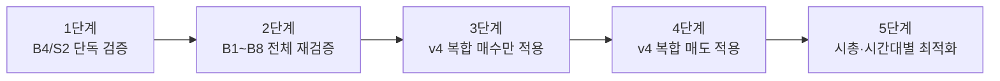

### 5.2 v4.0 조건식의 의도

| 구조 | 이유 |
|---|---|
| 전략 플래그 15개 | 짧은 시간대별 전략을 하나의 긴 복합 감시 조건으로 합치기 위해 |
| 복합점수 | 단일 조건 실패/성공보다 다중 수급 확인을 우선하기 위해 |
| 위험점수 | 허수호가, 매도수량 급증, 스프레드 확대, VI 근접 위험을 동시에 차단하기 위해 |
| 시간대 분기 | 09:00~09:02와 09:20 이후는 같은 기준을 쓰면 안 되기 때문 |
| 시총별 기준값 | 소형주는 강한 조건·짧은 손절, 대형주는 완화 조건·추세 청산이 필요하기 때문 |

---

## 6. v4.0과 이전 개별 전략의 관계

| v4.0 전략 플래그 | 기존 조건식 세트 | 권장 매도 세트 |
|---|---|---|
| 전략01_시가갭즉발지속 | B1 | S1, S4 |
| 전략02_무갭시가돌파 | B2 | S3 |
| 전략03_강갭눌림회복 | B3 | S3, S4 |
| 전략04_매도흡수후재돌파 | B3 | S2, S4 |
| 전략05_거래대금폭발고가돌파 | B4 | S2 |
| 전략06_체결강도호가동시상승 | B5 | S2 |
| 전략07_횡보후발화 | B6 | S2 |
| 전략08_라운드피겨돌파 | B7 | S5, S6 |
| 전략09_VI근접전강세 | B1/B4 제한 | S5 |
| 전략10_대형주장초추세 | B8 | S7 |
| 전략11_전일비회전율가속 | 추가 발굴 | S2 |
| 전략12_매도벽소화돌파 | B7 확장 | S6 |
| 전략13_고가권재가속 | 추가 발굴 | S2 |
| 전략14_저가방어후상승각 | 추가 발굴 | S2 |
| 전략15_종료전엄선추세 | B8 확장 | S8 |

---

## 7. v4.0 백테스트 기록표

| 날짜 | 전략버전 | 시간대 | 시총구간 | 시가갭률 | 매수사유 | 매도사유 | 매매수 | 승률 | 평균수익 | 평균손실 | 손익비 | MDD |
|---|---|---|---|---|---|---|---:|---:|---:|---:|---:|---:|
|  | v4.0 | 09:00~09:02 | 소형 | 2~6% | 01갭즉발 | 최고수익반락 |  |  |  |  |  |  |
|  | v4.0 | 09:02~09:10 | 중형 | 0~6% | 05거대폭발 | 체결강도급락 |  |  |  |  |  |  |
|  | v4.0 | 09:10~09:20 | 대형 | 0~3% | 10대형추세 | 60이평이탈 |  |  |  |  |  |  |
|  | v4.0 | 09:20~09:28 | 대형 | 0~3% | 15종료전엄선 | 시간청산 |  |  |  |  |  |  |

---


---

# Part A. 이전 전략별 조건식 전체 재수록: v3 최종 전략 보고서 원문

> 이 장은 이전 보고서의 **전략 15개, 매수 조건식 B1~B8, 매도 조건식 S1~S8, 점수형 고도화안**을 누락 없이 보존하기 위한 원문 재수록이다.


## STOM 1초 Tick DB 기반 09:00~09:30 시초 급등·시가갭·오더플로우 최종 전략 보고서

> 작성일: 2026-06-06  
> 대상 데이터: STOM 1초스냅샷 Tick DB, 09:00:00~09:30:00  
> 목적: 시초 30분 급등주 자동매매·백테스트용 조건식 고도화  
> 주의: 본 보고서는 전략 연구와 시스템 개발 목적의 예시이며, 투자 수익을 보장하지 않는다.

---

### 0. 핵심 결론

이 보고서의 결론은 단순하다.

```text
09:00~09:30 전략은 하나의 조건식으로 끝내면 안 된다.

반드시 다음 4축으로 분해해야 한다.
1. 시간대: 09:00:05~09:00:30 / 09:00:30~09:02 / 09:02~09:10 / 09:10~09:25
2. 시가갭률: 무갭 / 정상갭 / 강갭 / 과열갭
3. 시가총액: 초소형 / 소형 / 중형 / 대형
4. 오더플로우 상태: 매수공격 / 매도흡수 / 호가압력 / 세력자금이탈
```

최종적으로 다음과 같이 구성한다.

| 구성 | 최종 개수 | 역할 |
|---|---:|---|
| 최종 발굴 전략 | 15개 | 시초 30분 패턴 라이브러리 |
| 실전 매수 조건식 세트 | 8개 | STOM에 바로 넣어 테스트할 매수 블록 |
| 실전 매도 조건식 세트 | 8개 | 고점대비 하락·세력 이탈·호가붕괴 반영 |
| 통합 매매 프레임 | 1개 | 공통 파생지표 + 금지필터 + 전략 신호 조합 |

가장 먼저 백테스트할 우선순위는 다음이다.

```text
1순위: B4 거래대금 폭발 + 고가돌파형 + S2 표준 트레일링
2순위: B3 매도흡수 후 재돌파형 + S4 세력자금 이탈 청산
3순위: B2 무갭/약갭 시가돌파형 + S3 시가이탈 실패 청산
4순위: B1 시초갭 즉발형 + S1 초고속 방어 청산
5순위: B8 대형주 장초 추세형 + S7 대형주 추세 청산
```

---

### 1. 근거 요약

| 근거 | 전략 반영 |
|---|---|
| KRX KOSDAQ 자료는 정규장, 호가단위, 가격제한, 단일가/접속매매, VI 구조를 설명한다. | 09:00 첫 틱은 특수하게 보고, 09:00:05 이후 접속매매 오더플로우를 분석한다. |
| 시초가주문은 동시호가 시세대로 매매해 달라는 주문 개념이다. | 09:00:00 첫 체결은 장전 수급 결과가 섞였으므로 조건식에서 제외한다. |
| Order flow imbalance 연구는 짧은 시간 가격 변화가 최우선 bid/ask의 수급 불균형과 관련이 크다고 설명한다. | `초당매수수량`, `초당매도수량`, `매수총잔량`, `매도총잔량`, `스프레드틱`을 핵심 변수로 사용한다. |
| 시장심도는 큰 주문을 가격 충격 없이 흡수할 수 있는 능력이다. | 소형주일수록 스프레드·잔량붕괴·매도수량 급증을 강하게 필터링한다. |

---

### 2. 시초 30분 시간대 지도


| 시간대 | 성격 | 추천 전략 | 주의점 |
|---|---|---|---|
| 09:00:00~09:00:04 | 첫 틱 노이즈 | 매수 금지 | 동시호가 결과 반영, 체결강도 왜곡 가능 |
| 09:00:05~09:00:30 | 즉발 급등 | B1, B2 | 손절·트레일링 매우 짧게 |
| 09:00:30~09:02:00 | 진짜/가짜 급등 분리 | B3, B4 | 매도흡수 확인 중요 |
| 09:02~09:10 | 장초 주력 | B5, B6 | 30초 평균 사용 가능 |
| 09:10~09:20 | 2차 추세 | B7, B8 | 추격보다 눌림·재상승 선호 |
| 09:20~09:28 | 종료관리 | 대형주 제한 | 신규매수 축소 |
| 09:29 이후 | 데이터 종료 대비 | 매도 | 강제청산 |

---

### 3. 시가갭률·시총별 전략 맵

#### 3.1 시가갭률별 해석

| 시가갭률 | 해석 | 매수 난이도 | 추천 조건 |
|---:|---|---:|---|
| -3% 이하 | 갭하락 | 높음 | 반등형만 별도 연구, 본 보고서에서는 제외 |
| -3~0% | 약세 출발 | 높음 | 시가 재탈환 + 강한 매수공격 필요 |
| 0~2% | 무갭 | 중간 | 시가 돌파형 B2 |
| 2~6% | 정상 갭 | 낮음 | B1/B3/B5 모두 가능 |
| 6~12% | 강갭 | 높음 | 체결강도·매수공격비 강화 |
| 12~20% | 과열갭 | 매우 높음 | 짧은 추세만, VI 근접 회피 |
| 20% 이상 | 극과열 | 매우 높음 | 원칙적 매수 금지 권장 |

#### 3.2 시총별 파라미터 히트맵

| 시총 구분 | 체결강도 | 매수공격비_1초 | 누적매수공격비 | 거래폭발 | 스프레드 | 손절 | 트레일링 |
|---|---:|---:|---:|---:|---:|---:|---:|
| 초소형 | 170↑ | 2.2↑ | 1.6↑ | 5.0↑ | 1틱 | -0.5% | 0.3%p |
| 소형 | 155↑ | 1.8↑ | 1.35↑ | 4.0↑ | 2틱 | -0.7% | 0.4%p |
| 중형 | 135↑ | 1.5↑ | 1.2↑ | 3.0↑ | 2틱 | -0.9% | 0.6%p |
| 대형 | 115↑ | 1.2↑ | 1.05↑ | 2.0↑ | 3틱 | -1.1% | 0.8%p |

---

### 4. STOM 조건식 작성 규칙

#### 4.1 현재틱 포함 회피

나쁜 예:

```python
현재가 > 최고현재가(30)
```

권장:

```python
현재가 > 최고현재가(30, 1)
```

#### 4.2 데이터길이 가드

| 사용할 함수 | 최소 데이터길이 |
|---|---:|
| `누적초당매수수량(5)` | 6 이상 |
| `초당거래대금평균(10, 1)` | 11 이상 |
| `초당거래대금평균(30, 1)` | 31 이상 |
| `이동평균(60, 1)` | 61 이상 |

#### 4.3 호가잔량 단독 사용 금지

허수호가 위험이 있으므로 다음 단독 조건은 피한다.

```python
매수총잔량 > 매도총잔량 * 2
```

대신 아래처럼 체결과 가격을 함께 본다.

```python
매수총잔량 > 매도총잔량
and 체결강도 >= 130
and 초당매수수량 > 초당매도수량 * 1.5
and 현재가 > 최고현재가(10, 1)
```

---

### 5. 공통 파생지표 블록

아래 코드는 모든 매수·매도 조건식 상단에 넣는 공통 모듈이다.

```python
# ==================================================
# STOM 1초 Tick DB 공통 파생지표
# ==================================================

전일종가추정 = 현재가 / max(1 + 등락율 / 100, 0.01)
시가갭률 = (시가 - 전일종가추정) / max(전일종가추정, 1) * 100
시가대비현재등락율 = (현재가 - 시가) / max(시가, 1) * 100
스프레드틱 = (매도호가1 - 매수호가1) / max(호가단위, 1)

매수공격비_1초 = 초당매수수량 / max(초당매도수량, 1)
매도공격비_1초 = 초당매도수량 / max(초당매수수량, 1)
호가매수비율_현재 = 매수총잔량 / max(매수총잔량 + 매도총잔량, 1)

if 데이터길이 >= 6:
    매수공격비_5초 = 누적초당매수수량(5) / max(누적초당매도수량(5), 1)
    매도공격비_5초 = 누적초당매도수량(5) / max(누적초당매수수량(5), 1)
else:
    매수공격비_5초 = 0
    매도공격비_5초 = 0

if 데이터길이 >= 11:
    매수공격비_10초 = 누적초당매수수량(10) / max(누적초당매도수량(10), 1)
    매도공격비_10초 = 누적초당매도수량(10) / max(누적초당매수수량(10), 1)
else:
    매수공격비_10초 = 0
    매도공격비_10초 = 0

if 데이터길이 >= 31:
    거래대금폭발배수 = 초당거래대금 / max(초당거래대금평균(30, 1), 1)
    체결강도상승배수 = 체결강도 / max(체결강도평균(30, 1), 1)
elif 데이터길이 >= 11:
    거래대금폭발배수 = 초당거래대금 / max(초당거래대금평균(10, 1), 1)
    체결강도상승배수 = 체결강도 / max(체결강도평균(10, 1), 1)
elif 데이터길이 >= 6:
    거래대금폭발배수 = 초당거래대금 / max(초당거래대금평균(5, 1), 1)
    체결강도상승배수 = 체결강도 / max(체결강도평균(5, 1), 1)
else:
    거래대금폭발배수 = 0
    체결강도상승배수 = 1

초소형주 = 시가총액 < 1500
소형주 = 1500 <= 시가총액 < 5000
중형주 = 5000 <= 시가총액 < 20000
대형주 = 시가총액 >= 20000

if 초소형주:
    최소체결강도 = 170
    최소매수공격비 = 2.2
    최소누적매수공격비 = 1.6
    최소거래폭발 = 5.0
    최대스프레드틱 = 1
    최대시가갭률 = 10
elif 소형주:
    최소체결강도 = 155
    최소매수공격비 = 1.8
    최소누적매수공격비 = 1.35
    최소거래폭발 = 4.0
    최대스프레드틱 = 2
    최대시가갭률 = 12
elif 중형주:
    최소체결강도 = 135
    최소매수공격비 = 1.5
    최소누적매수공격비 = 1.2
    최소거래폭발 = 3.0
    최대스프레드틱 = 2
    최대시가갭률 = 15
else:
    최소체결강도 = 115
    최소매수공격비 = 1.2
    최소누적매수공격비 = 1.05
    최소거래폭발 = 2.0
    최대스프레드틱 = 3
    최대시가갭률 = 10
```

---

### 6. 공통 금지필터

```python
# ==================================================
# 공통 매수 금지필터
# ==================================================

금지필터 = False

if 데이터길이 < 6:
    금지필터 = True
elif 시분초 < 90005:
    금지필터 = True
elif 시분초 >= 92800:
    금지필터 = True
elif 관심종목 != 1:
    금지필터 = True
elif 당일거래대금 < 30:
    금지필터 = True
elif not (-2 <= 등락율 <= 25):
    금지필터 = True
elif 스프레드틱 > 최대스프레드틱:
    금지필터 = True
elif 호가갭발생(3):
    금지필터 = True
elif 시가갭률 > 최대시가갭률:
    금지필터 = True
elif 시분초 <= 90200 and 현재가 < 시가 - 호가단위 * 2:
    금지필터 = True
elif 초당매도수량 > 초당매수수량 * 2:
    금지필터 = True
elif 데이터길이 >= 6 and 누적초당매도수량(5) > 누적초당매수수량(5) * 1.8:
    금지필터 = True
elif 매수총잔량 < 매수총잔량N(1) * 0.65:
    금지필터 = True
elif 매수총잔량 > 매도총잔량 * 2 and 체결강도 < 110:
    금지필터 = True
elif 최고매도금액 > 최고매수금액 * 1.5 and 체결강도 < 100:
    금지필터 = True
elif VI가격 > 0 and 현재가 >= VI가격 - VI호가단위 * 3 and 체결강도 < 150:
    금지필터 = True
elif 라운드피겨위5호가이내 and 초당매도수량 > 초당매수수량:
    금지필터 = True
```

---

### 7. 추가 발굴 전략 15개

| 번호 | 전략명 | 시간 | 핵심 신호 | 권장 매수세트 | 권장 매도세트 |
|---:|---|---|---|---|---|
| 1 | 시가갭 즉발 지속형 | 09:00:05~09:00:30 | 갭 2~12%, 시가 위, 5초 매수공격 | B1 | S1 |
| 2 | 무갭 시가 돌파형 | 09:00:05~09:02 | 갭 -1~6%, 시가대비 +0.6%, 5초 고가돌파 | B2 | S3 |
| 3 | 강갭 눌림 회복형 | 09:00:20~09:02 | 강갭 후 시가 방어, 저점 3호가 회복 | B3 | S3 |
| 4 | 매도흡수 후 재돌파형 | 09:00:30~09:05 | 매도물량 출회 후 10초 고가 재돌파 | B3 | S4 |
| 5 | 거래대금 폭발 고가돌파형 | 09:02~09:10 | 30초 평균 3배, 직전고가 돌파 | B4 | S2 |
| 6 | 체결강도·호가상승압력 동시형 | 09:02~09:15 | 체결강도급등 + 구간호가비율 상승 | B5 | S2 |
| 7 | 횡보 후 발화형 | 09:05~09:20 | 횡보감지 후 거래대금급증 | B6 | S2 |
| 8 | 라운드피겨 돌파형 | 09:02~09:15 | 심리 가격대 부근 돌파, 매도우위 회피 | B7 | S5 |
| 9 | 매도벽 소화형 | 09:00:30~09:10 | 매도잔량1 급감 + 현재가 상승 | B7 | S6 |
| 10 | VI 근접 전 급등 제한형 | 09:00~09:20 | VI 근처 체결강도 유지 시만 허용 | B1/B4 | S5 |
| 11 | 시가 이탈 후 재탈환형 | 09:00:30~09:05 | 시가 이탈 후 재돌파, 매수공격 회복 | B3 | S3 |
| 12 | 저가갱신 후 급반등형 | 09:01~09:10 | 저가갱신 후 가격급등 | B6 | S3 |
| 13 | 관심종목 거래대금각도형 | 09:02~09:15 | 관심종목 + 거래대금각도 상승 | B4 | S2 |
| 14 | 대형주 장초 추세형 | 09:05~09:25 | 60초 이평 위, 30초 누적 매수우위 | B8 | S7 |
| 15 | 고가미갱신 위험회피형 | 매도 전용 | 급등 후 고가미갱신 + 체결강도 약화 | - | S4 |

---

## 8. 매수 조건식 8세트

### B1. 09:00:05~09:00:30 시가갭 즉발 지속형

```python
매수 = False

if not 금지필터:
    if 90005 <= 시분초 <= 90030:
        if 2 <= 시가갭률 <= 최대시가갭률:
            if 현재가 >= 시가 + 호가단위 * 2:
                if 현재가 > 현재가N(1) or 현재가 >= 고가:
                    if 체결강도 >= 최소체결강도:
                        if 매수공격비_1초 >= 최소매수공격비:
                            if 매수공격비_5초 >= 최소누적매수공격비:
                                if 거래대금폭발배수 >= 최소거래폭발 * 0.7:
                                    if 호가매수비율_현재 >= 0.45:
                                        if 매수총잔량 >= 매수총잔량N(1) * 0.7:
                                            매수 = True

if 매수:
    self.Buy()
```

### B2. 09:00:05~09:02 무갭·약갭 시가 돌파형

```python
매수 = False

if not 금지필터:
    if 데이터길이 >= 7:
        if 90005 <= 시분초 <= 90200:
            if -1 <= 시가갭률 <= 6:
                if 시가대비현재등락율 >= 0.6:
                    if 현재가 >= 시가 + 호가단위 * 2:
                        if 현재가 > 최고현재가(5, 1):
                            if 연속상승(3) or 가격급등(5, 0.5):
                                if 체결강도 >= 최소체결강도 - 10:
                                    if 체결강도상승배수 >= 1.05:
                                        if 매수공격비_1초 >= 최소매수공격비:
                                            if 매수공격비_5초 >= 최소누적매수공격비:
                                                if 거래대금폭발배수 >= 최소거래폭발 * 0.6:
                                                    매수 = True

if 매수:
    self.Buy()
```

### B3. 09:00:30~09:05 매도흡수 후 재돌파형

```python
매수 = False

if not 금지필터:
    if 데이터길이 >= 31:
        if 90030 <= 시분초 <= 90500:
            if 1 <= 등락율 <= 18:
                if 누적초당매도수량(10) >= 누적초당매수수량(10) * 0.8:
                    if 현재가 >= 시가 - 호가단위 * 2:
                        if 현재가 >= 최저현재가(10) + 호가단위 * 3:
                            if 현재가 > 최고현재가(10, 1):
                                if 매수공격비_1초 >= 최소매수공격비:
                                    if 체결강도 >= 최소체결강도 - 10:
                                        if 체결강도 >= 체결강도평균(10, 1):
                                            if 초당거래대금 >= 초당거래대금평균(10, 1) * 2:
                                                if not 호가하락압력(10, 0.35):
                                                    매수 = True

if 매수:
    self.Buy()
```

### B4. 09:02~09:10 거래대금 폭발 + 고가돌파형

```python
매수 = False

if not 금지필터:
    if 데이터길이 >= 61:
        if 90200 <= 시분초 <= 91000:
            if 2 <= 등락율 <= 20:
                if 현재가 > 최고현재가(30, 1):
                    if 현재가 > 이동평균(20, 1):
                        if 초당거래대금 >= 초당거래대금평균(30, 1) * 3:
                            if 당일거래대금각도(30) >= 8:
                                if 체결강도 >= 최소체결강도 - 5:
                                    if 체결강도 >= 체결강도평균(30, 1) * 1.1:
                                        if 초당매수수량 >= 초당매도수량 * 최소매수공격비:
                                            if 누적초당매수수량(10) >= 누적초당매도수량(10) * 최소누적매수공격비:
                                                if 구간호가총잔량비율(30) >= 0.52:
                                                    매수 = True

if 매수:
    self.Buy()
```

### B5. 체결강도 급등 + 호가상승압력 동시형

```python
매수 = False

if not 금지필터:
    if 데이터길이 >= 61:
        if 90200 <= 시분초 <= 91500:
            if 2 <= 등락율 <= 18:
                if 현재가 > 이동평균(20, 1):
                    if 현재가 > 최고현재가(20, 1):
                        if 체결강도급등(30, 1.1):
                            if 체결강도 >= 최소체결강도:
                                if 호가상승압력(30, 0.6):
                                    if 초당거래대금 >= 초당거래대금평균(30, 1) * 2.5:
                                        if 초당매수수량 >= 초당매도수량 * 최소매수공격비:
                                            if 매수수량급증(30, 2):
                                                매수 = True

if 매수:
    self.Buy()
```

### B6. 횡보 후 발화형

```python
매수 = False

if not 금지필터:
    if 데이터길이 >= 91:
        if 90500 <= 시분초 <= 92000:
            if 1 <= 등락율 <= 15:
                if 횡보감지(30, 0.5):
                    if 거래대금급증및구간최고가갱신(30, 3):
                        if 체결강도급등(30, 1.1):
                            if 현재가 > 이동평균(20, 1):
                                if 초당매수수량 >= 초당매도수량 * max(1.3, 최소매수공격비 - 0.2):
                                    if 구간호가총잔량비율(30) >= 0.5:
                                        매수 = True

if 매수:
    self.Buy()
```

### B7. 라운드피겨·매도벽 소화 돌파형

```python
매수 = False

if not 금지필터:
    if 데이터길이 >= 31:
        if 90200 <= 시분초 <= 91500:
            if 2 <= 등락율 <= 18:
                if 라운드피겨위5호가이내:
                    if 현재가 > 최고현재가(10, 1):
                        if 초당매수수량 >= 초당매도수량 * 최소매수공격비:
                            if 체결강도 >= 최소체결강도:
                                if 매도잔량1 < 매도잔량1N(1) * 0.6:
                                    if 현재가 >= 매도호가1N(1):
                                        if 스프레드틱 <= 최대스프레드틱:
                                            매수 = True

if 매수:
    self.Buy()
```

### B8. 대형주 장초 추세형

```python
매수 = False

if not 금지필터:
    if 데이터길이 >= 91:
        if 90500 <= 시분초 <= 92500:
            if 시가총액 >= 20000:
                if 1 <= 등락율 <= 10:
                    if 현재가 > 이동평균(60, 1):
                        if 현재가 > 최고현재가(30, 1):
                            if 초당거래대금 >= 초당거래대금평균(30, 1) * 1.8:
                                if 체결강도 >= 110:
                                    if 누적초당매수수량(30) >= 누적초당매도수량(30) * 1.05:
                                        if 구간호가총잔량비율(30) >= 0.48:
                                            if 스프레드틱 <= 3:
                                                매수 = True

if 매수:
    self.Buy()
```

---

## 9. 매도 조건식 8세트

### S1. 시초 초고속 방어형

```python
매도 = False

if 시가총액 < 5000:
    손절률 = -0.6
    익절률 = 1.2
    트레일링시작 = 0.8
    트레일링폭 = 0.3
    최대보유시간 = 60
else:
    손절률 = -0.9
    익절률 = 1.6
    트레일링시작 = 1.0
    트레일링폭 = 0.5
    최대보유시간 = 90

if 시분초 >= 92900:
    매도 = True
elif 수익률 <= 손절률:
    매도 = True
elif 수익률 >= 익절률:
    매도 = True
elif 최고수익률 >= 트레일링시작 and 수익률 <= 최고수익률 - 트레일링폭:
    매도 = True
elif 시분초 <= 90200 and 현재가 < 시가 - 호가단위 * 2:
    매도 = True
elif 데이터길이 >= 6 and 매도공격비_5초 >= 1.4:
    매도 = True
elif 초당매도수량 > 초당매수수량 * 1.5:
    매도 = True
elif 매수총잔량 < 매수총잔량N(1) * 0.65 and 현재가 <= 현재가N(1):
    매도 = True
elif 보유시간 >= 최대보유시간:
    매도 = True

if 매도:
    self.Sell()
```

### S2. 표준 트레일링 + 오더플로우 약화형

```python
매도 = False

if 시가총액 < 5000:
    손절률 = -0.8
    익절률 = 1.6
    트레일링시작 = 1.0
    트레일링폭 = 0.4
    최대보유시간 = 120
    매도수량배수 = 1.3
elif 시가총액 < 20000:
    손절률 = -1.0
    익절률 = 2.0
    트레일링시작 = 1.2
    트레일링폭 = 0.6
    최대보유시간 = 180
    매도수량배수 = 1.5
else:
    손절률 = -1.2
    익절률 = 2.3
    트레일링시작 = 1.5
    트레일링폭 = 0.8
    최대보유시간 = 240
    매도수량배수 = 1.7

if 시분초 >= 92900:
    매도 = True
elif 수익률 <= 손절률:
    매도 = True
elif 수익률 >= 익절률:
    매도 = True
elif 최고수익률 >= 트레일링시작 and 수익률 <= 최고수익률 - 트레일링폭:
    매도 = True
elif 데이터길이 >= 31 and 구간고가대비현재가등락율(30) <= -0.8:
    매도 = True
elif 최고수익률 >= 1.2 and 고가미갱신지속틱수() >= 15 and 체결강도 < 체결강도평균(30, 1):
    매도 = True
elif 체결강도급락(30, 0.9) and 체결강도 < 체결강도평균(30, 1):
    매도 = True
elif 초당매도수량 > 초당매수수량 * 매도수량배수:
    매도 = True
elif 누적초당매도수량(10) > 누적초당매수수량(10) * 매도수량배수:
    매도 = True
elif 호가하락압력(30, 0.35):
    매도 = True
elif 보유시간 >= 최대보유시간:
    매도 = True

if 매도:
    self.Sell()
```

### S3. 시가 이탈·흡수 실패 청산형

```python
매도 = False

if 시가총액 < 5000:
    손절률 = -0.7
    트레일링폭 = 0.4
    최대보유시간 = 90
else:
    손절률 = -0.9
    트레일링폭 = 0.6
    최대보유시간 = 150

if 시분초 >= 92900:
    매도 = True
elif 수익률 <= 손절률:
    매도 = True
elif 시분초 <= 90500 and 현재가 < 시가 - 호가단위:
    매도 = True
elif 데이터길이 >= 11 and 현재가 < 최저현재가(10, 1):
    매도 = True
elif 최고수익률 >= 1.0 and 수익률 <= 최고수익률 - 트레일링폭:
    매도 = True
elif 데이터길이 >= 11 and 누적초당매도수량(10) > 누적초당매수수량(10) * 1.4 and 현재가 < 현재가N(1):
    매도 = True
elif 데이터길이 >= 11 and 체결강도 < 체결강도평균(10, 1) * 0.85:
    매도 = True
elif 데이터길이 >= 11 and 초당거래대금 >= 초당거래대금평균(10, 1) * 3 and 현재가 < 현재가N(1):
    매도 = True
elif 보유시간 >= 최대보유시간:
    매도 = True

if 매도:
    self.Sell()
```

### S4. 세력자금 이탈 감지형

```python
매도 = False
세력이탈 = False

if 최고수익률 >= 1.5 and 수익률 <= 최고수익률 - 0.7:
    세력이탈 = True
elif 시가총액 < 5000 and 최고수익률 >= 1.0 and 수익률 <= 최고수익률 - 0.4:
    세력이탈 = True
elif 데이터길이 >= 11 and 최고수익률 >= 1.2 and 고가미갱신지속틱수() >= 10 and 체결강도 < 체결강도평균(10, 1):
    세력이탈 = True
elif 데이터길이 >= 11 and 초당거래대금 >= 초당거래대금평균(10, 1) * 3 and 현재가 < 현재가N(1) and 초당매도수량 > 초당매수수량:
    세력이탈 = True
elif 데이터길이 >= 6 and 누적초당매도수량(5) > 누적초당매수수량(5) * 1.5:
    세력이탈 = True
elif 데이터길이 >= 11 and 누적초당매도수량(10) > 누적초당매수수량(10) * 1.5:
    세력이탈 = True
elif 최고매도금액 > 최고매수금액 * 1.5 and 체결강도 < 100:
    세력이탈 = True
elif 데이터길이 >= 11 and 호가하락압력(10, 0.35) and 매수총잔량 < 매수총잔량N(1) * 0.7:
    세력이탈 = True
elif 시분초 <= 90200 and 현재가 < 시가 - 호가단위 * 2:
    세력이탈 = True

if 세력이탈:
    매도 = True

if 매도:
    self.Sell()
```

### S5. 라운드피겨·VI·호가붕괴 위험 청산형

```python
매도 = False

if 시분초 >= 92900:
    매도 = True
elif 수익률 <= -0.8:
    매도 = True
elif VI가격 > 0 and 현재가 >= VI가격 - VI호가단위 * 3 and 체결강도 < 140:
    매도 = True
elif 라운드피겨위5호가이내 and 초당매도수량 > 초당매수수량 * 1.2:
    매도 = True
elif 라운드피겨위5호가이내 and 고가미갱신지속틱수() >= 10:
    매도 = True
elif 최고매도금액 > 최고매수금액 * 1.5 and 체결강도 < 100:
    매도 = True
elif 매수총잔량 < 매수총잔량N(1) * 0.65 and 현재가 <= 현재가N(1):
    매도 = True
elif 데이터길이 >= 11 and 호가하락압력(10, 0.35):
    매도 = True
elif 최고수익률 >= 1.0 and 수익률 <= 최고수익률 - 0.4:
    매도 = True
elif 보유시간 >= 90:
    매도 = True

if 매도:
    self.Sell()
```

### S6. 매도벽·최고매도금액 우위 청산형

```python
매도 = False

if 시분초 >= 92900:
    매도 = True
elif 수익률 <= -0.9:
    매도 = True
elif 최고매도금액 > 최고매수금액 * 1.3 and 현재가 <= 최고매도가격:
    매도 = True
elif 최고매도금액 > 최고매수금액 * 1.5 and 체결강도 < 100:
    매도 = True
elif 매도잔량1 > 매도잔량1N(1) * 1.8 and 현재가 <= 현재가N(1):
    매도 = True
elif 데이터길이 >= 11 and 초당거래대금 >= 초당거래대금평균(10, 1) * 3 and 현재가 < 현재가N(1) and 초당매도수량 > 초당매수수량:
    매도 = True
elif 최고수익률 >= 1.2 and 수익률 <= 최고수익률 - 0.5:
    매도 = True
elif 데이터길이 >= 11 and 현재가 < 최저현재가(10, 1):
    매도 = True

if 매도:
    self.Sell()
```

### S7. 대형주 장초 추세 청산형

```python
매도 = False

if 시분초 >= 92900:
    매도 = True
elif 수익률 <= -1.2:
    매도 = True
elif 수익률 >= 2.5:
    매도 = True
elif 최고수익률 >= 1.5 and 수익률 <= 최고수익률 - 0.8:
    매도 = True
elif 데이터길이 >= 61 and 현재가 < 이동평균(60, 1):
    매도 = True
elif 데이터길이 >= 31 and 누적초당매도수량(30) > 누적초당매수수량(30) * 1.3:
    매도 = True
elif 데이터길이 >= 31 and 초당거래대금 >= 초당거래대금평균(30, 1) * 2.5 and 현재가 < 현재가N(1):
    매도 = True
elif 데이터길이 >= 31 and 호가하락압력(30, 0.4):
    매도 = True
elif 보유시간 >= 240:
    매도 = True

if 매도:
    self.Sell()
```

### S8. 종료관리·강제청산형

```python
매도 = False

# 09:28 이후에는 수익 구간을 짧게 보호
if 92800 <= 시분초 < 92900:
    if 수익률 >= 0.5:
        매도 = True
    elif 최고수익률 >= 1.0 and 수익률 <= 최고수익률 - 0.3:
        매도 = True
    elif 수익률 <= -0.5:
        매도 = True

# 09:29 이후 강제청산
elif 시분초 >= 92900:
    매도 = True

if 매도:
    self.Sell()
```

---

### 10. 전략별 최종 조합표

| 전략 | 매수세트 | 매도세트 | 보조 매도 | 추천 대상 |
|---:|---|---|---|---|
| 1 | B1 | S1 | S5 | 소형·중형, 갭 2~12% |
| 2 | B2 | S3 | S4 | 중형, 갭 -1~6% |
| 3 | B3 | S3 | S4 | 강갭 눌림 회복 |
| 4 | B3 | S2 | S4 | 매도흡수 후 재돌파 |
| 5 | B4 | S2 | S4 | 표준 장초 돌파 |
| 6 | B5 | S2 | S6 | 체결강도+호가압력 |
| 7 | B6 | S2 | S3 | 횡보 후 발화 |
| 8 | B7 | S5 | S6 | 라운드피겨/매도벽 소화 |
| 9 | B1/B4 제한 | S5 | S4 | VI 근접 급등주 |
| 10 | B8 | S7 | S8 | 대형주 장초 추세 |

---

### 11. 고도화 포인트: AND 조건식에서 점수형 조건식으로

전략이 너무 엄격하면 매매가 거의 없고, 너무 느슨하면 허수 급등에 당한다. 최종 운영에서는 아래처럼 `게이트 + 점수` 방식을 추천한다.

```python
# ==================================================
# 점수형 매수 판단 예시
# ==================================================

매수 = False
점수 = 0

# 게이트 조건: 이 조건을 통과하지 못하면 점수와 무관하게 금지
게이트통과 = True

if 금지필터:
    게이트통과 = False
elif 스프레드틱 > 최대스프레드틱:
    게이트통과 = False
elif 시분초 >= 92800:
    게이트통과 = False

if 게이트통과:
    if 현재가 > 최고현재가(10, 1):
        점수 += 1
    if 체결강도 >= 최소체결강도:
        점수 += 1
    if 매수공격비_1초 >= 최소매수공격비:
        점수 += 1
    if 매수공격비_5초 >= 최소누적매수공격비:
        점수 += 1
    if 거래대금폭발배수 >= 최소거래폭발:
        점수 += 1
    if 호가매수비율_현재 >= 0.45:
        점수 += 1
    if 매수총잔량 >= 매수총잔량N(1) * 0.8:
        점수 += 1

if 게이트통과 and 점수 >= 5:
    매수 = True

if 매수:
    self.Buy()
```

---

### 12. 백테스트 리포트 양식

| 전략 | 매수세트 | 매도세트 | 시총 | 갭률 | 시간대 | 매매수 | 승률 | 평균수익 | 평균손실 | 손익비 | MDD | 비고 |
|---|---|---|---|---|---|---:|---:|---:|---:|---:|---:|---|
| 전략 1 | B1 | S1 | 소형 | 2~6% | 09:00:05~09:00:30 |  |  |  |  |  |  |  |
| 전략 2 | B2 | S3 | 중형 | 0~2% | 09:00:05~09:02 |  |  |  |  |  |  |  |
| 전략 4 | B3 | S4 | 중형 | 2~12% | 09:00:30~09:05 |  |  |  |  |  |  |  |
| 전략 5 | B4 | S2 | 중형 | 0~15% | 09:02~09:10 |  |  |  |  |  |  |  |
| 전략 10 | B8 | S7 | 대형 | 0~8% | 09:05~09:25 |  |  |  |  |  |  |  |

---

### 13. 최종 운용 순서

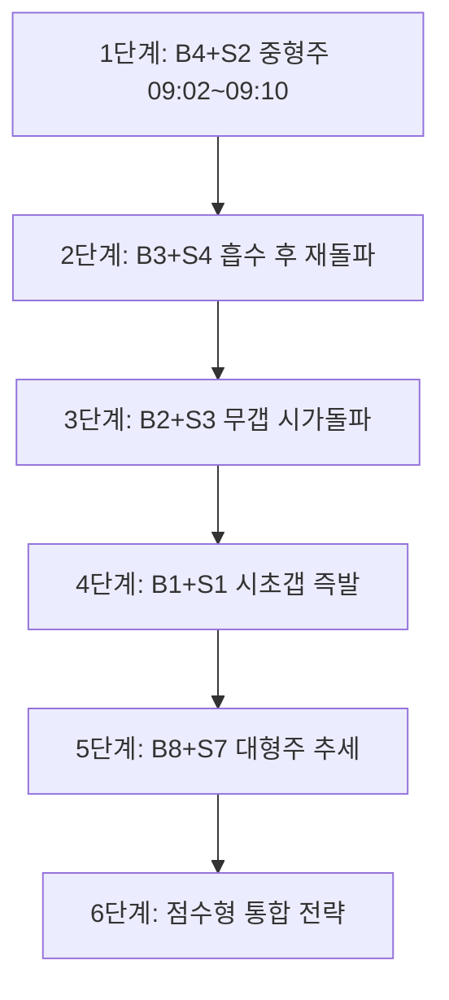

---

### 14. 실행 전 확인 체크리스트

| 체크 | 내용 |
|---|---|
| 시가총액 단위 | 본 보고서는 억 원 단위 가정. STOM DB 단위를 반드시 확인. |
| 당일거래대금 단위 | 기존 예제에서 `당일거래대금 >= 100` 사용. 실제 단위에 맞게 30/50/100 조정. |
| `max()` 사용 가능 여부 | STOM 전략 엔진이 Python built-in을 허용하는지 확인. 불가하면 분모가 0일 때 직접 분기 처리. |
| 첫 틱 처리 | 09:00:00~09:00:04 매수 금지 유지. |
| 09:29 청산 | 09:30 이후 데이터가 없으므로 강제청산 필수. |
| 수수료·세금·슬리피지 | 초단타는 비용 반영 전 수익률이 좋아도 실전에서 무너질 수 있음. |

---

### 15. 참고자료

1. KRX, *Introduction to KOSDAQ Market*, KOSDAQ Market Trading section. 정규장, 호가단위, 가격제한, 단일가/접속매매, VI 개념 확인.  
   URL: https://global.krx.co.kr/contents/GLB/02/0201/0201010304/kosdaq_brochure.pdf
2. KB Think, “시초가주문”. 시초가주문은 동시호가 시세대로 매매해 달라는 주문이라고 설명.  
   URL: https://kbthink.com/dictionary/view.html?dictId=KED-00001417
3. Rama Cont, Arseniy Kukanov, Sasha Stoikov, “The Price Impact of Order Book Events”, arXiv:1011.6402. 단기 가격 변화와 order flow imbalance의 관계 설명.  
   URL: https://arxiv.org/abs/1011.6402
4. Investopedia, “Market Depth Explained”. 시장심도는 큰 주문을 가격 충격 없이 흡수하는 능력이며, 호가장·스프레드·잔량 분석에 활용된다고 설명.  
   URL: https://www.investopedia.com/terms/m/marketdepth.asp

---

### 16. 최종 결론

최종 조건식은 다음 방향으로 운용한다.

```text
매수:
시초 5초 이후
+ 시가갭률/시가대비현재등락율 확인
+ 현재가가 직전 고가 또는 시가를 돌파
+ 초당매수수량과 5~10초 누적 매수수량 우위
+ 체결강도 절대값과 평균 대비 상승
+ 거래대금 폭발
+ 스프레드 안정
+ 매수잔량 붕괴 없음

매도:
고정 손절
+ 최고수익률 대비 하락
+ 최근 고점 대비 하락
+ 고가 미갱신 지속
+ 체결강도 붕괴
+ 초당매도수량/누적매도수량 급증
+ 최고매도금액 우위
+ 호가하락압력
+ 매수잔량 붕괴
+ 09:29 강제청산
```

가장 중요한 원칙은 다음이다.

> 시초 2분 급등주는 빨리 사는 것보다, 가짜 급등·허수호가·세력 이탈을 더 빨리 감지하는 것이 수익률을 좌우한다.

---

# Part B. 복합 전략 v3.2 원문 재수록

> 이 장은 v3.2에서 작성했던 복합 전략 내용을 보존한다. v4.0은 이 장을 대체하는 것이 아니라, 이 장을 기반으로 더 긴 시간 커버리지와 기존 개별 조건식 보존을 추가한 버전이다.

## STOM 1초 Tick DB 09:00~09:30 복합 오더플로우 전략 고도화 보고서 v3.2

> 작성일: 2026-06-07  
> 입력 DB: `strategy.db`  
> 확인한 DB 구조: `stockbuy` 88개, `stocksell` 36개 전략 코드 보유  
> 핵심 업데이트: 기존 10개 전략을 **09:00~09:30 전체 커버형 복합 전략 1개**로 통합하고, 첨부 DB와 유사한 `if not ... elif not ... else/elif` 조건식 포맷으로 재작성

---

### 1. 이번 업데이트의 핵심 결론

기존 보고서의 전략은 시간대별로 잘게 나뉘어 있었지만, 실전 운용에서는 09:00~09:30 전체를 계속 감시하면서 조건이 맞는 순간 진입해야 합니다. 따라서 이번 버전은 다음 구조로 변경했습니다.

```text
기존 구조
전략 A, B, C, D를 따로 실행
→ 시간대별 코드가 분산됨
→ 09:00~09:30 전체 커버가 약함

개선 구조
공통 파생변수
+ 시가총액별 파라미터
+ 리스크 점수
+ 12개 전략 플래그
+ 복합점수
= 최종 매수 조건식 1개

공통 파생변수
+ 시가총액별 매도 파라미터
+ 세력이탈점수
+ 가격/호가/체결 이탈
= 최종 매도 조건식 1개
```

핵심은 **단일 조건식 안에서 여러 전략을 동시에 평가**하는 것입니다.

| 개선 항목 | 기존 | 개선 |
|---|---|---|
| 시간 범위 | 전략별 짧은 시간 | 09:00:05~09:28 전체 감시 |
| 조건식 구조 | 중첩 if 많음 | DB와 유사한 순차 필터형 |
| 매수 판단 | 단일 조건 위주 | 12개 전략 플래그 + 복합점수 |
| 매도 판단 | 손절/익절 중심 | 최고수익률 대비 하락 + 세력이탈점수 |
| 시가총액 반영 | 일부 반영 | 초소형/소형/중형/대형 파라미터 분리 |
| 오더플로우 반영 | 체결강도·수량 중심 | 호가소화강도·잔량붕괴·매도금액 우위 추가 |

---

### 2. 첨부 DB 조건식 포맷 반영 사항

첨부한 `strategy.db`를 확인한 결과, `stockbuy`, `stocksell` 테이블의 조건식은 대체로 다음 형태였습니다.

```python
매수 = False

if not (조건1):
    매수 = False
elif not (조건2):
    매수 = False
elif not (조건3):
    매수 = False
else:
    매수 = True

if 매수:
    self.Buy(...)
```

매도식도 비슷하게 다음 구조가 많았습니다.

```python
매도 = False

if 수익률 >= 목표:
    매도 = True
elif 수익률 <= 손절:
    매도 = True
elif 체결강도 약화:
    매도 = True

if 매도:
    self.Sell(...)
```

이번 최종 조건식은 이 포맷을 최대한 유지했습니다.  
다만 복합 전략을 구현해야 하므로, 중간에 `전략_...` 플래그와 `복합점수`, `세력이탈점수`를 계산한 뒤 마지막 판단부를 순차형으로 작성했습니다.

---

### 3. 09:00~09:30 통합 전략 구조

#### 3.1 전체 흐름

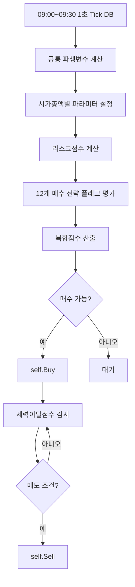

#### 3.2 시간대별 전략 커버

| 시간대 | 기존 해석 | 이번 통합 조건식에서의 역할 |
|---|---|---|
| 09:00:00~09:00:04 | 동시호가 잔상/노이즈 | 신규 매수 금지 |
| 09:00:05~09:02:00 | 시가갭·시가돌파·초급등 | `시가갭급등지속`, `무갭시가돌파`, `상단호가소화돌파` |
| 09:02:00~09:10:00 | 장초 주력 돌파 | `거래대금폭발고가돌파`, `체결강도호가상승압력` |
| 09:10:00~09:20:00 | 2차 상승/흡수/눌림 | `매도흡수후재돌파`, `저점방어2차상승`, `눌림후재상승` |
| 09:20:00~09:28:00 | 보수적 진입 | `대형주장초추세`, `눌림후재상승`만 유리 |
| 09:28:00~09:29:00 | 신규매수 금지 | 보유 종목만 관리 |
| 09:29:00 이후 | 데이터 종료 리스크 | 강제청산 |

---

### 4. 추가 발굴 전략 12개

이번 버전은 기존 10개 전략에 다음 개념을 추가·통합했습니다.

| 번호 | 전략 플래그 | 핵심 시간 | 핵심 원리 | 위험 회피 |
|---:|---|---|---|---|
| 1 | `전략_시가갭급등지속` | 09:00:05~09:05 | 갭상승 후 시가 위 매수세 지속 | 시가 이탈, 매도수량 급증 |
| 2 | `전략_무갭시가돌파` | 09:00:05~09:10 | 갭이 작아도 시가를 강하게 돌파 | 5초 저가 이탈 |
| 3 | `전략_매도흡수후재돌파` | 09:00:30~09:15 | 매도물량이 나왔는데 가격 방어 후 재돌파 | 호가하락압력 |
| 4 | `전략_거래대금폭발고가돌파` | 09:02~09:20 | 30초 평균 대비 거래대금 폭발 + 고가 돌파 | 고점대비 하락 |
| 5 | `전략_체결강도호가상승압력` | 09:02~09:20 | 체결강도 급등 + 매수호가 압력 | 허수호가 |
| 6 | `전략_눌림후재상승` | 09:05~09:28 | 이동평균 위 눌림 후 단기 고가 재돌파 | 이평 이탈 |
| 7 | `전략_상단호가소화돌파` | 09:00:05~09:20 | 매도 1~2호가 물량을 실제 매수수량이 소화 | 상단 매도벽 미소화 |
| 8 | `전략_라운드피겨강돌파` | 09:00:05~09:15 | 라운드피겨 근처 매물대를 강체결로 돌파 | 매도 우위 라운드피겨 회피 |
| 9 | `전략_VI근접강세지속` | 09:00:05~09:20 | VI 근접 전 강한 체결 지속 | VI 3호가 이내 약체결 회피 |
| 10 | `전략_대형주장초추세` | 09:05~09:28 | 대형주는 거래대금 지속성과 60초 이평 위 추세 | 체결강도 과도 조건 완화 |
| 11 | `전략_저점방어2차상승` | 09:02~09:20 | 저점 미갱신 지속 후 2차 고가 돌파 | 재하락 시 빠른 청산 |
| 12 | `전략_전일동시간비폭발` | 09:02~09:20 | 전일 동시간 대비 거래량 폭발 + 순매수금액 | 일회성 거래대금 제외 |

---

### 5. 오더플로우 고도화 지표

아래 지표들은 STOM 1초 Tick DB 변수만으로 만들 수 있습니다.

| 지표 | 계산 | 해석 |
|---|---|---|
| `매수공격비_1초` | `초당매수수량 / 초당매도수량` | 현재 1초 공격적 매수 우위 |
| `매수공격비_5초` | `누적초당매수수량(5) / 누적초당매도수량(5)` | 초단기 매수세 지속성 |
| `매도공격비_10초` | `누적초당매도수량(10) / 누적초당매수수량(10)` | 세력 이탈/투매 감지 |
| `호가매수비율` | `매수총잔량 / 전체총잔량` | 호가상 지지력 |
| `상단호가소화강도` | `초당매수수량 / (매도잔량1+매도잔량2)` | 매도벽 소화 여부 |
| `매수잔량붕괴율` | `전틱 매수총잔량 대비 감소율` | 지지 붕괴·허수호가 이탈 |
| `거래대금폭발배수` | `초당거래대금 / 기준평균` | 순간 자금 유입 |
| `체결강도상승배수` | `체결강도 / 기준평균` | 매수 체결 우위 강화 |
| `세력이탈점수` | 매도수량·고점이탈·호가붕괴 조합 | 급등 자금 이탈 추정 |
| `복합점수` | 12개 전략 + 보조점수 | 최종 진입 강도 |

---

### 6. 최종 복합 매수 조건식

> 아래 코드는 **STOM 1초스냅샷 매수전략**에 그대로 옮겨 테스트할 수 있도록 작성했습니다.  
> 첨부 DB와 유사하게 `파생변수 → 파라미터 → 전략 플래그 → 최종 순차 필터` 구조입니다.

```python
# =============================================================================
# STOM 1초 Tick DB 09:00~09:30 복합 오더플로우 매수 조건식 v3.2
# 작성 포맷: strategy.db의 stockbuy 유사 포맷
# 목적: 시가갭, 시가돌파, 매도흡수, 거래대금폭발, 눌림재상승, 대형주추세를 하나로 통합
# =============================================================================

# -----------------------------------------------------------------------------
# 1. 공통 파생변수
# -----------------------------------------------------------------------------

전일종가 = 현재가 / (1 + (등락율 / 100)) if (1 + (등락율 / 100)) != 0 else 현재가
시가등락율 = ((시가 - 전일종가) / 전일종가) * 100 if 전일종가 != 0 else 0
시가대비등락율 = ((현재가 - 시가) / 시가) * 100 if 시가 != 0 else 0

스프레드틱 = (매도호가1 - 매수호가1) / 호가단위 if 호가단위 != 0 else 99

초당순매수수량 = 초당매수수량 - 초당매도수량
초당순매수금액 = 초당순매수수량 * 현재가 / 1_000_000

매수공격비_1초 = 초당매수수량 / 초당매도수량 if 초당매도수량 != 0 else 초당매수수량
매도공격비_1초 = 초당매도수량 / 초당매수수량 if 초당매수수량 != 0 else 초당매도수량

호가매수비율 = 매수총잔량 / (매수총잔량 + 매도총잔량) if (매수총잔량 + 매도총잔량) != 0 else 0.5
호가압력지수 = (매수총잔량 - 매도총잔량) / (매수총잔량 + 매도총잔량) * 100 if (매수총잔량 + 매도총잔량) != 0 else 0

상단2호가매도잔량 = 매도잔량1 + 매도잔량2
하단2호가매수잔량 = 매수잔량1 + 매수잔량2
상단호가소화강도 = 초당매수수량 / 상단2호가매도잔량 if 상단2호가매도잔량 != 0 else 초당매수수량
하단호가지지강도 = 하단2호가매수잔량 / 상단2호가매도잔량 if 상단2호가매도잔량 != 0 else 하단2호가매수잔량

매수잔량증가율 = ((매수총잔량 - 매수총잔량N(1)) / 매수총잔량N(1)) * 100 if 데이터길이 >= 2 and 매수총잔량N(1) != 0 else 0
매도잔량증가율 = ((매도총잔량 - 매도총잔량N(1)) / 매도총잔량N(1)) * 100 if 데이터길이 >= 2 and 매도총잔량N(1) != 0 else 0
거래대금증가율_1초 = ((초당거래대금 - 초당거래대금N(1)) / 초당거래대금N(1)) * 100 if 데이터길이 >= 2 and 초당거래대금N(1) != 0 else 0
체결강도증가율_1초 = ((체결강도 - 체결강도N(1)) / 체결강도N(1)) * 100 if 데이터길이 >= 2 and 체결강도N(1) != 0 else 0

if 데이터길이 >= 6:
    매수공격비_5초 = 누적초당매수수량(5) / 누적초당매도수량(5) if 누적초당매도수량(5) != 0 else 누적초당매수수량(5)
    매도공격비_5초 = 누적초당매도수량(5) / 누적초당매수수량(5) if 누적초당매수수량(5) != 0 else 누적초당매도수량(5)
    최근5초고가 = 최고현재가(5, 1)
    최근5초저가 = 최저현재가(5, 1)
else:
    매수공격비_5초 = 0
    매도공격비_5초 = 0
    최근5초고가 = 현재가
    최근5초저가 = 현재가

if 데이터길이 >= 11:
    매수공격비_10초 = 누적초당매수수량(10) / 누적초당매도수량(10) if 누적초당매도수량(10) != 0 else 누적초당매수수량(10)
    매도공격비_10초 = 누적초당매도수량(10) / 누적초당매수수량(10) if 누적초당매수수량(10) != 0 else 누적초당매도수량(10)
    최근10초고가 = 최고현재가(10, 1)
    최근10초저가 = 최저현재가(10, 1)
else:
    매수공격비_10초 = 0
    매도공격비_10초 = 0
    최근10초고가 = 현재가
    최근10초저가 = 현재가

if 데이터길이 >= 31:
    기준거래대금평균 = 초당거래대금평균(30, 1)
    기준체결강도평균 = 체결강도평균(30, 1)
    기준최고가 = 최고현재가(30, 1)
    기준최저가 = 최저현재가(30, 1)
elif 데이터길이 >= 11:
    기준거래대금평균 = 초당거래대금평균(10, 1)
    기준체결강도평균 = 체결강도평균(10, 1)
    기준최고가 = 최고현재가(10, 1)
    기준최저가 = 최저현재가(10, 1)
elif 데이터길이 >= 6:
    기준거래대금평균 = 초당거래대금평균(5, 1)
    기준체결강도평균 = 체결강도평균(5, 1)
    기준최고가 = 최고현재가(5, 1)
    기준최저가 = 최저현재가(5, 1)
else:
    기준거래대금평균 = 0
    기준체결강도평균 = 0
    기준최고가 = 현재가
    기준최저가 = 현재가

거래대금폭발배수 = 초당거래대금 / 기준거래대금평균 if 기준거래대금평균 != 0 else 0
체결강도상승배수 = 체결강도 / 기준체결강도평균 if 기준체결강도평균 != 0 else 1

# -----------------------------------------------------------------------------
# 2. 시간대·시가총액별 파라미터
# -----------------------------------------------------------------------------

초소형주 = 시가총액 < 1500
소형주 = 1500 <= 시가총액 < 5000
중형주 = 5000 <= 시가총액 < 20000
대형주 = 시가총액 >= 20000

if 초소형주:
    최소체결강도 = 170
    최소매수공격비 = 2.20
    최소누적매수공격비 = 1.60
    최소거래폭발 = 5.00
    최대스프레드틱 = 1
    최대시가등락율 = 10
    최소초당순매수금액 = 10

elif 소형주:
    최소체결강도 = 155
    최소매수공격비 = 1.80
    최소누적매수공격비 = 1.35
    최소거래폭발 = 4.00
    최대스프레드틱 = 2
    최대시가등락율 = 12
    최소초당순매수금액 = 15

elif 중형주:
    최소체결강도 = 135
    최소매수공격비 = 1.50
    최소누적매수공격비 = 1.20
    최소거래폭발 = 3.00
    최대스프레드틱 = 2
    최대시가등락율 = 15
    최소초당순매수금액 = 30

else:
    최소체결강도 = 115
    최소매수공격비 = 1.15
    최소누적매수공격비 = 1.05
    최소거래폭발 = 1.80
    최대스프레드틱 = 3
    최대시가등락율 = 10
    최소초당순매수금액 = 60

# 09:20 이후 신규매수는 더 보수적으로 만든다.
if 시분초 >= 92000:
    최소체결강도 = 최소체결강도 + 10
    최소매수공격비 = 최소매수공격비 + 0.10
    최소거래폭발 = 최소거래폭발 + 0.50

# -----------------------------------------------------------------------------
# 3. 리스크 점수
# -----------------------------------------------------------------------------

리스크점수 = 0

if 스프레드틱 > 최대스프레드틱:
    리스크점수 += 2

if 호가갭발생(3):
    리스크점수 += 2

if 초당매도수량 > 초당매수수량 * 2:
    리스크점수 += 2

if 데이터길이 >= 6 and 누적초당매도수량(5) > 누적초당매수수량(5) * 1.8:
    리스크점수 += 2

if 매수총잔량 < 매수총잔량N(1) * 0.65:
    리스크점수 += 2

if 매수총잔량 > 매도총잔량 * 2 and 체결강도 < 110:
    리스크점수 += 1

if 최고매도금액 > 최고매수금액 * 1.5 and 체결강도 < 100:
    리스크점수 += 2

if 시분초 <= 90200 and 현재가 < 시가 - 호가단위 * 2:
    리스크점수 += 3

if 시가등락율 > 최대시가등락율:
    리스크점수 += 2

if VI가격 > 0 and 현재가 >= VI가격 - VI호가단위 * 3 and 체결강도 < 160:
    리스크점수 += 2

if 라운드피겨위5호가이내 and 초당매도수량 > 초당매수수량:
    리스크점수 += 1

# -----------------------------------------------------------------------------
# 4. 추가 발굴 전략 플래그 12개
# -----------------------------------------------------------------------------

전략_시가갭급등지속 = (
    데이터길이 >= 6 and
    90005 <= 시분초 <= 90500 and
    2 <= 시가등락율 <= 최대시가등락율 and
    현재가 >= 시가 + 호가단위 * 2 and
    현재가 >= 최근5초고가 and
    체결강도 >= 최소체결강도 and
    매수공격비_1초 >= 최소매수공격비 and
    매수공격비_5초 >= 최소누적매수공격비 and
    거래대금폭발배수 >= 최소거래폭발 * 0.60 and
    호가매수비율 >= 0.45
)

전략_무갭시가돌파 = (
    데이터길이 >= 6 and
    90005 <= 시분초 <= 91000 and
    -1 <= 시가등락율 <= 6 and
    시가대비등락율 >= 0.60 and
    현재가 >= 시가 + 호가단위 * 2 and
    현재가 > 최근5초고가 and
    (연속상승(3) or 가격급등(5, 0.5)) and
    체결강도 >= 최소체결강도 - 10 and
    체결강도상승배수 >= 1.03 and
    매수공격비_1초 >= 최소매수공격비 and
    거래대금폭발배수 >= 최소거래폭발 * 0.55
)

전략_매도흡수후재돌파 = (
    데이터길이 >= 11 and
    90030 <= 시분초 <= 91500 and
    1 <= 등락율 <= 20 and
    누적초당매도수량(10) >= 누적초당매수수량(10) * 0.70 and
    현재가 >= 시가 - 호가단위 * 2 and
    현재가 >= 최근10초저가 + 호가단위 * 3 and
    현재가 > 최근10초고가 and
    매수공격비_1초 >= 최소매수공격비 and
    체결강도 >= 최소체결강도 - 10 and
    체결강도 >= 기준체결강도평균 and
    초당거래대금 >= 기준거래대금평균 * 1.8 and
    not 호가하락압력(10, 0.35)
)

전략_거래대금폭발고가돌파 = (
    데이터길이 >= 31 and
    90200 <= 시분초 <= 92000 and
    2 <= 등락율 <= 22 and
    현재가 > 최고현재가(30, 1) and
    현재가 > 이동평균(20, 1) and
    초당거래대금 >= 초당거래대금평균(30, 1) * 최소거래폭발 and
    당일거래대금각도(30) >= 8 and
    체결강도 >= 최소체결강도 - 5 and
    체결강도 >= 체결강도평균(30, 1) * 1.08 and
    초당매수수량 >= 초당매도수량 * 최소매수공격비 and
    누적초당매수수량(10) >= 누적초당매도수량(10) * 최소누적매수공격비 and
    구간호가총잔량비율(30) >= 0.50
)

전략_체결강도호가상승압력 = (
    데이터길이 >= 31 and
    90200 <= 시분초 <= 92000 and
    체결강도급등(30, 1.10) and
    호가상승압력(30, 0.60) and
    현재가 > 기준최고가 and
    초당거래대금 >= 초당거래대금평균(30, 1) * 2.5 and
    매수공격비_1초 >= 최소매수공격비
)

전략_눌림후재상승 = (
    데이터길이 >= 61 and
    90500 <= 시분초 <= 92800 and
    1 <= 등락율 <= 18 and
    현재가 > 이동평균(20, 1) and
    현재가 >= 최저현재가(30) + 호가단위 * 3 and
    현재가 > 최고현재가(10, 1) and
    초당거래대금 >= 초당거래대금평균(30, 1) * 1.8 and
    체결강도 >= 최소체결강도 - 20 and
    초당매수수량 >= 초당매도수량 * max(1.15, 최소매수공격비 - 0.30) and
    누적초당매수수량(30) >= 누적초당매도수량(30) * 1.05
)

전략_상단호가소화돌파 = (
    데이터길이 >= 6 and
    90005 <= 시분초 <= 92000 and
    상단호가소화강도 >= 0.35 and
    매수잔량증가율 > -20 and
    매도잔량증가율 <= 50 and
    현재가 > 최근5초고가 and
    초당매수수량 >= 초당매도수량 * 최소매수공격비 and
    체결강도 >= 최소체결강도 - 10
)

전략_라운드피겨강돌파 = (
    데이터길이 >= 6 and
    90005 <= 시분초 <= 91500 and
    라운드피겨위5호가이내 and
    현재가 >= 최근5초고가 and
    체결강도 >= 최소체결강도 + 20 and
    초당매수수량 >= 초당매도수량 * max(2.0, 최소매수공격비) and
    상단호가소화강도 >= 0.50 and
    거래대금폭발배수 >= 최소거래폭발
)

전략_VI근접강세지속 = (
    데이터길이 >= 11 and
    90005 <= 시분초 <= 92000 and
    VI가격 > 0 and
    현재가 < VI가격 - VI호가단위 * 3 and
    현재가 > 최근10초고가 and
    체결강도 >= 최소체결강도 + 20 and
    매수공격비_10초 >= 최소누적매수공격비 and
    거래대금폭발배수 >= 최소거래폭발
)

전략_대형주장초추세 = (
    데이터길이 >= 61 and
    대형주 and
    90500 <= 시분초 <= 92800 and
    0 <= 시가등락율 <= 8 and
    0.5 <= 등락율 <= 12 and
    현재가 > 이동평균(60, 1) and
    초당거래대금 >= 초당거래대금평균(30, 1) * 1.8 and
    체결강도 >= 110 and
    초당매수수량 >= 초당매도수량 * 1.15 and
    누적초당매수수량(30) >= 누적초당매도수량(30) * 1.05 and
    구간호가총잔량비율(30) >= 0.48
)

전략_저점방어2차상승 = (
    데이터길이 >= 31 and
    90200 <= 시분초 <= 92000 and
    저가미갱신지속틱수() >= 20 and
    현재가 > 이동평균(20, 1) and
    현재가 > 최고현재가(10, 1) and
    초당매수수량 >= 초당매도수량 * 최소매수공격비 and
    체결강도 >= 기준체결강도평균 * 1.05
)

전략_전일동시간비폭발 = (
    데이터길이 >= 31 and
    90200 <= 시분초 <= 92000 and
    전일동시간비 >= 200 and
    초당거래대금 >= 초당거래대금평균(30, 1) * 2.2 and
    현재가 > 최고현재가(30, 1) and
    체결강도 >= 최소체결강도 - 10 and
    초당순매수금액 >= 최소초당순매수금액
)

# -----------------------------------------------------------------------------
# 5. 복합 점수
# -----------------------------------------------------------------------------

복합점수 = 0

if 전략_시가갭급등지속:
    복합점수 += 4

if 전략_무갭시가돌파:
    복합점수 += 4

if 전략_매도흡수후재돌파:
    복합점수 += 4

if 전략_거래대금폭발고가돌파:
    복합점수 += 4

if 전략_체결강도호가상승압력:
    복합점수 += 3

if 전략_눌림후재상승:
    복합점수 += 3

if 전략_상단호가소화돌파:
    복합점수 += 2

if 전략_라운드피겨강돌파:
    복합점수 += 2

if 전략_VI근접강세지속:
    복합점수 += 2

if 전략_대형주장초추세:
    복합점수 += 3

if 전략_저점방어2차상승:
    복합점수 += 2

if 전략_전일동시간비폭발:
    복합점수 += 2

# 공통 보조 점수
if 체결강도 >= 최소체결강도:
    복합점수 += 1

if 매수공격비_1초 >= 최소매수공격비:
    복합점수 += 1

if 거래대금폭발배수 >= 최소거래폭발:
    복합점수 += 1

if 호가매수비율 >= 0.50:
    복합점수 += 1

if 초당순매수금액 >= 최소초당순매수금액:
    복합점수 += 1

if 시분초 <= 90200:
    최소복합점수 = 5
elif 시분초 <= 92000:
    최소복합점수 = 5
else:
    최소복합점수 = 6

# -----------------------------------------------------------------------------
# 6. 최종 매수 판단: strategy.db 유사 포맷
# -----------------------------------------------------------------------------

매수 = False
매수사유 = ""

if not (데이터길이 >= 6):
    매수 = False

elif not (90005 <= 시분초 <= 92800):
    매수 = False

elif not (관심종목 == 1):
    매수 = False

elif not (1000 <= 현재가 <= 200000):
    매수 = False

elif not (-2 <= 등락율 <= 25):
    매수 = False

elif not (당일거래대금 >= 30):
    매수 = False

elif not (고저평균대비등락율 >= -3):
    매수 = False

elif 리스크점수 >= 3:
    매수 = False

elif 복합점수 < 최소복합점수:
    매수 = False

elif 전략_시가갭급등지속:
    매수 = True
    매수사유 = "시가갭급등지속"

elif 전략_무갭시가돌파:
    매수 = True
    매수사유 = "무갭시가돌파"

elif 전략_매도흡수후재돌파:
    매수 = True
    매수사유 = "매도흡수후재돌파"

elif 전략_거래대금폭발고가돌파:
    매수 = True
    매수사유 = "거래대금폭발고가돌파"

elif 전략_체결강도호가상승압력:
    매수 = True
    매수사유 = "체결강도호가상승압력"

elif 전략_눌림후재상승:
    매수 = True
    매수사유 = "눌림후재상승"

elif 전략_상단호가소화돌파:
    매수 = True
    매수사유 = "상단호가소화돌파"

elif 전략_라운드피겨강돌파:
    매수 = True
    매수사유 = "라운드피겨강돌파"

elif 전략_VI근접강세지속:
    매수 = True
    매수사유 = "VI근접강세지속"

elif 전략_대형주장초추세:
    매수 = True
    매수사유 = "대형주장초추세"

elif 전략_저점방어2차상승:
    매수 = True
    매수사유 = "저점방어2차상승"

elif 전략_전일동시간비폭발:
    매수 = True
    매수사유 = "전일동시간비폭발"

if 매수:
    self.Buy(종목코드, 종목명, 매수수량, 현재가, 매도호가1, 매수호가1, 데이터길이)

```

---

### 7. 최종 복합 매도 조건식

> 아래 코드는 **STOM 1초스냅샷 매도전략**에 맞춘 최종 통합 매도식입니다.  
> 핵심은 고정 익절보다 `최고수익률 대비 하락`, `세력이탈점수`, `매수잔량붕괴`, `고점대비하락`을 우선하는 것입니다.

```python
# =============================================================================
# STOM 1초 Tick DB 09:00~09:30 복합 오더플로우 매도 조건식 v3.2
# 작성 포맷: strategy.db의 stocksell 유사 포맷
# 목적: 최고수익률 대비 하락, 고점대비 하락, 세력자금 이탈, 호가붕괴, 시간청산 통합
# =============================================================================

# -----------------------------------------------------------------------------
# 1. 공통 파생변수
# -----------------------------------------------------------------------------

시가대비등락율 = ((현재가 - 시가) / 시가) * 100 if 시가 != 0 else 0
스프레드틱 = (매도호가1 - 매수호가1) / 호가단위 if 호가단위 != 0 else 99

초당순매수수량 = 초당매수수량 - 초당매도수량
초당순매수금액 = 초당순매수수량 * 현재가 / 1_000_000

매도공격비_1초 = 초당매도수량 / 초당매수수량 if 초당매수수량 != 0 else 초당매도수량
매수공격비_1초 = 초당매수수량 / 초당매도수량 if 초당매도수량 != 0 else 초당매수수량

호가매수비율 = 매수총잔량 / (매수총잔량 + 매도총잔량) if (매수총잔량 + 매도총잔량) != 0 else 0.5
호가압력지수 = (매수총잔량 - 매도총잔량) / (매수총잔량 + 매도총잔량) * 100 if (매수총잔량 + 매도총잔량) != 0 else 0

매수잔량붕괴율 = ((매수총잔량N(1) - 매수총잔량) / 매수총잔량N(1)) * 100 if 데이터길이 >= 2 and 매수총잔량N(1) != 0 else 0
매도잔량증가율 = ((매도총잔량 - 매도총잔량N(1)) / 매도총잔량N(1)) * 100 if 데이터길이 >= 2 and 매도총잔량N(1) != 0 else 0
체결강도하락률_1초 = ((체결강도N(1) - 체결강도) / 체결강도N(1)) * 100 if 데이터길이 >= 2 and 체결강도N(1) != 0 else 0

if 데이터길이 >= 6:
    매도공격비_5초 = 누적초당매도수량(5) / 누적초당매수수량(5) if 누적초당매수수량(5) != 0 else 누적초당매도수량(5)
    매수공격비_5초 = 누적초당매수수량(5) / 누적초당매도수량(5) if 누적초당매도수량(5) != 0 else 누적초당매수수량(5)
else:
    매도공격비_5초 = 0
    매수공격비_5초 = 0

if 데이터길이 >= 11:
    매도공격비_10초 = 누적초당매도수량(10) / 누적초당매수수량(10) if 누적초당매수수량(10) != 0 else 누적초당매도수량(10)
    매수공격비_10초 = 누적초당매수수량(10) / 누적초당매도수량(10) if 누적초당매도수량(10) != 0 else 누적초당매수수량(10)
    기준체결강도평균 = 체결강도평균(10, 1)
    기준거래대금평균 = 초당거래대금평균(10, 1)
else:
    매도공격비_10초 = 0
    매수공격비_10초 = 0
    기준체결강도평균 = 체결강도
    기준거래대금평균 = 초당거래대금

if 데이터길이 >= 31:
    기준체결강도평균 = 체결강도평균(30, 1)
    기준거래대금평균 = 초당거래대금평균(30, 1)

# -----------------------------------------------------------------------------
# 2. 시가총액·시간대별 매도 파라미터
# -----------------------------------------------------------------------------

if 시가총액 < 1500:
    손절률 = -0.50
    기본익절률 = 1.20
    강제익절률 = 2.50
    트레일링시작 = 0.80
    트레일링폭 = 0.30
    고점하락률_10초 = -0.35
    고점하락률_30초 = -0.50
    매도수량배수 = 1.20
    체결강도하한 = 105
    최대보유시간 = 60

elif 시가총액 < 5000:
    손절률 = -0.70
    기본익절률 = 1.50
    강제익절률 = 3.00
    트레일링시작 = 1.00
    트레일링폭 = 0.40
    고점하락률_10초 = -0.45
    고점하락률_30초 = -0.65
    매도수량배수 = 1.30
    체결강도하한 = 95
    최대보유시간 = 90

elif 시가총액 < 20000:
    손절률 = -0.90
    기본익절률 = 2.00
    강제익절률 = 4.00
    트레일링시작 = 1.20
    트레일링폭 = 0.60
    고점하락률_10초 = -0.60
    고점하락률_30초 = -0.85
    매도수량배수 = 1.50
    체결강도하한 = 85
    최대보유시간 = 150

else:
    손절률 = -1.10
    기본익절률 = 2.30
    강제익절률 = 4.50
    트레일링시작 = 1.50
    트레일링폭 = 0.80
    고점하락률_10초 = -0.80
    고점하락률_30초 = -1.00
    매도수량배수 = 1.70
    체결강도하한 = 80
    최대보유시간 = 240

# 09:00~09:02는 급락이 빠르므로 더 짧게 자른다.
if 시분초 <= 90200:
    손절률 = 손절률 + 0.10
    트레일링폭 = max(0.25, 트레일링폭 - 0.10)
    최대보유시간 = min(최대보유시간, 75)

# -----------------------------------------------------------------------------
# 3. 세력 이탈 점수
# -----------------------------------------------------------------------------

세력이탈점수 = 0

if 최고수익률 >= 트레일링시작 and 수익률 <= 최고수익률 - 트레일링폭:
    세력이탈점수 += 2

if 데이터길이 >= 11 and 구간고가대비현재가등락율(10) <= 고점하락률_10초:
    세력이탈점수 += 2

if 데이터길이 >= 31 and 구간고가대비현재가등락율(30) <= 고점하락률_30초:
    세력이탈점수 += 2

if 최고수익률 >= 1.0 and 고가미갱신지속틱수() >= 8 and 체결강도 < 기준체결강도평균:
    세력이탈점수 += 1

if 최고수익률 >= 1.5 and 고가미갱신지속틱수() >= 15:
    세력이탈점수 += 1

if 체결강도 < 체결강도하한:
    세력이탈점수 += 2

if 체결강도 < 기준체결강도평균 * 0.85:
    세력이탈점수 += 1

if 매도공격비_1초 >= 매도수량배수:
    세력이탈점수 += 1

if 데이터길이 >= 6 and 매도공격비_5초 >= 매도수량배수:
    세력이탈점수 += 1

if 데이터길이 >= 11 and 매도공격비_10초 >= 매도수량배수:
    세력이탈점수 += 2

if 기준거래대금평균 != 0 and 초당거래대금 >= 기준거래대금평균 * 3 and 현재가 < 현재가N(1):
    세력이탈점수 += 2

if 최고매도금액 > 최고매수금액 * 1.3 and 체결강도 < 100:
    세력이탈점수 += 1

if 최고매도금액 > 최고매수금액 * 1.5 and 현재가 <= 최고매도가격:
    세력이탈점수 += 2

if 당일매도금액 > 당일매수금액 * 1.05 and 체결강도 < 100:
    세력이탈점수 += 1

if 데이터길이 >= 11 and 호가하락압력(10, 0.35):
    세력이탈점수 += 1

if 데이터길이 >= 31 and 호가하락압력(30, 0.35):
    세력이탈점수 += 1

if 매수잔량붕괴율 >= 35 and 현재가 <= 현재가N(1):
    세력이탈점수 += 2

if 매수잔량붕괴율 >= 50 and 현재가 < 현재가N(1):
    세력이탈점수 += 3

if 호가갭발생(3):
    세력이탈점수 += 2

if 라운드피겨위5호가이내 and 초당매도수량 > 초당매수수량 * 1.2:
    세력이탈점수 += 1

if VI가격 > 0 and 현재가 >= VI가격 - VI호가단위 * 3 and 체결강도 < 140:
    세력이탈점수 += 2

# -----------------------------------------------------------------------------
# 4. 최종 매도 판단: strategy.db 유사 포맷
# -----------------------------------------------------------------------------

매도 = False
강제청산 = False
매도사유 = ""

if 시분초 >= 92900:
    매도 = True
    강제청산 = True
    매도사유 = "0929시간청산"

elif 수익률 <= 손절률:
    매도 = True
    매도사유 = "시총별손절"

elif 수익률 >= 강제익절률:
    매도 = True
    매도사유 = "강제익절"

elif 수익률 >= 기본익절률 and 세력이탈점수 >= 1:
    매도 = True
    매도사유 = "익절구간세력이탈"

elif 최고수익률 >= 트레일링시작 and 수익률 <= 최고수익률 - 트레일링폭:
    매도 = True
    매도사유 = "최고수익률대비하락"

elif 세력이탈점수 >= 4:
    매도 = True
    매도사유 = "세력이탈점수청산"

elif 시분초 <= 90500 and 현재가 < 시가 - 호가단위:
    매도 = True
    매도사유 = "시가이탈"

elif 데이터길이 >= 11 and 현재가 < 최저현재가(10, 1):
    매도 = True
    매도사유 = "10초저점이탈"

elif 데이터길이 >= 31 and 현재가 < 최저현재가(30, 1):
    매도 = True
    매도사유 = "30초저점이탈"

elif 데이터길이 >= 21 and 시가총액 < 20000 and 현재가 < 이동평균(20, 1):
    매도 = True
    매도사유 = "20초이평이탈"

elif 데이터길이 >= 61 and 시가총액 >= 20000 and 현재가 < 이동평균(60, 1):
    매도 = True
    매도사유 = "60초이평이탈"

elif 보유시간 >= 최대보유시간:
    매도 = True
    매도사유 = "최대보유시간"

if 매도:
    self.Sell(종목코드, 종목명, 매도수량, 현재가, 매도호가1, 매수호가1, 강제청산)

```

---

### 8. 복합 전략의 매수/매도 연결표

| 매수 전략 플래그 | 주 매도 로직 | 매도 핵심 |
|---|---|---|
| `시가갭급등지속` | 초단기 트레일링 + 시가이탈 | 최고수익률 대비 -0.3~-0.6%p |
| `무갭시가돌파` | 시가 이탈·10초 저점 이탈 | 시가 밑으로 밀리면 실패 |
| `매도흡수후재돌파` | 세력이탈점수 + 10초 저점 이탈 | 흡수 실패 확인 |
| `거래대금폭발고가돌파` | 고점대비하락 + 매도공격비 | 거래대금 터지며 하락 시 이탈 |
| `체결강도호가상승압력` | 체결강도 붕괴 + 호가하락압력 | 호가 지지 약화 |
| `눌림후재상승` | 이동평균 이탈 + 보유시간 | 눌림 회복 실패 |
| `상단호가소화돌파` | 매수잔량붕괴 + 매도금액 우위 | 매도벽 소화 실패 |
| `라운드피겨강돌파` | 라운드피겨 매도 우위 | 심리 가격 저항 |
| `VI근접강세지속` | VI 근접 약체결 청산 | 급등 정지/되돌림 관리 |
| `대형주장초추세` | 60초 이평 이탈 + 30초 매도 우위 | 추세 훼손 |
| `저점방어2차상승` | 10초/30초 저점 이탈 | 방어 실패 |
| `전일동시간비폭발` | 거래대금 하락 반전 | 일회성 거래량 회피 |

---

### 9. 위험 성향별 조정값

동일 코드를 쓰되 아래 파라미터만 조정해도 성격이 달라집니다.

| 항목 | 공격형 | 표준형 | 보수형 |
|---|---:|---:|---:|
| 최소복합점수 | -1 | 기본값 | +1 |
| 리스크점수 허용 | 3 미만 | 3 미만 | 2 미만 |
| 시초 매수 시작 | 09:00:05 | 09:00:05 | 09:00:10 |
| 09:20 이후 매수 | 허용 | 보수 허용 | 대형주만 |
| 손절률 | 현재값 -0.2%p | 기본값 | 현재값 +0.2%p |
| 트레일링폭 | 넓게 | 기본값 | 좁게 |
| 세력이탈점수 청산 | 5점 | 4점 | 3점 |

---

### 10. 백테스트 분리 기록 양식

최종 조건식은 하나이지만, 내부 `매수사유`를 기준으로 성과를 분리해야 합니다.

| 매수사유 | 시간대 | 시총구간 | 매매수 | 승률 | 평균수익 | 평균손실 | 손익비 | MDD | 개선 방향 |
|---|---|---|---:|---:|---:|---:|---:|---:|---|
| 시가갭급등지속 | 09:00~09:05 | 소형 |  |  |  |  |  |  | |
| 무갭시가돌파 | 09:00~09:10 | 중형 |  |  |  |  |  |  | |
| 매도흡수후재돌파 | 09:00~09:15 | 중형 |  |  |  |  |  |  | |
| 거래대금폭발고가돌파 | 09:02~09:20 | 중형 |  |  |  |  |  |  | |
| 눌림후재상승 | 09:05~09:28 | 중대형 |  |  |  |  |  |  | |
| 대형주장초추세 | 09:05~09:28 | 대형 |  |  |  |  |  |  | |

---

### 11. 검증 순서

```text
1단계: 복합 매수/매도 코드가 STOM에서 문법 오류 없이 실행되는지 확인
2단계: 매수사유별 체결 횟수 집계
3단계: 09:00~09:02 / 09:02~09:10 / 09:10~09:20 / 09:20~09:28 분리
4단계: 시가총액 구간별 성과 분리
5단계: 리스크점수 2, 3, 4 기준 비교
6단계: 세력이탈점수 청산 기준 3, 4, 5 비교
7단계: 매수사유별로 살아남는 전략만 최종 운영
```

---

### 12. 최종 운용 제안

가장 현실적인 운용 방식은 다음입니다.

```text
운영 전략:
최종 복합 매수식 1개
+ 최종 복합 매도식 1개

단, 결과 분석은 매수사유별로 분리:
1. 시가갭급등지속
2. 무갭시가돌파
3. 매도흡수후재돌파
4. 거래대금폭발고가돌파
5. 눌림후재상승
6. 대형주장초추세

삭제 후보:
매매수는 많은데 승률/손익비가 낮은 매수사유

강화 후보:
매매수는 적지만 손익비와 MDD가 좋은 매수사유
```

---

### 13. 결론

이번 최종 버전은 **전략을 여러 개로 나누어 실행하는 방식이 아니라, 09:00~09:30 전체를 하나의 복합 조건식이 계속 감시하는 방식**입니다.

```text
최종 매수:
12개 전략 플래그
+ 복합점수
+ 리스크점수
+ 시가총액별 파라미터
+ 시간대별 보수화

최종 매도:
최고수익률 대비 하락
+ 세력이탈점수
+ 고점대비 하락
+ 매도공격비
+ 최고매도금액 우위
+ 매수잔량붕괴
+ 09:29 강제청산
```

실전적으로 가장 중요한 것은 매수 조건보다 **매도 조건의 세력이탈점수**입니다.  
시초 급등주는 상승 속도만큼 이탈도 빠르므로, `수익률`, `최고수익률`, `구간고가대비현재가등락율`, `고가미갱신지속틱수`, `초당매도수량`, `최고매도금액`, `매수잔량붕괴율`을 함께 보는 방식이 더 안정적입니다.

---

# Part C. v2.0 조건식 아카이브 원문 재수록

> 이 장은 초기 v2.0 보고서의 매수 5세트, 매도 5세트, 추가 발굴 필터를 보존하기 위한 아카이브다. v4.0 실전 적용은 앞의 v4.0 조건식을 우선하되, v2.0 조건은 개별 전략 단위 비교 백테스트에 활용한다.


---
title: "STOM 1초 Tick DB 기반 시초 30분 오더플로우 조건식 최종 보고서 v2.0"
author: "ChatGPT"
date: "2026-06-06"
lang: ko-KR
---

## STOM 1초 Tick DB 기반 시초 30분 오더플로우 조건식 최종 보고서 v2.0

> 대상: **국내주식 09:00:00~09:30:00 1초스냅샷 Tick DB**  
> 목적: **시가갭, 시가급등, 호가창, 체결강도, 거래대금, 세력 자금 이탈을 반영한 초단타 매수/매도 조건식 개발**  
> 핵심 산출물: **최종 전략 10개 + 매수 조건식 5세트 + 매도 조건식 5세트 + 공통 필터 + 백테스트 설계표**

---

### 0. 핵심 결론

09:00~09:02 급등 종목은 기존의 `09:02 이후 30초 평균 기반 돌파식`으로는 늦습니다.  
따라서 STOM 1초 Tick DB 전략은 아래처럼 **시간대별로 완전히 분리**해야 합니다.

```text
09:00:00~09:00:05  : 동시호가 잔상/첫 틱 노이즈 → 매수 금지
09:00:05~09:00:30  : 시가갭 급등 지속형 → 5초 누적 매수/매도와 시가갭률 사용
09:00:30~09:02:00  : 흡수 후 재돌파형 → 10초 누적 수량, 시가 방어, 직전고가 재돌파
09:02:00~09:10:00  : 표준 장초 돌파형 → 30초 평균 대비 거래대금/체결강도 사용
09:05:00~09:25:00  : 눌림 후 재상승·대형주 추세형 → 이동평균, 30초 누적 수급 사용
09:28:00 이후      : 신규매수 금지
09:29:00 이후      : 강제청산
```

---

### 1. 연구 기반과 조건식 설계 원리

#### 1.1 장 시작 구조

KRX의 장 시작 동시호가 시간은 08:30~09:00으로 유지되고, 09:00 이후 실제 장중 체결 흐름이 형성됩니다. 사용자의 DB가 09:00~09:30만 포함한다면, **08:30~09:00 예상체결량은 직접 사용할 수 없고 09:00 이후 첫 5~10초의 체결/호가로 대체**해야 합니다.[^fsc]

[^fsc]: Financial Services Commission, “FSC Grants Final Approval to Nextrade for Operating Multilateral Trading Facility,” https://www.fsc.go.kr/eng/pr010101/83967

#### 1.2 오더플로우 핵심

시장미시구조 연구에서는 짧은 시간의 가격 변화가 단순 거래량보다 **best bid/ask 근처의 수요·공급 불균형, 즉 order flow imbalance**와 더 직접적이며, 그 가격 영향은 시장심도에 반비례한다고 설명합니다.[^ofi]

[^ofi]: Cont, Kukanov & Stoikov, “The Price Impact of Order Book Events,” arXiv:1011.6402, https://arxiv.org/abs/1011.6402

STOM에서는 진짜 OFI를 완전하게 계산하기 어렵지만 다음 변수 조합으로 근사할 수 있습니다.

| 개념 | STOM 변수/조건 | 의미 |
|---|---|---|
| 공격적 매수 | `초당매수수량`, `누적초당매수수량(5/10/30)` | 시장가성 매수 우위 추정 |
| 공격적 매도 | `초당매도수량`, `누적초당매도수량(5/10/30)` | 시장가성 매도 우위 추정 |
| 호가심도 | `매수총잔량`, `매도총잔량`, `매수잔량1~5`, `매도잔량1~5` | 가격 충격 흡수 능력 |
| 가격 확인 | `현재가`, `시가`, `최고현재가`, `최저현재가` | 수급이 실제 가격을 밀었는지 확인 |
| 자금 강도 | `초당거래대금`, `당일거래대금`, `초당매수금액`, `초당매도금액` | 체결 수량보다 금액 기준 필터 |
| 세력 이탈 | `최고매도금액`, `최고매수가격`, `최고매도가격`, `고가미갱신지속틱수()` | 고점 이후 물량 출회 추정 |

시장심도는 큰 주문을 가격 변화 없이 흡수할 수 있는 능력을 뜻하며, 호가장 대기 주문과 bid-ask spread를 함께 보아야 합니다.[^depth]

[^depth]: Investopedia, “Market Depth Explained,” https://www.investopedia.com/terms/m/marketdepth.asp

#### 1.3 시초 장세의 특성

장 초반 거래량은 장중 다른 시간보다 높은 경우가 많고, 장 시작 직후의 거래량·갭·확인 신호는 당일 분위기를 판단하는 데 중요한 정보입니다.[^open] 단, 장 시작 거래량은 원래 높기 때문에 같은 장중 평균과 비교하면 안 되고, 사용 가능한 DB 내에서는 **초반 5초/10초 평균 대비 현재 초당거래대금**처럼 같은 시초 구간 안에서 비교해야 합니다.

[^open]: Investopedia, “What the Market Open Tells You,” https://www.investopedia.com/articles/trading/11/analyzing-market-open.asp

또한 여러 시장 연구에서 시장 시작과 마감 부근에 주문 집중이 나타나는 패턴이 보고됩니다.[^repec]

[^repec]: Lee, Fok & Liu, “Explaining Intraday Pattern of Trading Volume from the Order Flow Data,” Journal of Business Finance & Accounting, https://ideas.repec.org/a/bla/jbfnac/v28y2001i1-2p199-230.html

---

### 2. STOM 조건식 작성 규칙

#### 2.1 현재값 포함 금지 원칙

돌파 조건에서는 현재틱이 포함된 고가/평균을 쓰면 과최적화가 됩니다.

```python
# 나쁨: 현재틱이 최고현재가 계산에 포함될 수 있음
현재가 > 최고현재가(30)

# 좋음: 직전 30틱 고점 돌파
현재가 > 최고현재가(30, 1)
```

평균 조건도 가능하면 직전값을 씁니다.

```python
초당거래대금 >= 초당거래대금평균(30, 1) * 3
체결강도 >= 체결강도평균(30, 1) * 1.1
현재가 > 이동평균(20, 1)
```

#### 2.2 데이터길이별 사용 가능 지표

| 데이터길이 | 사용 가능 기준 | 추천 조건 |
|---:|---|---|
| 1~5 | 판단 금지 | 첫 틱 노이즈 회피 |
| 6~10 | 5초 기준 | `누적초당매수수량(5)`, `초당거래대금평균(5,1)` |
| 11~30 | 10초 기준 | `누적초당매수수량(10)`, `체결강도평균(10,1)` |
| 31~60 | 30초 기준 일부 | `초당거래대금평균(30,1)` |
| 61 이상 | 표준 조건 | 30초 평균 + 60초 이동평균 가능 |

#### 2.3 호가잔량 단독 사용 금지

```python
# 위험: 허수호가 가능
매수총잔량 > 매도총잔량 * 2
```

반드시 실제 체결과 가격을 함께 봅니다.

```python
매수총잔량 > 매도총잔량
and 체결강도 >= 130
and 초당매수수량 > 초당매도수량 * 1.5
and 현재가 > 최고현재가(10, 1)
```

---

### 3. 최종 전략 10개

| 번호 | 전략명 | 시간 | 대상 | 매수세트 | 매도세트 | 핵심 판단 |
|---:|---|---|---|---|---|---|
| 1 | 시가갭 급등 지속형 | 09:00:05~09:00:30 | 소형·중형 | B1 | S1 | 갭상승 후 시가 위에서 매수공격 지속 |
| 2 | 무갭/약갭 시가 돌파형 | 09:00:05~09:02 | 중형 | B2 | S3 | 갭은 작지만 장 시작 후 시가 강돌파 |
| 3 | 강갭 눌림 회복형 | 09:00:20~09:02 | 소형·중형 | B3 | S3 | 강갭 후 눌림, 시가 회복, 재돌파 |
| 4 | 매도흡수 후 재돌파형 | 09:00:30~09:05 | 중형 | B3 | S2 | 매도물량을 맞고도 가격 방어 후 재돌파 |
| 5 | 거래대금 폭발 고가돌파형 | 09:02~09:10 | 소형·중형 | B4 | S2 | 30초 평균 대비 거래대금 폭발 + 고가 갱신 |
| 6 | 체결강도 급등 + 호가상승압력형 | 09:02~09:15 | 중형 | B4 | S2 | 체결강도 급등과 호가상승압력 동시 발생 |
| 7 | 횡보 후 가격급등형 | 09:05~09:20 | 중형·대형 | B5 | S2 | 저변동성 후 급등, 가짜 돌파 감소 |
| 8 | 상단호가 소화 돌파형 | 09:00:30~09:10 | 소형·중형 | B4 변형 | S4 | 매도1~5호가가 줄면서 가격 상승 |
| 9 | VI 근접 급등 관리형 | 09:00~09:20 | 급등주 | B1/B4 제한 | S4 | VI 근처는 신규매수 제한, 보유는 빠른 청산 |
| 10 | 대형주 장초 추세형 | 09:05~09:25 | 대형주 | B5 | S5 | 체결강도보다 거래대금 지속성과 60초 이평 |

---

### 4. 전략 구조 시각화

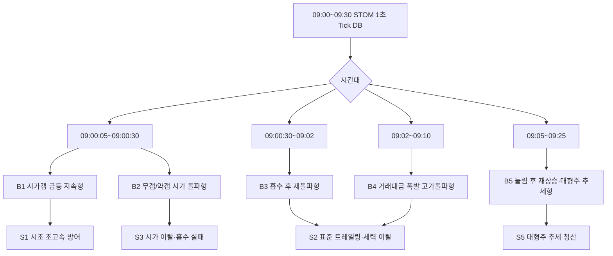

---

### 5. 공통 파생변수 블록

아래 블록은 모든 매수/매도 조건식 상단에 공통으로 넣습니다.

```python
# ==================================================
# STOM 1초 Tick DB 공통 파생변수 블록
# ==================================================

전일종가추정 = 현재가 / max(1 + 등락율 / 100, 0.01)
시가갭률 = (시가 - 전일종가추정) / max(전일종가추정, 1) * 100
시가대비현재등락율 = (현재가 - 시가) / max(시가, 1) * 100

스프레드틱 = (매도호가1 - 매수호가1) / max(호가단위, 1)
매수공격비_1초 = 초당매수수량 / max(초당매도수량, 1)
매도공격비_1초 = 초당매도수량 / max(초당매수수량, 1)
호가매수비율_현재 = 매수총잔량 / max(매수총잔량 + 매도총잔량, 1)

매도5호가잔량합 = 매도잔량1 + 매도잔량2 + 매도잔량3 + 매도잔량4 + 매도잔량5
매수5호가잔량합 = 매수잔량1 + 매수잔량2 + 매수잔량3 + 매수잔량4 + 매수잔량5
매도5호가잔량합_직전 = 매도잔량1N(1) + 매도잔량2N(1) + 매도잔량3N(1) + 매도잔량4N(1) + 매도잔량5N(1)
매수5호가잔량합_직전 = 매수잔량1N(1) + 매수잔량2N(1) + 매수잔량3N(1) + 매수잔량4N(1) + 매수잔량5N(1)

상단호가소화율 = 1 - (매도5호가잔량합 / max(매도5호가잔량합_직전, 1))
하단호가붕괴율 = 1 - (매수5호가잔량합 / max(매수5호가잔량합_직전, 1))

if 데이터길이 >= 6:
    매수공격비_5초 = 누적초당매수수량(5) / max(누적초당매도수량(5), 1)
    매도공격비_5초 = 누적초당매도수량(5) / max(누적초당매수수량(5), 1)
else:
    매수공격비_5초 = 0
    매도공격비_5초 = 0

if 데이터길이 >= 11:
    매수공격비_10초 = 누적초당매수수량(10) / max(누적초당매도수량(10), 1)
    매도공격비_10초 = 누적초당매도수량(10) / max(누적초당매수수량(10), 1)
else:
    매수공격비_10초 = 0
    매도공격비_10초 = 0

if 데이터길이 >= 31:
    거래대금폭발배수 = 초당거래대금 / max(초당거래대금평균(30, 1), 1)
    체결강도상승배수 = 체결강도 / max(체결강도평균(30, 1), 1)
elif 데이터길이 >= 11:
    거래대금폭발배수 = 초당거래대금 / max(초당거래대금평균(10, 1), 1)
    체결강도상승배수 = 체결강도 / max(체결강도평균(10, 1), 1)
elif 데이터길이 >= 6:
    거래대금폭발배수 = 초당거래대금 / max(초당거래대금평균(5, 1), 1)
    체결강도상승배수 = 체결강도 / max(체결강도평균(5, 1), 1)
else:
    거래대금폭발배수 = 0
    체결강도상승배수 = 1
```

---

### 6. 시가총액별 파라미터 블록

시가총액 단위는 STOM DB 기준에 맞게 확인 후 조정해야 합니다. 아래는 **억 원 단위 가정**입니다.

```python
# ==================================================
# 시가총액별 파라미터 블록
# ==================================================

초소형주 = 시가총액 < 1500
소형주 = 1500 <= 시가총액 < 5000
중형주 = 5000 <= 시가총액 < 20000
대형주 = 시가총액 >= 20000

if 초소형주:
    최소체결강도 = 175
    최소매수공격비 = 2.3
    최소누적매수공격비 = 1.7
    최소거래폭발 = 5.0
    최대스프레드틱 = 1
    최대시가갭률 = 10
    최소상단소화율 = 0.30

elif 소형주:
    최소체결강도 = 155
    최소매수공격비 = 1.9
    최소누적매수공격비 = 1.4
    최소거래폭발 = 4.0
    최대스프레드틱 = 2
    최대시가갭률 = 12
    최소상단소화율 = 0.25

elif 중형주:
    최소체결강도 = 135
    최소매수공격비 = 1.5
    최소누적매수공격비 = 1.2
    최소거래폭발 = 3.0
    최대스프레드틱 = 2
    최대시가갭률 = 15
    최소상단소화율 = 0.20

else:
    최소체결강도 = 115
    최소매수공격비 = 1.2
    최소누적매수공격비 = 1.05
    최소거래폭발 = 2.0
    최대스프레드틱 = 3
    최대시가갭률 = 10
    최소상단소화율 = 0.15
```

---

### 7. 공통 매수 금지 필터

```python
# ==================================================
# 공통 매수 금지 필터
# ==================================================

금지필터 = False

if 데이터길이 < 6:
    금지필터 = True
elif 시분초 < 90005:
    금지필터 = True
elif 시분초 >= 92800:
    금지필터 = True
elif 관심종목 != 1:
    금지필터 = True
elif 당일거래대금 < 30:
    금지필터 = True
elif not (-2 <= 등락율 <= 25):
    금지필터 = True
elif 스프레드틱 > 최대스프레드틱:
    금지필터 = True
elif 호가갭발생(3):
    금지필터 = True
elif 시가갭률 > 최대시가갭률:
    금지필터 = True
elif 시분초 <= 90200 and 현재가 < 시가 - 호가단위 * 2:
    금지필터 = True
elif 초당매도수량 > 초당매수수량 * 2:
    금지필터 = True
elif 데이터길이 >= 6 and 누적초당매도수량(5) > 누적초당매수수량(5) * 1.8:
    금지필터 = True
elif 매수총잔량 < 매수총잔량N(1) * 0.65:
    금지필터 = True
elif 매수총잔량 > 매도총잔량 * 2 and 체결강도 < 110:
    금지필터 = True
elif 최고매도금액 > 최고매수금액 * 1.5 and 체결강도 < 100:
    금지필터 = True
elif VI가격 > 0 and 현재가 >= VI가격 - VI호가단위 * 3 and 체결강도 < 150:
    금지필터 = True
elif 라운드피겨위5호가이내 and 초당매도수량 > 초당매수수량:
    금지필터 = True
elif 하단호가붕괴율 >= 0.35 and 현재가 <= 현재가N(1):
    금지필터 = True
```

---

## 8. 매수 조건식 5세트

### B1. 09:00:05~09:00:30 시가갭 급등 지속형

**전략 적용:** 전략 1, 전략 9 제한형  
**핵심:** `시가갭률 + 시가 위 유지 + 5초 매수공격 + 상단호가 소화`

```python
# ==================================================
# B1. 09:00:05~09:00:30 시가갭 급등 지속형
# ==================================================

매수 = False

if not 금지필터:
    if 90005 <= 시분초 <= 90030:
        if 2 <= 시가갭률 <= 최대시가갭률:
            if 현재가 >= 시가 + 호가단위 * 2:
                if 현재가 > 현재가N(1) or 현재가 >= 고가:
                    if 체결강도 >= 최소체결강도:
                        if 매수공격비_1초 >= 최소매수공격비:
                            if 매수공격비_5초 >= 최소누적매수공격비:
                                if 거래대금폭발배수 >= 최소거래폭발 * 0.7:
                                    if 호가매수비율_현재 >= 0.45:
                                        if 매수총잔량 >= 매수총잔량N(1) * 0.7:
                                            if 상단호가소화율 >= 최소상단소화율 or 현재가 > 최고현재가(5, 1):
                                                매수 = True

if 매수:
    self.Buy()
```

#### B1 실패 신호

| 실패 신호 | 해석 |
|---|---|
| `현재가 < 시가 - 호가단위 * 2` | 갭 상승 실패 |
| `매도공격비_5초 >= 1.4` | 5초 단위 매도 우위 |
| `하단호가붕괴율 >= 0.35` | 매수호가 지지 붕괴 |
| `최고매도금액 > 최고매수금액 * 1.5` | 가격대별 매도 자금 우위 |

---

### B2. 09:00:05~09:02 무갭/약갭 시가 돌파형

**전략 적용:** 전략 2  
**핵심:** `갭은 작지만 시가 대비 현재가가 빠르게 상승`

```python
# ==================================================
# B2. 09:00:05~09:02 무갭/약갭 시가 돌파형
# ==================================================

매수 = False

if not 금지필터:
    if 데이터길이 >= 7:
        if 90005 <= 시분초 <= 90200:
            if -1 <= 시가갭률 <= 6:
                if 시가대비현재등락율 >= 0.6:
                    if 현재가 >= 시가 + 호가단위 * 2:
                        if 현재가 > 최고현재가(5, 1):
                            if 연속상승(3) or 가격급등(5, 0.5):
                                if 체결강도 >= 최소체결강도 - 10:
                                    if 체결강도상승배수 >= 1.05:
                                        if 매수공격비_1초 >= 최소매수공격비:
                                            if 매수공격비_5초 >= 최소누적매수공격비:
                                                if 거래대금폭발배수 >= 최소거래폭발 * 0.6:
                                                    if 상단호가소화율 >= 최소상단소화율 * 0.8 or 현재가 > 최고현재가(5, 1):
                                                        매수 = True

if 매수:
    self.Buy()
```

---

### B3. 09:00:30~09:05 매도흡수 후 재돌파형

**전략 적용:** 전략 3, 전략 4  
**핵심:** `매도물량이 나왔는데 시가를 방어하고 재돌파`

```python
# ==================================================
# B3. 09:00:30~09:05 매도흡수 후 재돌파형
# ==================================================

매수 = False

if not 금지필터:
    if 데이터길이 >= 31:
        if 90030 <= 시분초 <= 90500:
            if 1 <= 등락율 <= 18:
                # 매도물량이 있었지만 가격이 버틴 구조
                if 누적초당매도수량(10) >= 누적초당매수수량(10) * 0.8:
                    if 현재가 >= 시가 - 호가단위 * 2:
                        if 현재가 >= 최저현재가(10, 1) + 호가단위 * 3:
                            if 현재가 > 최고현재가(10, 1):
                                if 매수공격비_1초 >= 최소매수공격비:
                                    if 체결강도 >= 최소체결강도 - 10:
                                        if 체결강도 >= 체결강도평균(10, 1):
                                            if 초당거래대금 >= 초당거래대금평균(10, 1) * 2:
                                                if not 호가하락압력(10, 0.35):
                                                    if 하단호가붕괴율 < 0.25:
                                                        매수 = True

if 매수:
    self.Buy()
```

---

### B4. 09:02~09:10 거래대금 폭발 + 고가돌파형

**전략 적용:** 전략 5, 전략 6, 전략 8  
**핵심:** `30초 평균 대비 거래대금 폭발 + 체결강도 급등 + 직전 고가 돌파`

```python
# ==================================================
# B4. 09:02~09:10 거래대금 폭발 + 고가돌파형
# ==================================================

매수 = False

if not 금지필터:
    if 데이터길이 >= 61:
        if 90200 <= 시분초 <= 91000:
            if 2 <= 등락율 <= 20:
                if 현재가 > 최고현재가(30, 1):
                    if 현재가 > 이동평균(20, 1):
                        if 초당거래대금 >= 초당거래대금평균(30, 1) * 3:
                            if 당일거래대금각도(30) >= 8:
                                if 체결강도 >= 최소체결강도 - 5:
                                    if 체결강도 >= 체결강도평균(30, 1) * 1.1:
                                        if 초당매수수량 >= 초당매도수량 * 최소매수공격비:
                                            if 누적초당매수수량(10) >= 누적초당매도수량(10) * 최소누적매수공격비:
                                                if 구간호가총잔량비율(30) >= 0.52:
                                                    if 상단호가소화율 >= 최소상단소화율 or 호가상승압력(30, 0.55):
                                                        매수 = True

if 매수:
    self.Buy()
```

---

### B5. 09:05~09:25 눌림 후 재상승·대형주 추세형

**전략 적용:** 전략 7, 전략 10  
**핵심:** `이평 위 추세 + 저점 회복 + 단기 고점 재돌파`

```python
# ==================================================
# B5. 09:05~09:25 눌림 후 재상승·대형주 추세형
# ==================================================

매수 = False

if not 금지필터:
    if 데이터길이 >= 61:
        if 90500 <= 시분초 <= 92500:
            if 1 <= 등락율 <= 15:
                if (시가총액 >= 20000 and 현재가 > 이동평균(60, 1)) or (시가총액 < 20000 and 현재가 > 이동평균(20, 1)):
                    if 현재가 >= 최저현재가(30, 1) + 호가단위 * 3:
                        if 현재가 > 최고현재가(10, 1):
                            if 초당거래대금 >= 초당거래대금평균(30, 1) * 1.8:
                                if 체결강도 >= max(110, 최소체결강도 - 25):
                                    if 초당매수수량 >= 초당매도수량 * max(1.15, 최소매수공격비 - 0.3):
                                        if 누적초당매수수량(30) >= 누적초당매도수량(30) * 1.05:
                                            if 구간호가총잔량비율(30) >= 0.48:
                                                if 하단호가붕괴율 < 0.25:
                                                    매수 = True

if 매수:
    self.Buy()
```

---

## 9. 매도 조건식 5세트

### S1. 시초 초고속 방어형

**적용:** B1, 전략 1  
**핵심:** 09:00~09:02 진입은 초고위험이므로 손절·트레일링을 짧게 잡습니다.

```python
# ==================================================
# S1. 시초 초고속 방어형
# ==================================================

매도 = False

if 시가총액 < 5000:
    손절률 = -0.6
    익절률 = 1.2
    트레일링시작 = 0.8
    트레일링폭 = 0.3
    최대보유시간 = 60
else:
    손절률 = -0.9
    익절률 = 1.6
    트레일링시작 = 1.0
    트레일링폭 = 0.5
    최대보유시간 = 90

if 시분초 >= 92900:
    매도 = True
elif 수익률 <= 손절률:
    매도 = True
elif 수익률 >= 익절률:
    매도 = True
elif 최고수익률 >= 트레일링시작 and 수익률 <= 최고수익률 - 트레일링폭:
    매도 = True
elif 시분초 <= 90200 and 현재가 < 시가 - 호가단위 * 2:
    매도 = True
elif 데이터길이 >= 6 and 매도공격비_5초 >= 1.4:
    매도 = True
elif 초당매도수량 > 초당매수수량 * 1.5:
    매도 = True
elif 하단호가붕괴율 >= 0.35 and 현재가 <= 현재가N(1):
    매도 = True
elif 매수총잔량 < 매수총잔량N(1) * 0.65 and 현재가 <= 현재가N(1):
    매도 = True
elif 보유시간 >= 최대보유시간:
    매도 = True

if 매도:
    self.Sell()
```

---

### S2. 표준 트레일링 + 세력 이탈형

**적용:** B3, B4, 전략 4~7  
**핵심:** 최고수익률 대비 하락, 고점 미갱신, 매도수량 급증, 최고매도금액 우위.

```python
# ==================================================
# S2. 표준 트레일링 + 세력 이탈형
# ==================================================

매도 = False

if 시가총액 < 5000:
    손절률 = -0.8
    익절률 = 1.6
    트레일링시작 = 1.0
    트레일링폭 = 0.4
    최대보유시간 = 120
    매도수량배수 = 1.3
elif 시가총액 < 20000:
    손절률 = -1.0
    익절률 = 2.0
    트레일링시작 = 1.2
    트레일링폭 = 0.6
    최대보유시간 = 180
    매도수량배수 = 1.5
else:
    손절률 = -1.2
    익절률 = 2.3
    트레일링시작 = 1.5
    트레일링폭 = 0.8
    최대보유시간 = 240
    매도수량배수 = 1.7

if 시분초 >= 92900:
    매도 = True
elif 수익률 <= 손절률:
    매도 = True
elif 수익률 >= 익절률:
    매도 = True
elif 최고수익률 >= 트레일링시작 and 수익률 <= 최고수익률 - 트레일링폭:
    매도 = True
elif 데이터길이 >= 31 and 구간고가대비현재가등락율(30) <= -0.8:
    매도 = True
elif 최고수익률 >= 1.2 and 고가미갱신지속틱수() >= 15 and 체결강도 < 체결강도평균(30, 1):
    매도 = True
elif 체결강도급락(30, 0.9) and 체결강도 < 체결강도평균(30, 1):
    매도 = True
elif 초당매도수량 > 초당매수수량 * 매도수량배수:
    매도 = True
elif 누적초당매도수량(10) > 누적초당매수수량(10) * 매도수량배수:
    매도 = True
elif 최고매도금액 > 최고매수금액 * 1.3 and 체결강도 < 100:
    매도 = True
elif 최고매도금액 > 최고매수금액 * 1.5 and 현재가 <= 최고매도가격:
    매도 = True
elif 호가하락압력(30, 0.35):
    매도 = True
elif 하단호가붕괴율 >= 0.35 and 현재가 <= 현재가N(1):
    매도 = True
elif 보유시간 >= 최대보유시간:
    매도 = True

if 매도:
    self.Sell()
```

---

### S3. 시가 이탈·흡수 실패 청산형

**적용:** B2, B3, 전략 2~4  
**핵심:** 시가돌파 매수는 시가 이탈 시 실패, 흡수 후 재돌파는 저점 재이탈 시 실패.

```python
# ==================================================
# S3. 시가 이탈·흡수 실패 청산형
# ==================================================

매도 = False

if 시가총액 < 5000:
    손절률 = -0.7
    트레일링폭 = 0.4
    최대보유시간 = 90
else:
    손절률 = -0.9
    트레일링폭 = 0.6
    최대보유시간 = 150

if 시분초 >= 92900:
    매도 = True
elif 수익률 <= 손절률:
    매도 = True
elif 시분초 <= 90500 and 현재가 < 시가 - 호가단위:
    매도 = True
elif 데이터길이 >= 11 and 현재가 < 최저현재가(10, 1):
    매도 = True
elif 최고수익률 >= 1.0 and 수익률 <= 최고수익률 - 트레일링폭:
    매도 = True
elif 데이터길이 >= 11 and 누적초당매도수량(10) > 누적초당매수수량(10) * 1.4 and 현재가 < 현재가N(1):
    매도 = True
elif 데이터길이 >= 11 and 체결강도 < 체결강도평균(10, 1) * 0.85:
    매도 = True
elif 데이터길이 >= 11 and 초당거래대금 >= 초당거래대금평균(10, 1) * 3 and 현재가 < 현재가N(1):
    매도 = True
elif 하단호가붕괴율 >= 0.30 and 현재가 <= 현재가N(1):
    매도 = True
elif 보유시간 >= 최대보유시간:
    매도 = True

if 매도:
    self.Sell()
```

---

### S4. 라운드피겨·VI·호가붕괴 위험 청산형

**적용:** 전략 8, 전략 9  
**핵심:** VI가격 근접, 라운드피겨 매도우위, 매수잔량 붕괴는 빠른 청산.

```python
# ==================================================
# S4. 라운드피겨·VI·호가붕괴 위험 청산형
# ==================================================

매도 = False

if 시분초 >= 92900:
    매도 = True
elif 수익률 <= -0.8:
    매도 = True
elif VI가격 > 0 and 현재가 >= VI가격 - VI호가단위 * 3 and 체결강도 < 140:
    매도 = True
elif 라운드피겨위5호가이내 and 초당매도수량 > 초당매수수량 * 1.2:
    매도 = True
elif 라운드피겨위5호가이내 and 고가미갱신지속틱수() >= 10:
    매도 = True
elif 최고매도금액 > 최고매수금액 * 1.5 and 체결강도 < 100:
    매도 = True
elif 매수총잔량 < 매수총잔량N(1) * 0.65 and 현재가 <= 현재가N(1):
    매도 = True
elif 하단호가붕괴율 >= 0.35 and 현재가 <= 현재가N(1):
    매도 = True
elif 데이터길이 >= 11 and 호가하락압력(10, 0.35):
    매도 = True
elif 최고수익률 >= 1.0 and 수익률 <= 최고수익률 - 0.4:
    매도 = True
elif 보유시간 >= 90:
    매도 = True

if 매도:
    self.Sell()
```

---

### S5. 대형주 장초 추세 청산형

**적용:** B5, 전략 10  
**핵심:** 대형주는 체결강도 급락보다 60초 이평 이탈, 30초 누적 매도우위, 거래대금 동반 하락이 중요.

```python
# ==================================================
# S5. 대형주 장초 추세 청산형
# ==================================================

매도 = False

if 시분초 >= 92900:
    매도 = True
elif 수익률 <= -1.2:
    매도 = True
elif 수익률 >= 2.5:
    매도 = True
elif 최고수익률 >= 1.5 and 수익률 <= 최고수익률 - 0.8:
    매도 = True
elif 데이터길이 >= 61 and 현재가 < 이동평균(60, 1):
    매도 = True
elif 데이터길이 >= 31 and 누적초당매도수량(30) > 누적초당매수수량(30) * 1.3:
    매도 = True
elif 데이터길이 >= 31 and 초당거래대금 >= 초당거래대금평균(30, 1) * 2.5 and 현재가 < 현재가N(1):
    매도 = True
elif 데이터길이 >= 31 and 호가하락압력(30, 0.4):
    매도 = True
elif 하단호가붕괴율 >= 0.30 and 현재가 < 현재가N(1):
    매도 = True
elif 보유시간 >= 240:
    매도 = True

if 매도:
    self.Sell()
```

---

## 10. 추가 발굴 필터 12개

아래 필터는 위 B/S 세트에 선택적으로 추가할 수 있습니다.

| 번호 | 필터명 | 방향 | 조건 예시 | 목적 |
|---:|---|---|---|---|
| F1 | 5호가 상단소화 | 매수 강화 | `상단호가소화율 >= 0.2` | 매도벽 소화 확인 |
| F2 | 5호가 하단붕괴 | 매수 금지/매도 | `하단호가붕괴율 >= 0.35` | 지지호가 붕괴 확인 |
| F3 | 시가 방어 | 매수 강화 | `현재가 >= 시가 - 호가단위` | 시초 급등 실패 회피 |
| F4 | 시가 이탈 | 매도 | `현재가 < 시가 - 호가단위 * 2` | 시초 전략 실패 청산 |
| F5 | 매도금액 우위 | 매도 | `최고매도금액 > 최고매수금액 * 1.5` | 세력 물량 출회 추정 |
| F6 | 매수잔량 급감 | 금지/매도 | `매수총잔량 < 매수총잔량N(1) * 0.65` | 허수호가 회피 |
| F7 | 고점 미갱신 | 매도 | `고가미갱신지속틱수() >= 15` | 고점 실패 청산 |
| F8 | 라운드피겨 매도우위 | 매도 | `라운드피겨위5호가이내 and 초당매도수량 > 초당매수수량` | 심리저항 회피 |
| F9 | VI 근접 약화 | 금지/매도 | `VI가격 > 0 and 현재가 >= VI가격 - VI호가단위 * 3` | VI 직전 변동성 관리 |
| F10 | 거래대금-가격 괴리 | 매도 | `초당거래대금 급증 and 현재가 < 현재가N(1)` | 대량 매도 출회 추정 |
| F11 | 체결강도 평균이탈 | 매도 | `체결강도 < 체결강도평균(10,1)*0.85` | 매수체결 약화 |
| F12 | 호가쏠림 허수 | 금지 | `매수총잔량 > 매도총잔량*2 and 체결강도 < 110` | 허매수 회피 |

---

## 11. 백테스트 설계 규칙

### 11.1 체결가 가정

초단타 백테스트에서 같은 틱 현재가 체결 가정은 과대평가될 수 있습니다.

| 구분 | 보수적 체결가 |
|---|---|
| 매수 | 조건 발생 다음 틱 `매도호가1` 또는 현재가 + 1호가 |
| 매도 | 조건 발생 다음 틱 `매수호가1` 또는 현재가 - 1호가 |
| 슬리피지 | 소형주 1~2틱, 중형주 1틱, 대형주 0~1틱 |
| 강제청산 | `시분초 >= 92900` |

### 11.2 성과 분리표

| 전략 | 매수세트 | 매도세트 | 시간대 | 시총구간 | 갭률 | 매매수 | 승률 | 평균수익 | 평균손실 | 손익비 | MDD | 비고 |
|---|---|---|---|---|---:|---:|---:|---:|---:|---:|---:|---|
| 전략1 | B1 | S1 | 09:00:05~09:00:30 | 소형 | 2~12 |  |  |  |  |  |  |  |
| 전략2 | B2 | S3 | 09:00:05~09:02 | 중형 | -1~6 |  |  |  |  |  |  |  |
| 전략4 | B3 | S2 | 09:00:30~09:05 | 중형 | 0~12 |  |  |  |  |  |  |  |
| 전략5 | B4 | S2 | 09:02~09:10 | 중형 | 0~15 |  |  |  |  |  |  |  |
| 전략10 | B5 | S5 | 09:05~09:25 | 대형 | 0~8 |  |  |  |  |  |  |  |

---

## 12. 최적화 순서

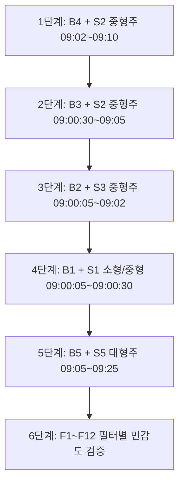

#### 우선순위

| 우선순위 | 조합 | 이유 |
|---:|---|---|
| 1 | B4 + S2 | 30초 데이터가 충분해 가장 안정적 |
| 2 | B3 + S2 | 흡수 후 재돌파라 가짜 돌파 감소 |
| 3 | B2 + S3 | 09:00~09:02 급등 포착 |
| 4 | B1 + S1 | 가장 빠르지만 체결 리스크 큼 |
| 5 | B5 + S5 | 대형주 안정형 |

---

## 13. 최종 운용 권고

### 13.1 소형주

```text
체결강도: 155 이상
매수공격비_1초: 1.9 이상
매수공격비_5초: 1.4 이상
거래대금폭발배수: 4 이상
스프레드: 2틱 이하
손절: -0.6~-0.8%
트레일링: 0.3~0.4%p
최대보유: 60~120초
```

### 13.2 중형주

```text
체결강도: 135 이상
매수공격비_1초: 1.5 이상
매수공격비_10초: 1.2 이상
거래대금폭발배수: 3 이상
스프레드: 2틱 이하
손절: -0.9~-1.0%
트레일링: 0.5~0.6%p
최대보유: 120~180초
```

### 13.3 대형주

```text
체결강도: 110~120 이상
매수공격비_1초: 1.15~1.2 이상
누적초당매수수량(30) > 누적초당매도수량(30) * 1.05
현재가 > 이동평균(60, 1)
초당거래대금 >= 초당거래대금평균(30, 1) * 1.8
손절: -1.1~-1.2%
트레일링: 0.8%p
최대보유: 240초
```

---

## 14. 최종 요약

```text
최종 전략 10개:
1. 시가갭 급등 지속형
2. 무갭/약갭 시가 돌파형
3. 강갭 눌림 회복형
4. 매도흡수 후 재돌파형
5. 거래대금 폭발 고가돌파형
6. 체결강도 급등 + 호가상승압력형
7. 횡보 후 가격급등형
8. 상단호가 소화 돌파형
9. VI 근접 급등 관리형
10. 대형주 장초 추세형

매수 5세트:
B1. 시가갭 급등 지속형
B2. 무갭/약갭 시가 돌파형
B3. 매도흡수 후 재돌파형
B4. 거래대금 폭발 + 고가돌파형
B5. 눌림 후 재상승·대형주 추세형

매도 5세트:
S1. 시초 초고속 방어형
S2. 표준 트레일링 + 세력 이탈형
S3. 시가 이탈·흡수 실패 청산형
S4. 라운드피겨·VI·호가붕괴 위험 청산형
S5. 대형주 장초 추세 청산형
```

가장 먼저 백테스트할 조합은 **B4 + S2**, 다음은 **B3 + S2**, 그 다음은 **B2 + S3**입니다. 09:00~09:02 전략은 수익 가능성도 높지만 체결 리스크와 허수호가 리스크가 크므로, 반드시 09:02 이후 표준 장초 전략에서 안정성을 먼저 확인한 뒤 확장하는 것이 좋습니다.

---

### 부록 A. 전체 전략 조합표

| 전략 | 매수 | 매도 | 핵심 진입 | 핵심 청산 |
|---:|---|---|---|---|
| 1 | B1 | S1 | 시가갭 + 5초 매수공격 | 초고속 손절·트레일링 |
| 2 | B2 | S3 | 시가 돌파 + 연속상승 | 시가 이탈·저점 이탈 |
| 3 | B3 | S3 | 강갭 눌림 회복 | 흡수 실패 청산 |
| 4 | B3 | S2 | 매도흡수 후 재돌파 | 세력 이탈 감지 |
| 5 | B4 | S2 | 거래대금 폭발 + 고가돌파 | 표준 트레일링 |
| 6 | B4 | S2 | 체결강도 급등 + 호가상승 | 표준 트레일링 |
| 7 | B5 | S2 | 횡보 후 재상승 | 고점 미갱신·매도우위 |
| 8 | B4 변형 | S4 | 상단호가 소화 | 라운드피겨/호가붕괴 |
| 9 | B1/B4 제한 | S4 | VI 근접 전 급등 | VI 근접 약화 청산 |
| 10 | B5 | S5 | 대형주 이평 위 추세 | 60초 이평 이탈 |

---

### 부록 B. 참고자료

1. Financial Services Commission, “FSC Grants Final Approval to Nextrade for Operating Multilateral Trading Facility”  
   https://www.fsc.go.kr/eng/pr010101/83967
2. Rama Cont, Arseniy Kukanov, Sasha Stoikov, “The Price Impact of Order Book Events”  
   https://arxiv.org/abs/1011.6402
3. Investopedia, “Market Depth Explained”  
   https://www.investopedia.com/terms/m/marketdepth.asp
4. Investopedia, “What the Market Open Tells You”  
   https://www.investopedia.com/articles/trading/11/analyzing-market-open.asp
5. Lee, Fok & Liu, “Explaining Intraday Pattern of Trading Volume from the Order Flow Data”  
   https://ideas.repec.org/a/bla/jbfnac/v28y2001i1-2p199-230.html

---

### 면책

본 문서는 STOM Tick DB 조건식 개발과 백테스트 설계를 위한 연구 보고서입니다. 실제 매매 적용 전에는 수수료, 세금, 슬리피지, 주문 지연, 매수·매도 호가 체결 가능성, 종목별 체결강도 산출 방식 차이를 반드시 반영해야 합니다.

---

# 최종 체크리스트

| 항목 | 확인 |
|---|---|
| 이전 전략별 조건식 B1~B8 포함 | ✅ |
| 이전 매도 조건식 S1~S8 포함 | ✅ |
| v3.2 복합 전략 포함 | ✅ |
| v2.0 조건식 아카이브 포함 | ✅ |
| v4.0 신규 복합 매수 조건식 포함 | ✅ |
| v4.0 신규 복합 매도 조건식 포함 | ✅ |
| strategy.db 유사 포맷 반영 | ✅ |
| HTML 좌측 목차 포함 | ✅ |
| 시각화 요소 추가 | ✅ |

