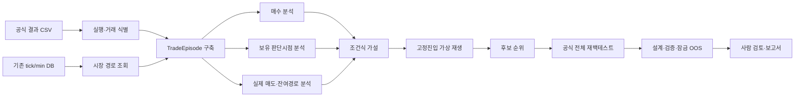

# QSP7 거래 에피소드·매도 반사실 연구 시스템 설계

> 작성일: 2026-08-01
> 상태: 설계 검토 완료·구현 전
> 적용 범위: 연구 전용 `feature/qsp3-map-surgery-20260731`
> 비적용 범위: 실거래, 운영 전략 자동 반영, 전체청산 이후 시세 생성·추정
> 선행 문서: [HANDOFF_2026-08-01_QSP7_매도식연구.md](./HANDOFF_2026-08-01_QSP7_매도식연구.md)

---

## 0. 결정 요약

사용자 제안인 **“실제 매도 이후부터 백테스트 전체청산시점까지 기존 tick/min DB의 가격·수급 경로를 결합해 매도식 연구 근거를 확장한다”**는 타당하다. 현재 결과 CSV가 실제 매도에서 거래 경로를 끝내기 때문에 볼 수 없던 다음 정보를 제공한다.

- 손절 이후 전체청산 전까지 회복했는가, 더 하락했는가.
- 실제 매도보다 30/60/120초 또는 1/2/3/5봉 뒤의 매도가 나았는가.
- 다른 매도조건이 이후 실제로 발동할 수 있었는가.
- 최종 보유시간이 아니라, 매수 후 고정 판단시점의 상태로 `매도/보유`를 구분할 수 있는가.
- 특정 매수 구간의 성과가 한 매도식에만 종속되는가, 여러 매도식에서 견고한가.

그러나 사후 가격 추가만으로 조건식 변경 효과가 증명되는 것은 아니다. 시스템은 다음 세 권위 단계를 명확히 구분해야 한다.

| 단계 | 산출물 | 용도 | 최종 채택 권한 |
|---|---|---|---|
| 진단 | 실제 매도 후~전체청산 경로, 고정시점 가상손익 | 문제 발견·가설 생성 | 없음 |
| 자문 | 기존 진입을 고정한 후보 매도식 가상 재생 | 후보 순위·실패 위험 확인 | 없음 |
| 정본 | 변경된 매수·매도식의 공식 전체 재백테스트 | 자금 점유·재진입까지 포함한 실측 | 설계/OOS 게이트 통과 후 사람 판단 |

결론적으로 **진단과 자문은 탐색 비용을 줄이고, 정본 재백테스트가 사실을 결정하는 구조**로 개발한다.

---

## 1. 목적과 사용자 작업

### 1.1 제품 목적

이 시스템은 머신러닝 모델이 전략을 대신 결정하는 도구가 아니다. 사람이 하던 다음 연구 과정을 AI가 더 빠르고 일관되게 수행하는 **조건식 연구 보조 시스템**이다.

1. 백테스트 결과에서 손익 구조를 찾는다.
2. 매수·보유·매도 시점의 사용 가능한 변수를 구분한다.
3. 손실 거래가 회복 가능했는지, 손절이 추가 손실을 막았는지 확인한다.
4. 사람이 이해할 수 있는 STOM 조건식 가설을 만든다.
5. 한 번에 하나의 의도를 바꾼 후보를 공식 엔진으로 재백테스트한다.
6. 설계·검증·표본외 결과와 실패 이유를 축적한다.
7. 최종 반영은 사람이 결정한다.

### 1.2 핵심 사용자 질문

시스템은 차트를 많이 보여주는 대신 다음 질문에 직접 답해야 한다.

- 이 매도조건이 손실을 만들었는가, 아니면 더 큰 손실을 막았는가?
- 이 조건에서 매도하지 않았다면 다음에 어떤 조건이 언제 발동했는가?
- 실제 매도 후 회복한 거래와 계속 하락한 거래는 무엇이 달랐는가?
- 그 차이는 매수시점에 이미 알 수 있었는가, 보유 중에만 알 수 있었는가?
- 60~120초 구간을 버려야 하는가, 아니면 그 안에서 매도/보유를 구분해야 하는가?
- 이 매수 필터는 다른 합리적 매도식에서도 개선되는가?
- 후보의 개선이 동일 거래의 청산 개선인가, 거래 감소·자금 재배분 효과인가?
- 설계구간의 개선이 표본외에서도 유지되는가?

### 1.3 비목표

- 전체청산시점 이후 가격을 생성·보간·추정하지 않는다.
- DB에 없는 미래 시장 데이터를 외부에서 추가하지 않는다.
- 사후 최고가격을 직접 조건식으로 변환하지 않는다.
- 진단 결과만으로 전략 DB에 자동 저장하거나 실전에 반영하지 않는다.
- 딥러닝 점수를 설명 없이 조건식으로 사용하지 않는다.
- 강제청산 건수를 줄이는 것 자체를 목표로 삼지 않는다.

---

## 2. 현재 시스템과 데이터의 확인된 사실

### 2.1 QSP7 데이터 범위

QSP6/QSP7 설정은 tick, 09:00~09:30이다.

- 설계: `2022-04-01~2024-03-31`
- 표본외: `2024-04-01~2026-02-27`
- `bt_universe_start_time=90000`
- `bt_universe_end_time=93000`

근거:

- [config_qsp6.json](./config_qsp6.json)
- [config_qsp6_holdout.json](./config_qsp6_holdout.json)

로컬 DB 읽기 전용 조사 결과:

- 일별 stock tick DB: 952개, `2022-03-23~2026-02-27`
- 통합 `stock_tick_back.db`: 약 29.7GB, 종목 테이블 약 2,427개
- 조사한 최초/최종 일자 모두 저장 시각은 `09:00~09:30`
- QSP7 연구기간과 시간범위를 포함하지만 09:30 이후 데이터는 없다.

### 2.2 실제 매도 후 고정시간 평가 가능 비율

전체청산 전까지 해당 시간이 남은 거래를 단순 시간 기준으로 계산한 값이다. 실제 구현은 종목별 틱 존재 여부도 함께 확인한다.

| 매도 후 평가시점 | 설계 2년 | 표본외 23개월 |
|---|---:|---:|
| +30초 | 72.8% | 76.4% |
| +60초 | 72.5% | 76.0% |
| +120초 | 71.8% | 75.1% |
| +300초 | 68.6% | 72.2% |
| +600초 | 60.1% | 64.3% |

평가 불가분의 대부분은 09:30 전체청산 거래다. 이 거래를 0이나 실패로 채우지 않고 `전체청산 경계로 인한 평가 불가`로 명시해야 한다.

### 2.3 현재 결과 데이터

현재 공식 결과는 [backtest/back_static.py](../../../backtest/back_static.py)의 기본 거래 컬럼과 추가 컬럼을 사용한다.

- 기본: 종목명, 매수/매도시간, 보유시간, 가격·금액, 수익률·수익금, 매도조건, 추가매수시간
- `B_*`: 매수시점 가격·수급·각도·거래대금 스냅샷
- `S_*`: 실제 매도시점 일부 가격·수급 스냅샷
- `R_*`: 실제 매도 전까지의 MFE/MAE

[backtest/backengine_base.py](../../../backtest/backengine_base.py)는 실제 매수와 실제 매도 시점에만 스냅샷을 만들며, 실제 매도 이후 경로는 결과에 남기지 않는다.

### 2.4 현재 QSP 제안 루프

[ai_strategy_loop/revision/round_runner.py](../../../ai_strategy_loop/revision/round_runner.py)는 다음 구조다.

- 이전 최고 매수식을 기준으로 손실 리프·팩터를 분석한다.
- 매수식만 drop/tighten/filter/deep 변형한다.
- 모든 후보에 동일한 `base_sell`을 붙인다.
- 공식 배치 백테스트 후 best를 선택한다.
- 선택 후보를 표본외에서 재평가한다.

따라서 현재 매수 라벨은 고정 매도식이 확정한 손익에 종속되고, 매도식 제안·변형·전이 분석은 없다.

### 2.5 현재 V4 UX 정보구조

[dashboard-v4-shell.jsx](../../../ai_strategy_loop/dashboard/frontend/dashboard-v4-shell.jsx)의 주 흐름은 다음과 같다.

`라이브 → 기록(History) → 보고서(Reports) → 성과 → 백테스트 → 리플레이`

현재 역할:

- **Backtest**: 전략 선택·편집·사전 점검·실행·결과 분석·A/B 비교
- **Replay**: tick/min 시장 시계열과 신호 맥락의 읽기 중심 재생
- **History**: 캠페인 아카이브, run/gen 비교, 결과 상세
- **Reports**: 등록된 HTML 보고서와 연구 Wiki의 안전한 읽기
- **성과**: 장기 비교 기준과 명예의 전당

따라서 새 최상위 탭은 만들지 않는다. 거래 경로 연구는 Backtest의 결과 분석에 들어가고, 개별 거래 정밀 관찰은 Replay로 이동하며, 확정된 연구 기록은 History와 Reports에 남긴다.

현재 [ai_strategy_loop/dashboard/research_index.py](../../../ai_strategy_loop/dashboard/research_index.py)의 Wiki 스캔 루트에는 `docs/research/quant_scoring_pipeline/`이 포함되지 않는다. 따라서 이 설계 문서는 파일 정본이지만, 코드 변경 전에는 Reports의 연구 Wiki에 자동 노출되지 않는다. P7에서 다음 중 하나를 명시적으로 수행해야 한다.

- quant scoring 문서 루트를 연구 인덱스의 허용된 정본 소스로 추가
- 이 설계를 근거로 등록된 HTML 연구 보고서를 생성

현재 UI에 보이지 않는 문서를 보이는 것처럼 안내해서는 안 된다.

---

## 3. 기존 QSP7 결론의 타당성 재검토

### 3.1 유지 가능한 사실

다음은 기술적·통계적 사실로 유지한다.

- 현재 매도식에서 손실 확정액은 두 `최저현재가` 조건과 전체청산에 집중된다.
- 1~2분에 실제 종료된 거래의 실현손익이 양 구간에서 나쁘다.
- 현재 매도 전까지 계산한 MFE/MAE에서 손절 거래 다수가 큰 추가하락을 경험하지 않았다.
- 비용 후 `수익금` 기준으로 설계와 표본외가 모두 적자다.
- 이익 실현 조건은 대체로 높은 최고수익률에 도달한 뒤 발동한다.

### 3.2 표현을 낮춰야 하는 결론

| 기존 표현 | 문제 | 수정 표현 |
|---|---|---|
| 손실은 매도에서 난다 | 매수 품질과 매도정책이 결합된 결과 | 현재 정책에서 손실이 특정 청산 경로로 확정된다 |
| 손절은 보호가 아니라 조기이탈이다 | 실제 매도 이후 경로가 없어 추가하락 방지 효과 미측정 | 조기이탈 가능성이 높아 전체청산 전 잔여 경로 검증이 필요하다 |
| 1~2분 구간을 제외하면 흑자다 | 최종 보유시간은 사후 변수이며 실전에서 미리 알 수 없음 | 60~120초 판단시점에서 매도/보유를 구분할 규칙을 찾아야 한다 |
| 손절1 제거가 최대 개선원이다 | 다음 조건·전체청산·자금 재배분 결과를 모름 | 우선순위가 가장 높은 반사실 실험 대상이다 |
| 장 마감 청산을 재설계한다 | 사용자는 전체청산을 필수로 규정 | 전체청산은 고정하고 그 이전 청산 능력을 연구한다 |
| `per_trade_net`을 추가한다 | `수익금`이 이미 비용 후라 중복 가능 | 기존 건당 순손익을 정본으로 두고 비용 커버리지 진단을 추가한다 |

### 3.3 새로 측정해야 결론을 낼 수 있는 것

- 손절 이후 전체청산까지의 추가 MFE/MAE
- 손익분기·실제 매도가·목표수익률 회복 시간
- 다음 `if/elif` 조건의 최초 발동시점
- 후보 매도식별 가상 비용 후 손익
- 고정 진입 가상 결과와 공식 전체 백테스트 결과의 차이
- 전체청산 전환 거래 수와 손익
- 매도 변경으로 새로 생기거나 사라진 이후 거래의 손익

---

## 4. 시간·정보·권위 계약

### 4.1 시간 경계

모든 거래 에피소드는 다음을 만족해야 한다.

```text
market_data_start ≤ buy_time ≤ actual_or_virtual_sell_time ≤ forced_liquidation_time ≤ market_data_end
```

- `forced_liquidation_time`은 하드코딩하지 않고 해당 run의 설정에서 읽는다.
- tick은 초 단위, min은 봉/분 단위로 별도 처리한다.
- 목표 평가시점이 전체청산을 넘으면 값을 전체청산으로 잘라 대체하지 않고 `unavailable_after_cutoff`로 기록한다.
- 별도 `to_forced_liquidation` 결과를 제공해 고정 horizon과 전체청산 결과를 혼동하지 않는다.

### 4.2 변수 계층과 누수 방지

| 접두/계층 | 시점 | 조건식 입력 가능 여부 | 용도 |
|---|---|---|---|
| `B_*` | 매수시점 | 매수식 가능 | 진입 품질 분석 |
| `H{n}_*` | 매수 후 n초/봉 판단시점 | 해당 시점 이후 매도식 가능 | 동적 보유·청산 판단 |
| `A_*` | 실제 매도시점 | 진단만 | 실제 청산 사실 |
| `F_*` | 실제 매도 이후~전체청산 | 불가 | 미래 라벨·기회/위험 평가 |
| `CF_*` | 후보정책 가상 결과 | 불가 | 후보 순위·반사실 비교 |
| `O_*` | 공식 후보 재백테스트 | 불가 | 정본 성과·채택 게이트 |

생성기는 `F_*`, `CF_*`, `O_*`의 변수명을 전략 코드에 출력할 수 없어야 한다. 이 값은 `B_*` 또는 `H{n}_*`에서 구분 가능한 가설을 찾는 라벨로만 사용한다.

### 4.3 결과 권위 배지

API와 UI의 모든 결과 블록은 다음 중 하나를 가져야 한다.

- `DIAGNOSTIC`: 고정시점 가격·사후경로 통계
- `ADVISORY`: 고정 진입 가상 매도식 재생
- `OFFICIAL`: 공식 엔진 전체 재백테스트

색상만으로 구분하지 않고 텍스트, 아이콘, 툴팁을 함께 제공한다.

---

## 5. 데이터 모델

### 5.1 실행 출처 `RunSource`

필수 식별자:

- `run_id`, `gen_no` 또는 `job_id`
- 결과 CSV 경로와 SHA-256
- 매수·매도 전략 이름과 코드 SHA-256
- timeframe `tick|min`
- start/end date, universe start/end time
- forced liquidation time
- source market DB 식별자, 크기, 수정시각
- 분석기 버전과 생성시각

이 값이 없으면 분석은 실행할 수 있어도 `신뢰도 낮음`으로 표시하고 정본 보고서 등록을 막는다.

### 5.2 거래 식별자 `TradeKey`

현재 CSV는 종목명 중심이라 이름 변경·중복 가능성이 있다. 목표 식별자는 다음이다.

```text
run_id + result_row_id + stock_code + buy_time + entry_sequence
```

구현 선결조건:

1. 기존 결과와 `stockinfo`를 조인해 종목코드를 복원한다.
2. 복원 불가·다중매칭은 `ambiguous_symbol`로 제외한다.
3. 장기적으로 결과 extra column 또는 실행 sidecar에 종목코드를 additive 저장한다.
4. 기존 CSV 컬럼 순서·하위 소비자 계약은 깨지지 않게 한다.

### 5.3 거래 에피소드 `TradeEpisode`

```text
identity
entry_snapshot
actual_exit
forced_liquidation_boundary
decision_points[]
continuation_outcomes[]
counterfactual_outcomes[]
data_quality
```

### 5.4 판단시점 `DecisionPoint`

tick 기본 후보: `30, 60, 90, 120, 180, 300초`
min 기본 후보: `1, 2, 3, 5, 10봉`

실제 값은 설정 가능하되 다음 제한을 둔다.

- 전체청산 이전인 경우만 생성
- 해당 종목의 실제 기록이 존재해야 함
- 목표시각과 실제 사용 틱의 시간차 기록
- 고정시점이 아닌 `조건 최초발동` 이벤트도 별도 지원

판단시점 필드 예:

- 현재가·수익률·비용 후 청산 예상손익
- 현재까지의 MFE/MAE
- MFE 대비 반납률
- 최근 가격방향·저점/고점 갱신
- 거래대금·체결강도·매수/매도수량 변화
- 호가압력
- 전체청산까지 남은 초/봉
- 원래 매도조건의 현재 참/거짓

### 5.5 잔여경로 결과 `ContinuationOutcome`

- `horizon`
- `availability`와 불가 사유
- 시점 가격과 실제 사용 시각
- 매수가 대비 비용 후 가상손익
- 실제 매도 대비 손익 차이
- 실제 매도 이후 해당 horizon까지의 최고·최저 수익률
- 손익분기·실제 매도가·목표수익률 회복 여부와 시간
- 전체청산까지 계속 보유한 결과

`가장 좋은 미래 매도시점`은 oracle 진단으로만 제공하고 조건식 후보의 직접 목표로 사용하지 않는다.

### 5.6 가상 매도 결과 `CounterfactualOutcome`

- 후보 매도식 코드 hash
- 첫 발동 시각·조건 ID·조건 순번
- 가상 체결가와 비용 후 손익
- 전체청산 대체 여부
- 실제 매도 대비 변화
- 실행 가능성/데이터 품질
- `fixed_entry_advisory` 권위 표시

### 5.7 분할매수·분할매도

현재 결과의 `추가매수시간`만으로 모든 체결 가격·수량·상태를 복원할 수 없는 전략은 CSV 단독 가상 재생을 정본으로 취급하지 않는다.

- 1차: 단일 진입·전량 청산 전략을 지원한다.
- 2차: 공식 엔진 실행 중 append-only 거래 이벤트 sidecar를 선택적으로 남긴다.
- 이벤트 ledger가 없는 분할 전략은 공식 전체 재백테스트만 정본으로 사용한다.

---

## 6. 분석 파이프라인



### 6.1 단계 A — 데이터 사전점검

- run/CSV/전략 code hash 확인
- timeframe와 시각 자릿수 일치 확인
- 시장 DB와 결과기간 교집합 확인
- forced liquidation time 확인
- 종목코드 매핑률 계산
- 각 horizon의 분석 가능 비율 계산
- 누락·중복·역전시각 거래 격리

UI는 분석 전에 `분석 가능 71.8%`, `전체청산 경계 27.0%`, `종목코드 모호 0.1%`처럼 범위를 먼저 보여준다.

### 6.2 단계 B — 거래 경로 결합

성능을 위해 거래별·horizon별 임의 조회를 반복하지 않는다.

- 거래를 날짜→종목코드로 그룹화
- 해당 날짜·종목의 필요한 최소~최대 구간을 한 번 읽음
- 여러 거래와 판단시점을 메모리에서 매핑
- API 응답은 요약과 선택 거래 경로를 분리
- 전체 tick 배열은 UI로 일괄 전송하지 않음

원천 DB는 항상 SQLite read-only URI로 연다. 파생 캐시는 선택적으로 생성할 수 있지만 시장 데이터의 권위 원천이 될 수 없다.

### 6.3 단계 C — 매도조건 실현·잔여경로 분석

매도조건별로 다음을 함께 집계한다.

- 실제 거래 수, 승률, 순손익, 건당 순손익
- 실제 매도 후 회복률·추가악화율
- 전체청산 계속보유 대비 개선/악화
- fixed horizon별 순손익 변화
- 손익분기 회복까지 걸린 시간
- 전체청산 경계 때문에 평가 불가한 비율

손실 기여도가 높은 조건을 `삭제 대상`이 아니라 `반사실 검증 우선순위`로만 사용한다.

### 6.4 단계 D — 고정 판단시점 분석

최종 보유시간을 설명변수로 쓰지 않는다. 예를 들어 60초에 아직 보유 중인 모든 거래를 하나의 risk set으로 만들고 다음 행동을 비교한다.

- 지금 매도
- 30/60/120초 추가 보유
- 후보 조건 최초발동까지 보유
- 전체청산까지 보유

당시 사용 가능한 `H60_*`만으로 결과 차이를 설명한다. 90/120초도 같은 방식으로 별도 분석한다.

### 6.5 단계 E — 매수식 견고성 분석

매수 리프·필터는 한 매도식의 실제 손익만으로 평가하지 않는다.

| 분류 | 판정 |
|---|---|
| 견고한 매수 엣지 | 여러 합리적 매도정책에서 설계/OOS 모두 양호 |
| 매수·매도 결합형 | 특정 매도정책에서만 개선 |
| 매수 문제 후보 | 대부분의 매도정책에서 손실 |
| 불안정 | 정책·기간에 따라 방향이 반복 역전 |

후보 생성기는 견고한 매수 엣지와 결합형 후보를 다른 유형으로 기록한다.

### 6.6 단계 F — 매도조건 순서·도달 분석

매도식은 `if/elif` 우선순위 정책이다. 조건을 독립적인 태그로만 분석하면 안 된다.

- 각 조건의 최초 발동 빈도
- 실제 매도시점에 동시에 참이었던 후순위 조건
- 선행 조건 때문에 가려진 조건
- 조건 제거·지연 시 다음 최초 발동 조건
- 조건 순서 변경 시 결과

후보 가상 재생과 공식 재백테스트 모두 전체 조건식 순서를 그대로 실행해야 한다.

---

## 7. AI 조건식 연구기

### 7.1 AI의 역할

AI는 다음을 수행한다.

- 손실·회복·추가하락 cohort를 자동 구성한다.
- 효과크기·분위수·기간 안정성을 계산한다.
- 사람이 읽을 수 있는 한두 조건 조합을 제안한다.
- 제안이 매수시점 변수인지 보유시점 변수인지 판정한다.
- 현재 STOM 문법으로 표현 가능한지 확인한다.
- 바꾸려는 정확한 `if/elif` 절과 우선순위를 명시한다.
- 반증 조건과 예상 실패 위험을 함께 제시한다.

AI는 다음을 하지 않는다.

- 미래 라벨을 조건식 입력으로 복사
- 근거 없는 복잡한 다중 조건 생성
- 공식 재백테스트 전 후보 승격
- 실전 DB 자동 반영

### 7.2 후보 카드 계약

각 후보는 다음 필드를 가져야 한다.

- 후보 ID, buy/sell, 설계 의도
- 대상 cohort와 표본 수
- 사용하는 변수와 사용 가능 시점
- 기준 조건식 절과 변경 diff
- 예상 개선 메커니즘
- 잔여경로 근거
- 고정진입 가상 결과
- 설계/OOS 공식 결과
- 전체청산 전환·거래수·MDD 변화
- 누수검사·문법검사·정본 상태
- 채택/거절 이유

### 7.3 조건식 후보 유형

매도식:

- 윈도우·임계값 조정
- 최소 보유시간·최소 손실폭
- MFE 대비 반납형 이익보호
- 수급 회복 시 손절 유예
- 저점 갱신·수급 악화 결합 손절
- 전체청산 전 시간대별 조건
- 조건 우선순위 변경

매수식:

- 여러 매도정책에서 공통 손실인 구간 필터
- 특정 매도정책과 결합될 때만 유효한 paired filter
- 진입시간·시가총액·수급 regime별 분기

처음에는 한 후보에 한 의도만 허용한다. 상호작용 후보는 단일 변경이 검증된 뒤 별도 라운드에서 생성한다.

---

## 8. 반사실 평가와 공식 재백테스트

### 8.1 진단: 고정시간 결과

가격 경로의 mark-to-market 진단이다. 후보를 찾는 데 빠르지만 조건식 실행·체결·자금 점유를 반영하지 않는다.

### 8.2 자문: 고정 진입 매도식 가상 재생

기존 매수 이벤트를 고정하고 후보 매도식을 매수부터 전체청산까지 재생한다.

- 시장 변수와 보유 상태를 시간순으로 갱신
- 전체 `if/elif` 순서 실행
- 첫 발동 조건에 가상 청산
- 어떤 조건도 발동하지 않으면 전체청산
- 가능한 경우 공식 수수료·세금·체결 규칙 재사용

한계:

- 매도시점 변경에 따른 이후 매수 기회와 자금 재배분 미반영
- 분할매수/매도 이벤트 ledger가 없으면 일부 상태 근사
- 후보 수가 많아질수록 다중탐색 과최적 위험

따라서 UI에 `ADVISORY · 고정진입`을 지속 표시한다.

### 8.3 정본: 공식 전체 재백테스트

후보 매도식을 실제 `buy/sell` pair로 공식 엔진에 넣는다.

필수 비교:

- 총 순손익·건당 순손익·승률·payoff
- MDD·최대 연속손실·꼬리손실
- 거래수·일평균 거래수
- 평균/중앙 보유시간
- 전체청산 수와 순손익
- 매도조건별 전이
- 매칭 거래 직접효과
- 새로 생긴/사라진 거래의 재배분 효과
- 설계·검증·잠금 OOS

### 8.4 매도조건 전이표

동일 거래는 `stock_code + buy_time + entry_sequence`로 우선 매칭한다.

| 기준 매도조건 | 후보 매도조건 | 공통 거래 | 기준 순손익 | 후보 순손익 | 차이 |
|---|---|---:|---:|---:|---:|
| 손절1 | 트레일링 익절 | … | … | … | … |
| 손절1 | 손절2 | … | … | … | … |
| 손절1 | 전체청산 | … | … | … | … |

별도 분해:

- 공통 거래의 직접 청산 효과
- 기준에만 있는 거래
- 후보에만 있는 거래
- 매수시간은 같지만 분할·재진입 상태가 다른 거래
- 전체 포트폴리오 순효과

### 8.5 검증 구간

동일 표본외를 매 라운드 후보 생성에 반복 사용하면 사실상 학습 데이터가 된다. 목표 구조:

1. 설계: 후보 발견
2. 검증: 임계값·후보 순위 결정
3. 잠금 OOS: 최종 후보만 제한적으로 개봉
4. 기간 폴드: 국면 안정성 확인

현재 QSP6의 표본외 반복 사용 이력은 그대로 기록하고, 새로운 잠금 OOS가 없다면 `최종 검증 아님`을 명시한다.

---

## 9. UX/UI 설계

### 9.1 디자인 방향

기존 V4의 산업용 quant terminal 스타일을 유지한다.

- 새로운 최상위 내비게이션을 만들지 않는다.
- 차트보다 질문→근거→행동의 순서를 우선한다.
- `DIAGNOSTIC/ADVISORY/OFFICIAL` 권위를 항상 보인다.
- 숫자의 출처, 기간, timeframe, 전체청산시각을 결과 상단에 고정한다.
- 미래 라벨과 실행 가능한 변수를 시각적으로 분리한다.

기억해야 할 핵심 UX는 **“실제 매도선 이후에도 전체청산선까지 이어지는 하나의 거래 경로”**다.

### 9.2 Backtest 배치

기존 `조건식 편집 | 결과 분석` 구조를 유지하고 `결과 분석` 내부에 다음 보조 뷰를 둔다.

1. 요약
2. 거래 경로
3. 매도 반사실
4. 조건식 후보

#### 결과 상단: 데이터 계약 밴드

- run/job/gen
- buy/sell code hash
- tick/min
- 분석기간·운용시간·전체청산시각
- 분석 가능 거래 비율
- 종목코드 매핑률
- 권위 배지
- `전체청산 이후 데이터 없음` 고정 문구

#### 거래 경로 뷰

왼쪽 필터:

- 매도조건
- 실제 수익/손실
- 보유시간·매수시간대
- 잔여시간 최소값
- 회복/추가하락/평가불가
- 종목·날짜·설계/OOS

중앙:

- 매수~전체청산 가격/수익률 경로
- 실제 매도선
- 후보 매도선
- 전체청산선
- MFE/MAE와 손익분기선
- 체결강도·수급·호가압력 선택 트랙

오른쪽 근거 패널:

- 이 거래가 cohort에 포함된 이유
- 실제 매도 이후 회복/추가하락
- 판단시점에 사용 가능했던 변수
- 미래라서 조건식에 사용할 수 없는 값
- 유사 거래 수와 설계/OOS 성적

#### cohort 우선 UX

개별 종목 하나의 아름다운 회복 사례보다 cohort 전체 통계를 먼저 보여준다. 개별 거래는 근거를 확인하는 drill-down이다.

### 9.3 Replay 연결

Backtest 거래 행에서 `리플레이로 열기`를 제공한다.

딥링크 전달값:

- date, stock_code, timeframe
- buy time, actual sell time, forced liquidation time
- candidate sell times
- 선택 변수 트랙

Replay는 이미 기록 시계열과 신호 맥락을 읽는 화면이므로 별도 차트 엔진을 만들지 않는다. Backtest는 cohort 판단, Replay는 한 거래의 정확한 시간 맥락을 소유한다.

### 9.4 History 연결

History는 다음을 소유한다.

- QSP7 분석 실행 기록
- 후보 카드와 상태
- 공식 재백테스트 결과 A/B 비교
- 기준→후보 매도조건 전이 요약
- 거절 후보와 실패 이유

진단 결과와 공식 결과를 같은 수익 숫자로 평면 비교하지 않는다. 정본 상태별 섹션을 나눈다.

### 9.5 Reports 연결

최종 연구 보고서는 기존 안전한 HTML 뷰어에 등록한다.

보고서 기본 목차:

1. 실행·데이터 계약
2. 매수·매도식 코드와 hash
3. 데이터 품질·분석 가능 범위
4. 실제 매도조건 분해
5. 잔여경로·회복·추가하락
6. 고정 판단시점 분석
7. 후보 가상 재생
8. 공식 설계/OOS 결과
9. 매도조건 전이와 재배분
10. 채택/거절·한계

`Reports`는 읽기 전용 정본 문서, `History`는 실행과 비교, `Backtest`는 능동 연구, `Replay`는 거래 단위 관찰로 역할을 고정한다.

### 9.6 후보 생성 액션

분석 화면의 액션은 `후보 초안 만들기`까지만 허용한다.

1. AI가 근거와 조건식 diff를 생성
2. 사용자가 근거·누수검사·우선순위를 검토
3. 기존 Backtest 조건식 편집기로 전달
4. 문법검사
5. 명시적 저장/실행

분석 화면에서 운영 전략을 즉시 덮어쓰지 않는다.

### 9.7 상태·오류 UX

필수 상태:

- 데이터 연결 확인 중
- 분석 가능
- 일부 horizon 검열
- 종목코드 모호
- 원천 틱/분봉 누락
- 분석 작업 실행 중/취소
- 가상 재생 완료
- 공식 재백테스트 필요
- 공식 검증 완료

빈 배열을 정상 0건처럼 보여주지 않고 원인과 다음 행동을 표시한다.

### 9.8 접근성·밀도

- 표와 차트에서 색상 외에 부호·패턴·텍스트 사용
- 키보드로 cohort→거래→Replay 이동
- 스크롤이 긴 화면은 고정 헤더·독립 패널 스크롤 사용
- tick 1,800개 수준 경로는 선택 거래만 로드
- 툴팁에 시각, 실제 틱 지연, 가격, 비용 후 수익률 표시
- light/dark 모두 기존 토큰 사용

---

## 10. 백엔드·API 배치

### 10.1 파일 경계

현재 `dashboard/backtest_api.py`와 `dashboard/backtest_analysis.py`는 각각 약 2,400/2,000줄로 크다. 새 기능을 여기에 직접 누적하지 않는다.

권장 새 경계:

```text
ai_strategy_loop/autopsy/trade_episode.py          # 결과 행과 run 계약
ai_strategy_loop/autopsy/market_path.py            # read-only tick/min 조회
ai_strategy_loop/autopsy/decision_points.py        # H_n 스냅샷
ai_strategy_loop/autopsy/continuation.py            # F_* 라벨
ai_strategy_loop/autopsy/exit_counterfactual.py     # CF_* 가상 재생
ai_strategy_loop/autopsy/exit_transition.py         # 공식 결과 전이 분해
ai_strategy_loop/revision/sell_proposer.py           # 설명 가능한 매도식 후보
ai_strategy_loop/dashboard/trade_path_api.py         # /bt/trade-path 라우터
```

프런트도 큰 기존 파일에 로직을 누적하지 않는다.

```text
frontend/bt-trade-path-tab.jsx
frontend/bt-trade-path-chart.jsx
frontend/bt-exit-counterfactual.jsx
frontend/bt-exit-transition.jsx
frontend/bt-condition-proposals.jsx
```

### 10.2 API 초안

```text
GET  /bt/trade-path/preflight
POST /bt/trade-path/jobs
GET  /bt/trade-path/jobs/{analysis_id}
POST /bt/trade-path/jobs/{analysis_id}/cancel
GET  /bt/trade-path/summary
GET  /bt/trade-path/cohorts
GET  /bt/trade-path/trades
GET  /bt/trade-path/trade/{trade_key}
POST /bt/trade-path/counterfactual
GET  /bt/trade-path/counterfactual/{analysis_id}
GET  /bt/trade-path/transitions
POST /bt/trade-path/proposals
```

규칙:

- 원천 DB는 read-only
- 긴 분석은 job + progress + cancel
- 조회는 페이지·필터·다운샘플 지원
- 응답마다 source/provenance/authority/data_quality 포함
- 후보 생성은 저장과 분리
- strategy 저장은 기존 검증·확인 endpoint 재사용

### 10.3 캐시와 아티팩트

- 키: CSV hash + DB identity + analyzer version + horizons + forced liquidation time
- 위치: 생성 상태 영역, Git 비추적
- 원천 DB 변경 시 무효화
- JSON summary와 거래별 상세를 분리
- 보고서 생성은 명시적 사용자 작업

---

## 11. 성능·안전·재현성

### 11.1 성능

- 날짜·종목별 배치 조회
- preflight에서 예상 처리량·디스크·시간 표시
- 전체 2년 분석은 백그라운드 job
- 선택 거래 경로만 on-demand 반환
- cohort 집계는 서버에서 수행
- 동일 분석 hash 캐시 재사용

### 11.2 안전

- `_database/*.db` read-only URI
- 전략 저장은 기존 human confirmation 경로만 사용
- 임의 Python 코드를 분석 API가 직접 실행하지 않음
- 저장된 전략명+code hash 또는 문법검사 통과 AST만 가상 재생 입력으로 허용
- 전체청산 이후 인덱스 접근을 타입/테스트로 차단
- 실전 주문·export endpoint 추가 금지

### 11.3 재현성

모든 분석 결과는 다음을 포함한다.

- 원천 CSV/DB fingerprint
- 전략 code hash
- 실행기간·시간·timeframe
- horizon 설정
- 분석기 버전
- 표본 수·제외 사유
- 공식/자문/진단 구분

---

## 12. 통계적 위험과 방어

| 위험 | 설명 | 방어 |
|---|---|---|
| 사후선택 | 가장 좋아 보인 미래시점을 골라 규칙화 | 고정 horizon 사전등록, oracle은 진단만 |
| 검열 편향 | 조기 매도만 긴 잔여경로를 가짐 | 남은 시간별 risk set, availability 병기 |
| 라벨 누수 | 미래 가격을 조건식에 사용 | 접두 계층과 생성기 금지목록 |
| 다중탐색 | 많은 임계값 중 우연한 승자 | 후보 수 제한, 폴드·FDR·잠금 OOS |
| 정책 종속 | 매수 라벨이 한 매도식에 종속 | 여러 sell policy 견고성 평가 |
| 재배분 누락 | 고정진입 가상 재생이 이후 매수를 못 바꿈 | 공식 전체 재백테스트 필수 |
| 체결 낙관 | 현재가 mark-to-market이 실제 체결보다 유리 | 진단 배지, 공식 체결 규칙 재검증 |
| 조건 순서 | 독립 조건 분석이 `if/elif`를 무시 | 전체 정책 순서 재생 |
| symbol 오인 | 결과 CSV의 종목명만으로 잘못 조인 | 종목코드 식별 계약·모호행 제외 |
| 비용 이중차감 | 이미 net인 수익금에서 비용 재차감 | gross/cost/net 필드 명시 |

---

## 13. 테스트 계획

### 13.1 단위 테스트

- tick/min 시각 파싱과 전체청산 경계
- horizon이 경계를 넘을 때 unavailable
- 첫 틱/첫 봉 선택 규칙과 실제 시간차
- MFE/MAE·회복시간·가상 비용 후 손익
- 조건 `if/elif` 최초 발동 순서
- diagnostic/advisory/official 권위 전파
- 미래 변수 생성 금지

### 13.2 통합 테스트

작은 SQLite fixture에 다음을 포함한다.

- 조기 손절 후 회복
- 손절 후 추가하락
- 실제 매도 뒤 다른 익절조건 발동
- 전체청산까지 어떤 조건도 미발동
- 틱 누락·종목코드 모호·분할거래

결과 CSV와 시장 DB를 실제 read-only repository 경로로 연결해 episode가 재현되는지 검증한다.

### 13.3 공식 엔진 패리티

- 동일 매수/매도식 가상 재생은 공식 결과와 일치해야 함
- 단일 진입·전량 청산 표본에서 매도시각·조건·가격·순손익 비교
- 불일치율과 원인을 보고하고 임계 이상이면 가상 재생 승격 차단

### 13.4 UX QA

- Backtest 완료 결과에서 거래 경로 분석 시작
- 진행/취소/재시도
- cohort 필터 후 개별 거래 선택
- Replay 딥링크의 날짜·종목·마커 일치
- 후보 초안→조건식 편집기 전달
- History A/B와 Reports 정본 연결
- 1920×1080, 2560×1440, 3440×1440, 320×800
- 키보드 탐색·스크린리더 이름·dark/light

---

## 14. 단계별 구현 계획과 게이트

### P0 — 계약과 fixture

목표:

- `RunSource`, `TradeKey`, timeframe, forced liquidation 계약 확정
- 미래 변수 금지목록
- 최소 SQLite/CSV fixture

완료 조건:

- 전체청산 이후 조회가 테스트에서 실패
- 종목코드 모호행 처리 규격
- 진단/자문/정본 상태 정의

### P1 — 거래 에피소드·잔여경로

목표:

- read-only market path repository
- 고정 판단시점과 잔여경로 결과
- CLI/JSON summary 우선, UI 미연결

완료 조건:

- QSP7 두 CSV preflight와 coverage 재현
- 표본 거래 수동 DB 조회와 일치
- 손절별 회복·추가하락·전체청산 결과 산출

### P2 — Backtest 거래 경로 UX

목표:

- 결과 분석 내부 `거래 경로`
- cohort 필터·선택 거래 타임라인
- Replay 딥링크

완료 조건:

- 권위·전체청산·검열 상태가 항상 노출
- 대용량 결과에서도 서버 페이지·on-demand path
- 빈/오류/부분 데이터 UX 검증

### P3 — 고정 진입 매도식 가상 재생

목표:

- 저장·검증된 후보 매도식의 first-trigger 재생
- 조건 전이와 가상 순손익
- 공식 엔진 패리티 측정

완료 조건:

- 단일 진입 표본 공식 결과 패리티
- 분할거래 미지원/근사 상태 표시
- 전체청산 fallback 일치

### P4 — 매도식 후보 제안기

목표:

- 회복군/추가하락군의 판단시점 변수 분석
- 한 의도·한 diff 후보
- STOM 문법·누수·순서 검사

완료 조건:

- 후보 카드에 근거·반증·위험 포함
- 미래 라벨이 코드에 들어가지 않음
- 사용자 확인 전 저장 없음

### P5 — 공식 pair 재백테스트·전이 분석

목표:

- 기준/후보 buy×sell 공식 배치
- 매칭 거래·신규/소실 거래·재배분 분해
- 설계/검증/OOS

완료 조건:

- 가상 결과와 공식 결과 차이 보고
- 매도조건 전이표
- MDD·전체청산·거래수 동반 비교

### P6 — 매수·매도 교대 연구 루프

목표:

- buy 고정 sell 탐색
- 상위 sell에서 buy 탐색
- 소규모 buy×sell 교차행렬
- 견고/결합형 매수 엣지 분류

완료 조건:

- 한 매도식 종속 후보 구분
- 깊이·후보 수 예산
- 잠금 OOS 오염 방지

### P7 — History·Reports·연구 원장

목표:

- 실행·후보·거절 이유 append-only 기록
- 정본 HTML 보고서 등록
- 대시보드 History/Reports 연결

완료 조건:

- source/code/data hash 추적
- 진단과 공식 결과 혼동 없음
- 실패 후보 재제안 방지

---

## 15. 우선순위와 중단 기준

권장 순서: `P0 → P1 → P2 → P3 → P4 → P5 → P6 → P7`

P1에서 먼저 확인할 가설:

1. 손절1 이후 회복군과 추가하락군이 모두 충분한 표본을 갖는가.
2. 고정 판단시점 변수로 두 군을 표본외에서도 구분할 수 있는가.
3. 단순 지연과 전체청산 보유가 손절보다 실제로 나은가.
4. 이익 개선이 소수 대형 회복 사례에만 의존하지 않는가.

중단/재설계 조건:

- 종목코드 매핑 오류가 정본 분석을 위협
- 고정시점 변수에 표본외 구분력이 없음
- 가상 재생과 공식 엔진 패리티가 허용범위를 벗어남
- 후보 개선이 전체청산 손실·MDD를 크게 악화
- 반복 OOS 사용으로 독립 검증이 불가능

---

## 16. 최종 권고

QSP7 P1의 첫 행동을 곧바로 손절식 4개 공식 재백테스트로 두기보다 다음으로 바꾼다.

> **QSP7 P0/P1: 기존 결과 CSV와 동일 기간·동일 시간범위의 tick DB를 결합해 거래 에피소드와 실제 매도 후~전체청산 잔여경로를 구축하고, 손절별 회복·추가하락·전체청산 결과를 설계/OOS에서 먼저 측정한다.**

그 결과가 다음 조건을 만족할 때만 매도식 후보 제안으로 이동한다.

- 회복/추가하락 양쪽 표본이 충분하다.
- 판단시점에서 사용 가능한 변수로 차이가 설명된다.
- 설계와 표본외 방향이 같다.
- 전체청산 경계와 검열률이 명시된다.
- 미래값은 라벨에만 쓰인다.

이 순서가 사용자의 원래 목적, 즉 **사람이 결과를 읽고 경험으로 조건식을 개선하던 과정을 AI가 더 넓은 데이터와 더 엄격한 검증으로 수행하는 시스템**에 가장 부합한다.
