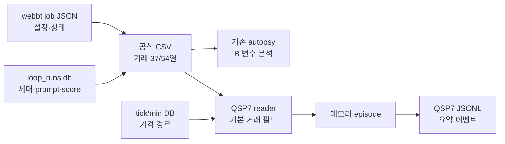

# QSP7 하이브리드 결과 저장소·단일 연구 파이프라인 최종 계획

> 작성일: 2026-08-02
> 최종 구현·브라우저 검증일: 2026-08-03
> 상태: 통합 연구 화면·핵심 replay 구현 완료, 공식 후보 수익·OOS 및 sidecar DB는 미완료
> 적용 브랜치: `codex/qsp7-trade-episode-research`
> 상위 판단 문서: [2026-08-02_qsp7_integrated_direction_scorecard_and_roadmap.md](./2026-08-02_qsp7_integrated_direction_scorecard_and_roadmap.md)
> 안전 경계: 운영 `_database/strategy.db` 쓰기, 실거래, 전체청산 이후 시세 추정, 후보 자동 채택 금지

---

## 0-A. 2026-08-02 실제 구현 결과와 남은 증명

### 전체 판정

페이지 흐름과 핵심 read-only 분석 기능은 구현됐다. 다만 이 문서가 제안한 연구 sidecar DB 전체와 사람 pattern 검색, 새 후보의 공식 설계/OOS 수익 개선은 아직 완료되지 않았다. 따라서 **프로세스 구현 완료**와 **전략 성과 증명 완료**를 분리해 판정한다.

| 구분 | 현재 상태 | 근거 | 남은 일 |
|---|---|---|---|
| 연구 UX 페이지 | ✅ 완료 | 데이터 계약→매수 해부→매도 해부→경로→매도식 추적→가상 매도→후보→공식 pair→OOS 채택, 8771 직접 QA | 새 후보의 공식 설계/OOS 실행은 성과 증명 단계에서 수행 |
| 공식 CSV 계약 | ✅ 완료 | SHA256·행/열·54/37 schema·0-only/missing·비용·전략 hash | sidecar DB 멱등 ingest |
| 매수시점 전수 확인 | ✅ 1차 완료 | `B_*` 전수 가용성, 비0 `B/D` 효과, 손실 구간 표시 | FDR·fold·조건절 funnel 통합 |
| 실제 매도 후 경로 | ✅ 완료 | tick/min DB read-only, 실제 매도→전체청산 경계, 회복·악화·검열 | 대규모 성능 최적화 |
| 원본 매도식 replay | ✅ 핵심 함수 완료 | `if/elif`, 파생 대입, 보유시간, 비용 수익률, 현재가N·이평·최저/최고·수급 창 | 181개 전체 함수가 아니라 미지원 명시 방식 유지·확장 |
| 후보 다양성 | ✅ 5개 연구군 | 손실 방어·이익 보존·수익 반납·시간 가치·마감 관리, tick/min 별도 창 | 사람 pattern catalog 검색·LLM evidence pack 연결 |
| 공식 비교 | ✅ 기능 완료 | 동일 매수·기간·timeframe 호환성 gate와 matched/new/lost 전이 | 새 매도 후보 공식 job 실행 |
| OOS 채택 | ✅ gate 완료 | 설계/OOS 공식 pair 둘 다 개선 + 기간 비중첩 필수 | 별도 OOS job 실행 및 결과 입력 |
| History | ✅ 1차 완료 | 진단·후보·공식 pair append-only 이벤트 | SQLite 정규 원장·migration |
| 수익 개선 증명 | ❌ 미증명 | 현재 공식 후보 pair의 개선 증거 없음 | 설계와 OOS 공식 재백테스트 모두 통과 필요 |

### 실제 브라우저 검증 수치

| 항목 | 확인 결과 |
|---|---|
| min 공식 결과 | 6,659건, modern 54열 |
| 매수 변수 | `B_*` 31개 전수 표시, 비0 26개, 0-only 5개 |
| 분석 투입 변수 | 분산 있는 `B/D` 38개 |
| min 경로 coverage | 6,577/6,659건, 제외 82건 |
| 실제 순손익 | -45,811,646원 |
| 경계 전 회복 | 1,389건 |
| 원본식 단일 거래 replay | 공식 10:55, 재생 첫 발동 10:55 일치 |
| 단일 거래 손익 차이 | +1,866원 자문 차이; 공식 체결/슬리피지 차이로 채택 근거 아님 |
| 테스트 | QSP7 집중 Python 143개, JSX graph 107개 통과 |

### 페이지별 사용 순서

| 순서 | 페이지 | 사람이 확인할 질문 | 다음 단계 |
|---:|---|---|---|
| 1 | 데이터 계약 | 이 CSV·전략·비용·전체청산 경계가 맞는가 | 경계/누락 이상이면 중단 |
| 2 | 매수 해부 | 어떤 `B_*`가 손실을 구분하며 0-only는 무엇인가 | 필터 가설 또는 매도 연구 선택 |
| 3 | 매도 해부 | 어느 실제 매도사유가 손익을 만들었는가 | 거래 cohort 선택 |
| 4 | 거래 경로 | 실제 매도 후 전체청산 전 회복/악화가 있었는가 | 개별 거래 선택 |
| 5 | 매도식 추적 | 원본 `if/elif` 중 무엇이 언제 처음 발동했는가 | 불일치·미지원 함수 확인 |
| 6 | 가상 매도 | 동일 진입에서 한 가설이 어떤 전이를 만드는가 | 공식 실행 가치 선별 |
| 7 | 조건식 후보 | 서로 다른 연구군의 근거·반증·위험이 무엇인가 | 한 축 후보 복사·검토 |
| 8 | 공식 pair | 공식 엔진에서 실제 거래 집합과 손익이 개선됐는가 | 개선 후보만 OOS로 이동 |
| 9 | OOS 채택 | 비중첩 OOS에서도 공식 개선됐는가 | 둘 다 통과해야 채택 |
| 10 | History | 어떤 증거로 생성·기각·비교했는가 | 실패 축을 다음 연구에 환류 |

### 현재 실행 주소와 장애

- 최신 빌드는 `http://127.0.0.1:8771/?tab=backtest`에서 검증했다.
- `8770`은 관리자 권한으로 2026-07-31부터 실행 중인 구형 PID 97248을 현재 비관리자 작업에서 종료할 수 없어 교체되지 않았다.
- 관리자 권한에서 해당 프로세스를 종료한 뒤 최신 브랜치를 8770으로 다시 시작해야 정본 포트를 최신화할 수 있다.

---

## 0. 🧭 최종 결론

### 질문별 답

| 질문 | 결론 |
|---|---|
| 공식 백테스트 결과를 CSV 대신 DB로 관리하면 좋은가? | **부분적으로 그렇다.** 연구 조회·비교·계보에는 DB가 훨씬 유리하지만 공식 CSV를 없애면 안 된다. |
| 권장 구조는? | **CSV 원본 영수증 + 연구 DB 정규화**의 하이브리드 구조다. |
| 새 QSP7 파이프라인을 별도로 만드는가? | **아니다.** 기존 QSP 부검·trade ledger·LLM 생성·공식 백테스트를 하나의 정본 흐름으로 묶는다. |
| 여러 파이프라인 중 하나를 사용자가 선택하는가? | 구현 파이프라인을 고르는 것이 아니라 **연구 질문과 전략 계열**을 선택한다. 내부 처리와 공식 검증은 하나다. |
| QSP7에 왜 누락이 생겼는가? | 안전한 read-only 수직 절편을 먼저 만든 뒤 기존 매수 부검·거래 원장·생성기를 연결하지 않았기 때문이다. |
| DB로 바꾸면 수익이 보장되는가? | 아니다. 데이터 재현성·연구 속도·설명력은 개선되지만 수익성은 공식 설계/OOS로만 증명된다. |

### 한 문장 결정

> 공식 CSV와 tick/min DB는 변경하지 않는 원본으로 보존하고, 그 위에 스키마 버전·거래·실행시점 변수·조건 발동·후보·공식 비교를 저장하는 **재구축 가능한 연구 sidecar DB**를 두는 것이 가장 타당하다.

---

## 1. 📂 현재 결과 관리 구조와 문제

### 1.1 현재 존재하는 저장소

| 저장소 | 현재 역할 | 장점 | 현재 한계 |
|---|---|---|---|
| `backtest/csv/*.csv` | 공식 거래별 결과 | 사람이 열기 쉽고 공식 결과의 원형을 보존 | 반복 파싱, run 간 join·pagination·schema 비교가 느림 |
| `state/webbt_jobs/*.json` | Backtest 페이지 job spec·상태·CSV 경로 | 간단하고 서버 재시작 복원 가능 | 다중 job 질의·관계·마이그레이션이 약함 |
| `loop_runs.db` | AI loop run·세대·점수·prompt·evidence | 실행 계보와 prompt 증거가 이미 있음 | 거래행은 `csv_path`만 참조하고 QSP7 episode를 저장하지 않음 |
| `trade_ledger.py`의 SQLite/Parquet | 정규화 거래행과 `B_*`/`S_*`/`R_*` | 현대 CSV 전체 거래열과 후보 identity를 저장할 기반이 있음 | QSP7 경로에서 호출되지 않음 |
| `analysis_snapshot.py` SQLite | 분석 결과 묶음과 행별 지표 | UI 분석 스냅샷 저장 가능 | 원 거래·feature·조건 trigger와 정규 관계가 없음 |
| QSP7 JSONL ledger | 분석·자문 이벤트 요약 | append-only이고 가벼움 | 거래 상세·조건식·공식 결과 join에 부적합 |
| `_database` tick/min DB | 실제 시장 경로 | 실제 존재 시세의 정본 | 연구 결과 DB로 쓰거나 수정하면 안 됨 |

### 1.2 핵심 문제는 “DB 부재”보다 “저장소 분절”이다

같은 run의 정보가 다음처럼 흩어져 있다.



이 구조에서는 다음 질문이 한 SQL 또는 한 API에서 답되지 않는다.

- 이 공식 거래의 `B_*` 값과 실제 매도 뒤 경로는 무엇인가?
- 같은 진입에서 후보 조건이 언제 처음 발동했는가?
- 가상 개선 거래가 공식 재백테스트에서 matched/new/lost 중 어디로 이동했는가?
- 같은 조건식의 설계/OOS 결과와 사용한 prompt·사람 pattern은 무엇인가?

---

## 2. ⚖️ CSV와 DB 비교

| 항목 | CSV만 사용 | DB만 사용 | 권장 하이브리드 |
|---|---|---|---|
| 공식 원본 보존 | 강함 | DB migration·수정으로 원형이 흐려질 수 있음 | CSV hash를 공식 영수증으로 보존 |
| 사람이 직접 열기 | 쉬움 | 도구 필요 | CSV 유지 |
| run 간 비교·join | 반복 파싱 필요 | 매우 유리 | DB 사용 |
| 37/54 schema 처리 | 파일마다 분기 | schema version으로 통합 가능 | ingest adapter 사용 |
| UI pagination·검색 | 대용량에서 비효율 | index로 빠름 | DB 사용 |
| 재현·감사 | 파일 경로가 바뀌면 취약 | lineage 저장 가능 | CSV hash + DB lineage |
| 장애 복구 | 파일 단위 복사 쉬움 | DB 복구 절차 필요 | DB는 CSV로 재구축 가능해야 함 |
| tick/min 원시 경로 | 별도 DB를 다시 읽음 | 복제하면 용량·정본 문제가 생김 | 원 DB는 read-only 참조만 저장 |

### 결정

1. 공식 CSV는 삭제·대체하지 않는다.
2. 연구 DB는 CSV와 job spec을 **idempotent ingest**한다.
3. DB의 모든 거래·feature·분석은 `source_csv_sha256`로 원본에 연결한다.
4. 연구 DB는 언제든 CSV와 job JSON에서 다시 만들 수 있어야 한다.
5. tick/min 원시 시세는 복제하지 않고 날짜·종목코드·timeframe·경계 참조만 저장한다.

---

## 3. 🧱 권장 저장 구조

### 3.1 저장소 역할

| 계층 | 권장 저장 | 내용 |
|---|---|---|
| 공식 artifact | CSV + manifest | 거래 원본, hash, row count, 공식 metric, 조건식 hash |
| job/run registry | SQLite | job spec, timeframe, 기간, **전체청산시각**, 비용 정책, CSV 위치 |
| normalized trade ledger | 기존 `TradeLedger` 확장 | 거래 1행, 종목코드, `B_*`, `S_*`, `R_*`, availability |
| feature episode | 연구 sidecar SQLite | 진입·실제 매도·고정 horizon의 feature와 provenance |
| trigger trace | 연구 sidecar SQLite | 조건식·절·시각·참/거짓·최초 발동 |
| path data | 원 tick/min DB read-only | 원시 가격·수급은 복제하지 않음 |
| derived analysis | SQLite snapshot | cohort, FDR, 상관, MFE/MAE, 회복, parameter surface |
| candidate/evidence | `loop_runs.db` evidence 계층과 연결 | 시나리오, prompt id, exemplar pattern, diff, 반증 |
| official comparison | SQLite | baseline/candidate, matched/new/lost, 설계/OOS verdict |

### 3.2 새 sidecar DB의 논리 테이블

실제 이름은 구현 시 migration 설계에서 확정하되 책임은 다음처럼 나눈다.

| 테이블 | 기본 키 | 핵심 필드 |
|---|---|---|
| `research_runs` | `run_id` | source kind, timeframe, train/validation/OOS role, 기간, 전체청산, 비용 정책 |
| `artifacts` | `artifact_id` | CSV 경로·SHA256·schema version·row count·ingest 상태 |
| `strategies` | `strategy_sha256` | side, timeframe, 원문, AST fingerprint, family |
| `trades` | `(run_id, row_no)` | 종목코드, 매수/매도·금액·손익·매도사유·분할체결 상태 |
| `feature_values` | `(run_id,row_no,phase,feature_id)` | 값, available, source, lookback, 계산 버전 |
| `path_refs` | `(run_id,row_no)` | date, code, source DB, 시작·종료·전체청산 경계 |
| `trigger_events` | `(replay_id,row_no,rule_no,time)` | condition SHA, 절 순서, 발동값, first-trigger 여부 |
| `outcomes` | `(policy_id,row_no,horizon)` | 실제/가상 손익, MFE/MAE, 검열, 비용 가정 |
| `hypotheses` | `hypothesis_id` | 의도, 근거·반증 cohort, pattern id, 변경축 |
| `candidates` | `candidate_id` | buy/sell SHA, prompt id, syntax·leakage·novelty gate |
| `official_pairs` | `pair_id` | baseline/candidate run, 호환성, matched/new/lost, delta·MDD |
| `promotion_verdicts` | `(candidate_id,role)` | design/OOS gate, 사유, 사람 승인 |

### 3.3 DB에 넣지 말아야 할 것

- 전체 tick/min 원시 데이터를 연구 DB에 다시 복제
- 운영 전략 DB 자동 변경
- 사용자 승인 전 후보의 운영 이름·승격 상태
- 전체청산 이후 가격 추정
- 사후 라벨을 매수 feature처럼 저장하는 모호한 열
- 출처·계산 버전 없는 임의 JSON 숫자

---

## 4. 🔍 QSP7에 누락이 생긴 이유

### 4.1 구현 역사상 이유

QSP7 첫 구현은 다음을 확인하는 **안전한 수직 절편(vertical slice)** 이었다.

1. 공식 CSV 한 건을 읽을 수 있는가
2. 종목명을 코드로 해결할 수 있는가
3. 기존 tick/min DB를 read-only로 읽을 수 있는가
4. 전체청산 전까지만 경로를 자를 수 있는가
5. 진단·가상·공식 권위를 UI에서 구분할 수 있는가

이 목표를 빠르게 검증하기 위해 `TradeResultRow`는 기본 거래 필드만, `MarketPoint`는 가격·체결강도·수량·잔량만 담았다. 사람 전략 DB·기존 `B_*` 부검·TradeLedger·LLM prompt는 연결하지 않았다.

### 4.2 현재 확인된 구조적 원인

| 원인 | 실제 영향 |
|---|---|
| 기존 QSP1~QSP6와 QSP7의 data model이 별도 | 기존 `B_*` 전수 분석이 QSP7 UI에 나타나지 않음 |
| Backtest job은 JSON, AI loop는 SQLite, QSP7은 JSONL | 하나의 run lineage로 join하기 어려움 |
| `BacktestJobSpec`에 전체청산시각 필드가 없음 | 새 실제 job도 현재는 `job_spec_end_time`을 보존하지 못하고 legacy 추론에 의존 |
| 현대 54열과 과거 37열이 공존 | 단일 축약 reader를 선택해 schema 차이를 우회함 |
| 정확한 STOM 함수 replay가 없음 | 임의 DSL 5필드 가상 정책만 지원 |
| 안전을 우선한 2-template proposer | 사람 DB·복합 prompt와 분리됨 |

### 4.3 이 선택은 처음에는 타당했지만 이제는 미완성이다

- 처음부터 운영 DB·공식 엔진·181개 함수를 한꺼번에 바꾸지 않은 것은 안전상 타당했다.
- 경계·coverage·공식 pair가 실제로 연결되는지 먼저 확인한 것도 타당했다.
- 하지만 수직 절편을 최종 파이프라인으로 간주하면 매수변수·조건 우선순위·사람형 생성이 영구 누락된다.

따라서 지금 필요한 것은 두 번째 새 파이프라인이 아니라 **수직 절편을 기존 정본 컴포넌트와 통합하는 단계**다.

---

## 5. 🛤️ 여러 파이프라인을 선택하는가

### 5.1 사용자에게 보일 것은 “파이프라인 선택”이 아니라 “연구 질문 선택”이다

| 연구 모드 | 사용자가 묻는 질문 | 고정하는 것 | 바꾸는 것 |
|---|---|---|---|
| 매수 진단 | 어떤 진입이 손실을 만들었는가 | 매도식 | 매수 필터·패턴 |
| 매도 진단 | 왜 너무 빨리/늦게 팔았는가 | 매수식·동일 진입 | 매도 조건·우선순위 |
| 매수·매도 쌍 연구 | 진입 근거와 무효화가 맞물리는가 | 공식 설정·기간 | 한 쌍의 시나리오 |
| 4시드 비교 | HIER/CSS·tick/min 중 어떤 계열이 안정적인가 | 비용·기간·게이트 | 전략 family |

내부 처리 순서는 네 모드 모두 동일하다.


### 5.2 선택 축과 고정 축

| 구분 | 선택 가능 | 선택 불가 |
|---|---|---|
| timeframe | tick 또는 min | 한 후보에서 두 단위를 혼합 |
| family | HIER 계량 또는 CSS 시나리오 | 서로 다른 family 결과를 한 점수로 뭉개기 |
| research side | buy, sell, pair, family compare | 같은 실험에서 buy와 sell을 동시에 무제한 변경 |
| authority | 진단 화면에서 자문으로 이동 | 가상 결과를 공식으로 승격 |
| official engine | 없음 | 사설 채점기를 최종 권위로 선택 |

즉, 파이프라인은 하나이고 **연구 lane과 가설 family만 선택**한다.

---

## 6. 🏗️ 최종 통합 파이프라인

| 단계 | 처리 | 저장 | 사용자 화면 | 완료 조건 |
|---:|---|---|---|---|
| P1 | job·CSV manifest ingest | artifacts, research_runs | 데이터 계약 | hash·행수·37/54 schema 일치 |
| P2 | 거래행 정규화 | trades, feature availability | CSV 변수 매트릭스 | 기존 4 CSV 전수 재현 |
| P3 | 매수 전 DB 구간·파생변수 계산 | feature_values, path_refs | 매수변수 탐색기 | 유효 `B_*`와 요구 함수 provenance 표시 |
| P4 | 원 매수·매도식 AST replay | trigger_events | 조건식 해부·first-trigger | 지원 DSL의 공식 시각·사유 일치 |
| P5 | 경로·회복·가상 정책 | outcomes | 거래 경로·horizon heatmap | 전체청산 경계·검열 표시 |
| P6 | 사람 pattern retrieval | hypotheses | 시나리오 후보 카드 | threshold 제거·근거/반증 포함 |
| P7 | tick/min별 복합 후보 | candidates | 후보 실험실 | family 4~8종·문법/누출/복제 gate |
| P8 | 공식 설계 실행·비교 | official_pairs | actual→official 전이 | matched/new/lost·비용·MDD |
| P9 | 잠긴 OOS | promotion_verdicts | 승격 보드 | 설정 고정·OOS 재사용 차단 |
| P10 | 실패·학습 환류 | evidence/feedback | 연구 History | 무효 축과 재현성 기록 |

---

## 7. 🖥️ 최종 상세 계획 페이지 UX

### 7.1 페이지 상단

- 현재 연구 질문: 매수 / 매도 / 쌍 / 4시드
- timeframe: tick / min
- 공식 job과 CSV hash
- 전체청산시각과 출처: official / operator / legacy inference
- 권위 badge: 진단 / 자문 / 공식
- 데이터 준비도: 거래·feature·path·replay·공식 비교

### 7.2 단계별 페이지

| 탭 | 핵심 시각화 | 사용자가 확인할 것 |
|---|---|---|
| 데이터 | artifact lineage, schema heatmap, 결측·0-only | 입력이 완전하고 같은 run인가 |
| 매수 해부 | `B_*` 분포, FDR, 상관, 조건절 funnel | 어떤 실행시점 값이 승패를 가르는가 |
| 매도 해부 | 사유 waterfall, MFE/MAE, 회복 생존곡선 | 어디서 손실·이익이 확정되는가 |
| 경로 | event-aligned path, actual/trigger/전체청산 | 너무 빠른지 늦은지 거래별 확인 |
| 후보 | HIER/CSS 카드, 근거·반증, STOM diff | 시험할 한 변화축 선택 |
| 공식 비교 | Sankey, matched/new/lost, 비용·MDD bridge | 가상 예상과 공식 결과 차이 |
| OOS 승격 | design/OOS paired scorecard | 채택·기각·재연구 결정 |

### 7.3 성능·신뢰 UX 목표

- 페이지는 CSV 전체 재파싱 대신 DB pagination을 사용한다.
- 모든 수치는 원본 CSV hash와 계산 버전을 클릭해 확인할 수 있다.
- `legacy`·`missing`·`unsupported DSL`은 정상값처럼 보이지 않게 별도 표시한다.
- 가상 결과 옆에는 항상 공식 결과가 아님을 표시한다.
- 동일 조건 재실행의 재현성 차이가 있으면 승격 버튼을 차단한다.

---

## 8. 🤖 전체 구현 진행용 프롬프트

다음 프롬프트는 후속 구현 작업을 시작할 때 그대로 사용할 수 있는 실행 브리프다. 목적은 agent가 또 다른 분석기나 임시 DB를 만드는 것을 막고, 기존 컴포넌트를 단계적으로 통합하도록 하는 것이다.

```text
현재 브랜치 codex/qsp7-trade-episode-research에서 QSP7 통합 연구 파이프라인 P1~P10을 순서대로 구현하세요.

최상위 목표:
공식 백테스트 CSV와 기존 tick/min DB를 원본으로 보존하면서, 실행·거래·feature·조건 trigger·가상 outcome·공식 pair·OOS 판정을 재구축 가능한 연구 sidecar DB로 연결합니다.

반드시 먼저 읽을 문서:
1. docs/research/quant_scoring_pipeline/2026-08-02_qsp7_hybrid_db_and_unified_pipeline_master_plan.md
2. docs/research/quant_scoring_pipeline/2026-08-02_qsp7_integrated_direction_scorecard_and_roadmap.md
3. utility/ai_agent/AGENTS.md
4. utility/ai_agent/strategy.txt
5. utility/ai_agent/rules.txt
6. utility/ai_agent/system_prompt/v1 및 v2의 관련 자산

고정 불변식:
- 공식 CSV를 삭제하거나 DB로 대체하지 않습니다.
- _database의 tick/min/strategy DB는 read-only입니다.
- 전체청산시각 이후 데이터를 읽거나 추정하지 않습니다.
- R_*, S_*, 매도 후 회복·미래 최고가는 매수 조건 입력으로 사용하지 않습니다.
- 후보는 운영 전략 DB에 자동 저장하지 않습니다.
- 공식 STOM 백테스트만 최종 권위입니다.
- 설계와 잠긴 OOS를 모두 통과하기 전 승격하지 않습니다.
- tick과 min 단위·변수·후보 family를 분리합니다.

구현 원칙:
- 기존 TradeLedger, analysis_snapshot, loop_runs evidence, QSP7 trade episode를 재사용하고 중복 저장기를 만들지 않습니다.
- 연구 DB는 ai_strategy_loop/state 아래의 generated sidecar로 두고 migration과 schema_version을 제공합니다.
- source CSV SHA256과 row count로 ingest를 멱등화합니다.
- BacktestJobSpec과 공식 artifact에 forced_liquidation_time, 비용 정책, 전략 hash를 보존합니다.
- legacy 37열과 현대 54열을 availability mask로 정규화하며 실제 0과 missing을 구분합니다.
- 원 조건식 AST에서 필요한 lookback을 구하고 기존 tick/min DB로 실행시점 함수를 재생합니다.
- replay가 지원하지 않는 STOM 함수는 추정하지 말고 unsupported로 표시합니다.
- 매수·매도 생성은 HIER 계량 lane과 CSS 시나리오 lane을 구분합니다.
- 사람 전략은 전체 식과 숫자를 복사하지 않고 threshold를 제거한 pattern card로 검색합니다.
- 후보마다 국면, 진입근거, 확인조건, 실패정의, 이익경로, 근거, 반증, STOM diff를 저장합니다.

작업 순서:
P1 schema profiler와 artifact registry
P2 normalized trade/feature contract
P3 기존 B_* 부검의 QSP7 연결
P4 공식 매수·매도 DSL first-trigger replay
P5 경로 outcome과 가상/공식 오차 측정
P6 사람 pattern catalog와 관련성 검색
P7 tick/min별 복합 후보 생성
P8 6단계 연구 UX/UI와 실제 브라우저 QA
P9 공식 설계 pair 실행·비교 경로
P10 잠긴 OOS·승격·실패 원장

각 단계 완료 규칙:
- 테스트를 먼저 추가하고 실패를 확인한 뒤 최소 구현합니다.
- 단계별 schema, API, UI, migration, 테스트, 문서를 함께 완료합니다.
- 기존 사용자 파일과 비관련 dirty worktree를 건드리지 않습니다.
- 커밋은 파일을 명시적으로 stage하고 한국어 제목·한국어 markdown 본문으로 작게 나눕니다.
- 실제 공식 후보 실행이나 전략 DB 등록이 필요하면 사람 승인 경계를 유지합니다.

최종 보고:
- 구현된 단계와 미완료 단계를 구분합니다.
- 데이터 coverage, replay 일치율, unsupported 함수, 후보 다양성, 공식/OOS 결과를 표로 제시합니다.
- 수익 개선이 증명되지 않았으면 명확히 미증명으로 표시합니다.
```

---

## 9. 🧠 QSP7 조건식 생성용 prompt 목적

구현 agent 프롬프트와 조건식 생성 LLM 프롬프트는 분리해야 한다. 조건식 생성 프롬프트는 코드를 바로 쓰게 하는 것이 아니라 **증거에서 사람의 시나리오를 먼저 구조화**하는 것이 목적이다.

### 입력 evidence pack

| 입력 | 허용 내용 |
|---|---|
| 부모 전략 | 매수·매도 전체 코드와 AST 구조 |
| timeframe | tick 또는 min 한 가지 |
| 진입 evidence | train의 유효 `B_*`, 교차셀, FDR, 분위수 |
| 매도 evidence | 사유, MFE/MAE, giveback, first-trigger |
| 경로 evidence | 전체청산 전 회복·악화·검열 |
| 사람 pattern | threshold 제거된 관련 HIER/CSS/DB pattern card |
| 실패 기억 | 이전 후보의 공식·OOS 기각 사유 |
| 제약 | 비용, 전체청산, 계산 예산, 문법 whitelist |

### 출력 계약

후보마다 다음을 구조적으로 반환한다.

1. `hypothesis_axis`
2. `market_regime`
3. `entry_thesis`
4. `confirmation`
5. `invalidation`
6. `profit_path`
7. `evidence`
8. `counterevidence`
9. `buy_code` 또는 변경 없음
10. `sell_code` 또는 변경 없음
11. `changed_clauses`
12. `expected_risk`
13. `self_review`

한 라운드에서는 buy 또는 sell 한 축만 바꾸고, 서로 다른 family의 후보 4~8개를 만든다. 숫자만 다른 후보는 하나의 parameter family로 묶는다.

---

## 10. 📈 예상 성과와 약속할 수 없는 것

### 10.1 예상 가능한 시스템 성과

| 단계 | 예상 성과 | 측정 기준 |
|---|---|---|
| 저장 통합 | CSV 반복 파싱과 경로 추적 감소 | 기존 4개 CSV가 같은 row count·hash로 ingest |
| 데이터 신뢰 | 37/54 schema와 0/missing 구분 | 열별 availability·source 표시 100% |
| 매수 연구 | 기존 `B_*` 부검과 QSP7 경로를 한 거래에서 조회 | 유효 진입 변수·조건절·사후 label 동시 drill-down |
| 매도 연구 | 다른 조건의 최초 발동과 실제 매도 비교 | 지원 DSL의 시각·사유 일치율 표시 |
| 생성 품질 | 2-template에서 복수 사람형 시나리오로 확장 | tick/min별 4개 이상 distinct family, 문법·누출 gate 100% |
| 연구 속도 | run 간 비교·필터·pagination 개선 | 주요 cohort 질의를 UI 대기 없이 조회하는 성능 목표 설정 |
| 재현성 | 분석과 후보가 원본·prompt·계산 버전에 연결 | 동일 artifact 재ingest·재계산 결과 일치 |
| 의사결정 | 가상 개선과 공식 개선을 구분 | actual/advisory/official 및 design/OOS scorecard |

### 10.2 제안하는 정량 목표

다음은 현재 성과가 아니라 구현 acceptance target이다.

- ingest row count·CSV hash 일치: 100%
- 신규 job의 정확한 전체청산시각 보존: 100%
- 경로 coverage: 95% 이상, 나머지 제외 사유 전수 표시
- 지원 DSL first-trigger 공식 일치율: 99% 목표, 불일치는 거래별 원인 기록
- 후보 STOM 문법·timeframe·leakage gate: 100%
- tick/min별 후보 family: 최소 4종
- 설계/OOS 결과 재실행 재현: 동일 설정에서 동일 거래·손익

### 10.3 약속할 수 없는 것

- 특정 수익률 또는 손익 개선 폭
- 손절 지연·trailing 변경이 반드시 MDD를 낮춘다는 보장
- 사람다운 조건식이 단순 조건식보다 항상 수익성이 높다는 보장
- 가상 delta가 공식 delta로 그대로 유지된다는 보장

성공의 첫 기준은 수익이 아니라 **틀린 근거를 걸러내고 공식 실행할 가치가 있는 후보만 남기는 것**이다. 수익성 성공은 그다음 공식 설계/OOS 결과로 판정한다.

---

## 11. 📋 실행 우선순위와 산출물

| 우선 | 작업 | 재사용할 기존 코드 | 새로 필요한 것 | 완료 산출물 |
|---:|---|---|---|---|
| 1 | artifact/schema registry | webbt job JSON, CSV hash | forced liquidation·cost·schema manifest | 데이터 계약 페이지 |
| 2 | 거래 DB ingest | `TradeLedger` | legacy adapter, availability mask, idempotent key | normalized trades |
| 3 | 분석 연결 | analyze, label_dataset, segment | episode join API | 매수변수 전수 탐색 |
| 4 | 조건 replay | 공식 전략 text/AST 자산 | supported DSL evaluator·trigger trace | first-trigger UI |
| 5 | 생성 연결 | prompt v1/v2, exemplar pool | pattern card retrieval·QSP7 evidence adapter | 복합 후보 실험실 |
| 6 | 공식 비교 | official pair·matrix | advisory↔official calibration | 전이·오차 보고서 |
| 7 | OOS 승격 | evaluation manifest·evidence store | locked role guard·promotion verdict | 최종 승격 보드 |

다음 구현의 시작점은 **1번 artifact/schema registry와 BacktestJobSpec의 전체청산시각 보존**이다. 이것이 완료되기 전에는 새로운 후보 생성기를 확장하지 않는다.
