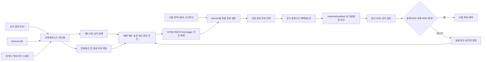

# QSP7 통합 방향성 점검·성과·연구 로드맵

> 작성일: 2026-08-02
> 기준 브랜치: `codex/qsp7-trade-episode-research`
> 기준 커밋: `e4ac882a` → `b6484549` → `3dda4cb3` → `cb3b0d7e`와 현재 구현 작업 트리
> 문서 역할: 대화와 문서가 바뀌면서 생긴 혼선을 정리하는 **QSP7 최상위 기준 문서**
> 권위 구분: 아래의 “구현됨”은 코드·실행 증거이고, “계획”과 “목표값”은 아직 성과가 아니다.
> 최종 실행 계획: [2026-08-02_qsp7_hybrid_db_and_unified_pipeline_master_plan.md](./2026-08-02_qsp7_hybrid_db_and_unified_pipeline_master_plan.md)

---

## 0. 🧭 한눈에 보는 결론

| 질문 | 현재 답 |
|---|---|
| 전체 방향은 맞는가? | **맞다. 8.5/10.** 공식 결과에서 출발하고, 기존 tick/min DB만 사용하며, 가상 분석과 공식 검증의 권위를 분리한 방향은 타당하다. |
| 시스템이 완성됐는가? | **연구 화면은 완성, 전체 저장·생성 체계는 미완성이다. 구현 성숙도 약 7.8/10.** 핵심 STOM 매도식 replay·5개 후보군·설계/OOS gate는 연결됐고, sidecar DB와 사람 pattern 검색은 남았다. |
| 수익 개선이 증명됐는가? | **아니다. 2.5/10.** 동일 조건 control 재현만 확인했다. 변경 매도식의 공식 설계/OOS 결과는 아직 없다. |
| 지금까지 가장 큰 성과는? | 공식 CSV와 tick/min DB를 묶어 실제 매도 뒤 잔여 경로를 보고, 진단 → 자문 → 공식 비교로 이어지는 안전한 연구 표면을 만든 것이다. |
| 가장 큰 부족함은? | 새 후보를 실제 공식 설계/OOS로 실행한 증거가 없고, 사람 전략 DB pattern 검색과 정규 sidecar DB도 아직 연결되지 않았다. |
| 바로 다음 핵심은? | **후보 한 축 선택 → 공식 설계 pair → 비중첩 OOS pair → 실패/채택 기록**, 병행해서 사람 pattern 검색·sidecar DB를 완성하는 순서다. |

### 현재 성과를 한 문장으로 표현하면

> “좋은 매도식을 찾았다”가 아니라, **사람이 공식 백테스트의 손익 거래를 해부하고, 전체청산 전 실제 가격 경로로 가설을 좁힌 뒤, 선택한 매도식을 공식 백테스트로 다시 검증할 수 있는 연구 기반을 연결했다**가 정확하다.

---

## 1. 🔒 앞으로 바뀌면 안 되는 기준

다음 원칙은 대화가 이어져도 QSP7의 고정 계약으로 유지한다.

1. **공식 백테스트 결과가 출발점**이다.
2. 시세는 **이미 존재하는 tick 또는 min DB만** 사용한다.
3. 실제 매도 뒤 경로는 **그 백테스트의 전체청산시각까지만** 읽는다.
4. **장 마감 전체청산은 유지**한다. 연구 대상은 그전에 더 나은 청산이 가능한지다.
5. 매도 뒤에 관측한 가격과 회복 여부는 **진단용 정답표(label)** 이며, 매수시점 조건에 섞지 않는다.
6. 가상 재생은 후보를 좁히는 **자문(advisory)** 이다. 공식 엔진의 전체 재백테스트를 대체하지 않는다.
7. 동일 진입 고정 결과와 실제 전략 전체 결과를 구분한다. 매도 변경은 자금 점유·재진입·동시보유·다음 거래까지 바꾼다.
8. 후보 조건은 자동으로 운영 전략 DB나 실거래에 반영하지 않는다.
9. 사람이 후보의 의도와 조건식 차이를 승인한 뒤 공식 백테스트를 실행한다.
10. **설계 구간과 잠긴 OOS 구간이 모두 통과한 후보만 채택**한다.

---

## 2. 🧾 대화와 커밋이 바뀐 이유

내용이 임의로 바뀐 것이 아니라, 초기 분석의 인과 추론 한계를 사용자 피드백과 구현 검증으로 수정한 과정이다.

| 단계 | 커밋·문서 | 당시 결론 | 이후 보정 |
|---|---|---|---|
| 1차 손실 해부 | `e4ac882a` | 손실 매도사유를 제거하거나 손절 파라미터부터 바꾸자는 방향 | 한 매도조건을 없애면 다른 조건에서 팔리므로 그 손익을 바로 알 수 없다는 문제가 확인됨 |
| 반사실 설계 | `b6484549` | 거래 에피소드, 전체청산 전 잔여 경로, 가상 정책, 공식 검증의 3권위 설계 | 강제청산 유지, 동일 진입 고정의 한계, 사후정보 누출 방지 계약을 명시함 |
| 연구 표면 구현 | `3dda4cb3` | 거래 경로·반사실·후보 초안·공식 pair·History/Wiki 연결 | 실제 실행에서 전체청산 경계, 분봉 시각, 보유시간 단위, pair 비교가능성 결함을 추가 보완함 |

### 초기 표현 중 내려놓아야 할 것

| 초기 표현 | 현재의 정확한 해석 |
|---|---|
| “이 손절이 손실의 원인이다” | 해당 조건에서 손실이 **확정된 빈도**가 높다는 뜻이다. 조건 제거 후 수익을 뜻하지 않는다. |
| “1~2분 보유가 최악이다” | 결과를 보유시간으로 묶은 사후 통계다. 1~2분 안에서 실행 가능한 변수를 찾으면 오히려 좋은 구간이 될 수 있다. |
| “손절 거래 대부분은 -3%까지 안 갔다” | 실제 매도 이후 경로를 결합하기 전에는 회복 가능성을 증명하지 못한다. 지금은 경로 분석으로 거래별 판정이 가능하다. |
| “장 마감 청산을 재설계한다” | 전체청산은 고정한다. 전체청산에 도달하기 전에 이익 보호·정체 청산·구조 이탈이 가능한지를 연구한다. |
| “반사실 이익 증가가 곧 개선이다” | 동일 진입 고정의 자문 수치다. 공식 전체 재백테스트에서 거래 연쇄가 바뀐 결과가 최종 권위다. |
| “건당 손익에서 비용을 다시 뺀다” | 공식 수익금이 이미 비용 후라면 이중 차감이다. 원시 체결·비용 원장이 있을 때만 비용 전후를 다시 분해한다. |

---

## 3. 📊 전체 방향성과 성숙도 점수

### 3.1 종합 점수

| 평가 축 | 점수 | 판정 근거 |
|---|---:|---|
| 연구 방향의 타당성 | **8.5/10** | 결과 우선, DB 경계 준수, 가상/공식 권위 분리, 사람 승인, OOS 채택 원칙이 맞다. |
| 현재 구현 성숙도 | **7.8/10** | 10개 연구 화면과 핵심 replay·공식/OOS gate는 연결됐다. sidecar DB·pattern 검색·실제 신규 공식 실행은 미완료다. |
| 데이터 정밀도 | **7.5/10** | 54/37·0/missing·B/S/R·비용·경계·전략 코드를 보존한다. 분할 체결과 정규 DB 원장은 남았다. |
| tick/min 분리 수준 | **8.0/10** | DB·시각·보유시간·lookback·후보 profile을 tick/min별로 분리했다. 전 함수 parity 통계는 미측정이다. |
| 조건식 생성 품질 | **QSP7 6.5/10** | 5개 의도 family와 근거·반증·위험을 생성한다. 사람 전략 DB retrieval·LLM evidence pack은 아직 없다. |
| 공식 검증 연결 | **7.5/10** | 공식 pair와 설계/OOS 비중첩 채택 gate가 구현됐다. 변경 후보의 실제 공식 결과는 아직 없다. |
| 실제 전략 개선 증거 | **2.5/10** | 동일조건 재현만 확인했다. 수익 개선·MDD 개선·OOS 유지 증거는 아직 0건이다. |

**종합 현재 성숙도: 약 7.8/10.**
방향은 높은 점수지만, 실제 성공 증거가 아직 낮으므로 둘을 합쳐 “완성”으로 표현하면 안 된다.

### 3.2 사용자가 제시한 8단계 흐름별 점수

| 단계 | 목표 | 현재 점수 | 현재 상태 | 핵심 부족분 |
|---:|---|---:|---|---|
| 1 | 공식 백테스트 결과 수집 | **9/10** | 구현됨 | 향후 job에 정확한 전체청산시각·종목코드·비용 원장 보존 |
| 2 | 손실·수익 거래를 매도사유별 분해 | **8/10** | 구현됨 | 조건절 우선순위와 중복 발동 가능성까지 분해 필요 |
| 3 | tick/min DB에서 실제 매도 이후 경로 확인 | **8/10** | 구현됨 | 지표 전체 재구성, 분할 체결·호가 체결 정밀도 보강 |
| 4 | 왜 빨리/늦게 팔았는지 분석 | **8/10** | 구현됨 | 대규모 first-trigger 일치율·체결 차이 분포 추가 필요 |
| 5 | 여러 매도 가설 가상 재생 | **8/10** | 구현됨 | 지원하지 않는 STOM 함수의 점진적 확대 필요 |
| 6 | 사람이 이해할 조건식 후보 생성 | **7/10** | 5개 연구군 | 사람 전략 DB·복합 예시 retrieval 연결 필요 |
| 7 | 공식 백테스트 재검증 | **7/10** | 실행·pair 경로 구현 | 변경 매도식 설계 구간 실제 실행 필요 |
| 8 | 설계/OOS 동시 통과만 채택 | **7/10** | 비중첩 OOS gate 구현 | 별도 OOS job과 재사용 잠금 원장 필요 |

---

## 4. 🧩 입력 데이터: 기대와 실제 구현의 차이

| 입력 | 필요 이유 | 현재 상태 | 다음 보완 |
|---|---|---|---|
| 공식 결과 CSV | 공식 거래·손익·매도사유의 정본 | ✅ 사용 | 스키마 버전과 원본 hash 유지 |
| tick/min DB | 실제 매도 전후의 존재하는 시세 경로 | ✅ 사용 | 종목별 누락·간격 품질 지표 추가 |
| 실제 매수·매도시각 | 거래 에피소드 경계 | ✅ 사용 | 분할 매수·분할 매도 체결 원장화 |
| 실제 매도사유 | 손익 확정 조건 분해 | ✅ 사용 | 원문 식 + 조건절 번호 + 우선순위 보존 |
| 전체청산시각 | 미래 경로 상한 | ⚠️ 부분 | 새 job부터 명시 저장. 과거 CSV 최종 매도시각 추론은 `legacy`로 표시 |
| 매수·매도시점 변수 | 원인 설명·조건 후보 생성 | ⚠️ 기존 QSP 부검은 `B_*`를 분석하지만 QSP7 거래경로 reader는 `B_*`, `S_*`, `R_*`를 현재 버림 | 기존 부검과 QSP7의 feature snapshot 계약 통합 |
| 실제 수익금·비용 | 비용 후 공식 성과와 가상 비용 비교 | ⚠️ 공식 손익은 사용, 가상 수량·비용은 근사 | 체결 수량·수수료·세금·슬리피지 원장 사용 |
| 종목코드 | 정확한 DB 결합 | ⚠️ 이름 중심 경로가 남아 있음 | 향후 공식 CSV에 종목코드 필수화 |
| 조건식 원문 | 같은 조건의 실제 시점별 재생 | ⚠️ job/전략에서 조회 가능하나 QSP7 replay와 미연결 | 안전한 AST/DSL 인터프리터와 연결 |

### 현재 경로 reader가 실제로 읽는 시장 변수

- 시각, 현재가
- 체결강도
- tick/min 매수·매도 수량
- 매수·매도 잔량 합계

따라서 현재 시스템은 DB에 존재하는 181개 STOM 변수·지표를 전부 복원하여 매도식을 평가하지 않는다. 이 차이가 “다른 매도조건이 먼저 발동했는가”를 아직 완전하게 답하지 못하는 핵심 이유다.

---

## 5. 🔬 요청한 계산 항목의 실제 지원 수준

| 연구 질문 | 현재 지원 | 정확한 의미와 제한 |
|---|---|---|
| 어떤 매도조건에서 손실이 확정됐는가? | ✅ | 공식 매도사유별 건수·손익·승률·코호트 집계 가능 |
| 매도 뒤 전체청산 전 회복했는가? | ✅ | 기존 DB 안에서 비용 후 회복 기준과 검열 여부를 계산 |
| 계속 더 하락했는가? | ✅ | post-exit MAE·MFE와 horizon 경로로 판정 |
| 몇 초/몇 분 더 보유하면 달라지는가? | ✅ 기본 | 고정 horizon mark-to-market은 가능. 체결·자금 점유는 근사 |
| 다른 매도조건이 먼저 발동할 수 있었는가? | ⚠️ 제한적 | 단순 정책은 가능하지만, 전체 STOM 식과 `if/elif` 순서를 정확히 재생하지 못함 |
| 동일 진입을 고정하면 후보 매도식은 어떻게 작동하는가? | ✅ 기본 | 후보 제거용 자문. 이후 진입·동시보유 변화는 반영하지 않음 |
| 공식 재백테스트와 가상 결과가 얼마나 다른가? | ⚠️ 기반만 | official pair와 matched/new/lost 비교 API는 있으나 변경 후보 실행 증거가 아직 없음 |
| 왜 너무 빨리 팔았는가? | ⚠️ 부분 | 회복·MFE/MAE는 보이나 당시 실행 가능한 변수의 조합 설명은 더 필요 |
| 왜 너무 늦게 팔았는가? | ⚠️ 부분 | 최고수익 대비 giveback은 계산 가능. first-trigger와 우선순위 분석이 부족 |

---

## 6. ✅ 지금까지 확인된 실제 성과

### 6.1 tick 진단 control

| 항목 | 결과 |
|---|---:|
| job | `20260727_112426_ResearchTestTickB0900000_66061` |
| 공식 거래 | 4,450건 |
| 경로 분석 | 4,399건, **98.85%** |
| 제외 | 51건 |
| 매도 뒤 회복 관측 | 2,315건 |
| 전체청산 경계 검열 | 2,608건 |
| 분석분 실제 손익 | -22,963,621원 |

이 결과는 tick DB 결합과 경로 진단이 작동한다는 증거다. tick 변경 후보의 반사실·공식 pair까지 끝났다는 뜻은 아니다.

### 6.2 min 전 구간 control

| 항목 | 결과 |
|---|---:|
| 공식 control job | `20260802_063342_MinBStudy251227_22848` |
| 공식 거래 | 6,659건 |
| 경로 분석 | 6,577건, **98.77%** |
| 제외 | 82건 |
| 매도 뒤 회복 관측 | 1,389건 |
| 전체청산 경계 검열 | 5,675건 |
| 분석분 실제 손익 | -45,811,646원 |
| 예시 가상 정책 자문 delta | +8,744,309원 |
| 공식 전체 손익 | -46,490,382원 |
| 공식 MDD | 211.95% |

가상 delta는 공식 개선값이 아니다. 최소 보유와 회복 이익실현이라는 한 정책을 동일 진입에 적용한 후보 축소용 수치다.

### 6.3 공식 비교 경로의 증거

- 같은 매수·매도 조건의 과거 job과 새 control job을 비교했다.
- 6,659건 전수 매칭, baseline-only 0건, candidate-only 0건, 손익 delta 0원이었다.
- 이것은 official pair 경로의 정상 작동을 보인 **control test**다.
- MDD는 212.23%와 211.95%로 0.28%p 차이가 있어 재현성 원인은 별도 확인 대상이다.

### 6.4 아직 증명되지 않은 것

- ❌ 변경 매도식의 공식 설계구간 수익 개선
- ❌ 변경 매도식의 OOS 수익 개선 유지
- ❌ 비용 후 손익과 MDD를 함께 개선한 후보
- ❌ tick/min 각각의 최종 채택 조건식
- ❌ 가상 결과와 공식 결과의 오차 분포
- ❌ 1~2분 구간을 실제 실행 가능한 조건으로 최고 구간으로 바꿀 수 있다는 증거

---

## 7. 🧠 조건식 생성과 사람 전략 DB 감사

### 7.1 기존 공통 프롬프트 자산은 생각보다 풍부하다

`utility/ai_agent/strategy.txt`, `rules.txt`와 v1/v2 prompt 자산에는 다음이 이미 있다.

- tick과 min의 변수·보유시간 단위 구분
- 허용 변수·함수 whitelist와 문법 제약
- 사후 결과 변수의 조건식 유입 금지
- 부모 매수·매도식 전체 문맥
- 지표·구간·MFE/MAE·선호/회피 영역과 연구 가설
- 복합 매수·매도 예시와 조건식 자기검토
- 한 번에 너무 많은 축을 바꾸지 않는 후보 프로토콜
- 사람 전략 DB exemplar를 읽어오는 read-only selector와 숫자 임계값 복사 방지

### 7.2 실제 사람 전략 DB 현황

2026-08-02 read-only 점검 기준이다.

| 종류 | 전체 | tick 계열 | min 계열 |
|---|---:|---:|---:|
| 주식 매수식 | 102 | 25 | 24 |
| 주식 매도식 | 47 | 22 | 18 |

사람이 작성한 매도식에는 구조 이탈, 빠른 무효화, 체결/수급 약화, 수익 후행, 목표가 실패, 시간 정체 등 재사용할 수 있는 다양한 **사고방식**이 있다.

### 7.3 그러나 현재 QSP7 후보 생성은 이 자산과 분리돼 있다

현재 `sell_proposer.py`는 약 74줄의 결정론적 proposer이며 사실상 다음 2종뿐이다.

1. 회복한 손실 거래 → 최소 보유 뒤 손절 + 저가 이탈
2. 전체청산 거래 → 이익권의 이동평균 이탈

tick은 90/300초, min은 2/5분으로 단위만 달라지고 정책 가족은 거의 같다. QSP7 API는 공통 LLM prompt, 사람 전략 DB exemplar, 코호트별 주요 변수, parameter sweep을 아직 호출하지 않는다.

### 7.4 조건식 생성 품질 점수

| 항목 | 공통 프롬프트 자산 | QSP7 실제 연결 |
|---|---:|---:|
| 문법·whitelist 안전성 | 9/10 | 7/10 |
| tick/min 단위 구분 | 8.5/10 | 6/10 |
| 사람의 조건식 사고방식 폭 | 8/10 | 2/10 |
| 사람 전략 DB 사용 가능성 | 7/10 | 1/10 |
| 현재 손실 코호트와 관련된 exemplar 검색 | 4/10 | 0/10 |
| 사후정보 누출 방지 | 8.5/10 | 8/10 |
| 데이터로 임계값 보정 | 4/10 | 2/10 |
| 다양한 매도 가족 생성 | 7/10 | 3/10 |

**결론:** “프롬프트가 전혀 단순하다”기보다, **풍부한 공통 프롬프트와 사람 전략 자산은 있는데 QSP7의 실제 매도 후보 생성 경로가 그것을 사용하지 않아 결과가 단순하다**가 정확하다.

---

## 8. 🏗️ 목표 시스템 구조

### 권위는 세 층으로 유지한다

| 층 | 역할 | 할 수 있는 주장 |
|---|---|---|
| 🔍 진단 | 공식 거래와 실제 잔여 경로를 설명 | 어느 조건에서 손실이 확정됐고 이후 어떻게 움직였는가 |
| 🧪 자문 | 동일 진입에서 후보를 빠르게 가상 재생 | 어떤 후보가 공식 실행 가치가 낮거나 높은가 |
| ✅ 공식 | STOM 전체 엔진으로 설계/OOS 재실행 | 실제 전략 전체 손익·MDD·거래 연쇄가 개선됐는가 |

---

## 9. 🧪 tick/min별 후보 생성은 별도 연구여야 한다

같은 템플릿의 숫자 단위만 바꾸지 않고, 데이터 구조와 시장 미시구조에 맞는 후보 가족을 별도로 만든다.

### 9.1 tick 후보 가족

| 후보 가족 | 조합할 수 있는 실행시점 정보 | 연구 질문 |
|---|---|---|
| 빠른 구조 무효화 | 초 단위 보유시간, 최저현재가, 등락률, 체결강도 | 진입 직후 진짜 실패와 정상 흔들림을 구분하는가 |
| 체결·수급 약화 | 매수/매도 체결수량, 잔량, 체결강도 변화 | 가격 손절보다 먼저 매수 압력 붕괴가 보이는가 |
| 미세 반등 실패 | 짧은 고점·저점, 이동평균 회복 실패 | -2% 고정 손절보다 재회복 실패를 기다리는 편이 나은가 |
| 단계형 trailing | 최고수익률 구간, giveback, 짧은 추세 | 이익 문턱을 낮추되 큰 추세의 상방을 남길 수 있는가 |
| 초단기 시간 정체 | 가격 범위, 강도, 거래량, 보유 초 | 1~2분 구간의 무조건 청산이 아니라 비효율 거래만 고를 수 있는가 |

### 9.2 min 후보 가족

| 후보 가족 | 조합할 수 있는 실행시점 정보 | 연구 질문 |
|---|---|---|
| 캔들 구조 이탈 | 분봉 저가·시가·종가, 이동평균, 각도 | 분봉 구조가 깨졌을 때만 손실을 확정할 수 있는가 |
| 추세 회복 대기 손절 | N분 저점, 평균선 재돌파 실패, 손실폭 | 정상 pullback과 지속 하락을 구분하는가 |
| 수익 구간별 trailing | 최고수익률 tier, 평균선, giveback | 2.5~5% 이익도 비용 후 보존하면서 큰 수익을 유지하는가 |
| 목표가 실패 | 고점 접근 후 거래량·강도 둔화 | 최고수익을 많이 반납하기 전에 실패를 포착하는가 |
| 장중 정체 청산 | 보유 분, 변동폭, 거래량, 손익권 | 전체청산까지 끌고 갈 가치가 없는 거래만 사전에 정리하는가 |
| 장 마감 전 이익 보호 | 전체청산까지 남은 시간, 수익권, 추세 | 강제청산을 없애지 않고 이익 거래의 반납을 줄이는가 |

### 9.3 후보 한 건이 가져야 할 설명 묶음

- 🎯 바꾸는 의도 1개
- 🧩 부모 매도식에서 바뀐 조건절과 우선순위
- 📚 사람 전략 DB에서 참고한 **패턴 이름**과 차이점
- 📈 근거 코호트, 표본 수, 실행시점 변수 분포
- ⚠️ 반증 코호트와 예상 부작용
- 🔢 설계 구간에서 탐색할 임계값 범위
- 🧪 가상 재생의 coverage·검열·비용 가정
- ✅ 공식 설계/OOS 채택 기준
- 🚫 사후 회복값이 실제 조건식에 들어가지 않았다는 leakage 검사

---

## 10. 📈 필요한 시각화

현재 UI의 요약·코호트·거래목록·개별 경로·반사실·초안·공식 pair를 유지하고 다음을 추가한다.

| 우선 | 시각화 | 사람이 답할 질문 |
|---:|---|---|
| 1 | 매도사유별 손익 waterfall | 전체 손실과 이익이 어느 매도사유에서 확정되는가 |
| 2 | 매도사유 × 추가 보유시간 heatmap | 10초/30초/1분/2분/5분 뒤 회복과 악화가 어떻게 다른가 |
| 3 | MAE–MFE 사분면 scatter | 정상 흔들림에서 잘린 거래와 계속 하락한 거래가 분리되는가 |
| 4 | 회복 생존곡선(time-to-breakeven) | 회복 거래는 보통 얼마 안에 회복하고, 언제부터 기다림이 무의미한가 |
| 5 | 조건 우선순위 first-trigger 흐름도 | 후보 조건을 넣었을 때 어떤 조건이 먼저 발동하는가 |
| 6 | parameter surface heatmap | 손절폭·최소보유·trailing 조합이 좁은 한 점이 아니라 안정 영역인가 |
| 7 | actual → advisory → official Sankey | 가상 전이와 공식 matched/new/lost 전이가 얼마나 다른가 |
| 8 | 설계/OOS paired scorecard | 설계에서 좋아진 효과가 OOS에서 얼마나 유지되는가 |
| 9 | 비용 전후·MDD bridge | 수익 증가가 비용·낙폭 악화로 상쇄되지 않는가 |
| 10 | tick/min 독립 연구 탭 | 두 timeframe의 변수·시간축·후보 가족을 혼동하지 않는가 |

---

## 11. 🚦성공 판정 기준

아래 값은 향후 합의할 **제안 기준**이며 현재 통과 실적이 아니다.

### 11.1 데이터 게이트

- 경로 결합 coverage 95% 이상, 제외 사유 100% 노출
- 전체청산시각 출처와 신뢰도 표시; 새 job은 추론이 아닌 공식 설정값 사용
- B_/S_/R_ 스냅샷과 종목코드 보존
- 비용의 포함 여부를 명시하고 이중 차감 금지
- 매도 뒤 정보가 후보 식에 들어가지 않는 leakage test 통과

### 11.2 후보 품질 게이트

- tick/min 각각 최소 4개 이상의 서로 다른 매도 가족
- 숫자만 다른 중복 후보를 같은 가족으로 묶어 과대표집 금지
- 후보마다 근거와 반증, 예상 거래수, 위험을 함께 표시
- 임계값은 사람 DB에서 복사하지 않고 현재 설계 코호트 분포로 보정
- `if/elif` 우선순위 변경을 별도 변화 축으로 표시

### 11.3 가상 재생 게이트

- 총 delta뿐 아니라 기간·시간대·매도사유·시장상태별 안정성 표시
- coverage와 전체청산 검열 비율 표시
- 비용·체결 근사와 공식 엔진과의 차이를 표시
- 한 축을 선택한 이유와 버린 가설을 원장에 기록

### 11.4 공식 채택 게이트

- 공식 비용 후 손익 개선
- MDD가 허용 범위 안에 있고 극단 손실이 악화되지 않음
- 거래수 감소만으로 만든 착시가 아닌지 matched/new/lost 비교
- 설계구간의 여러 시간 fold에서 방향이 일관됨
- 잠긴 OOS에서 설계 개선분의 일정 비율 유지. 예: **50% 이상은 검토용 목표**이며 데이터 검토 후 확정
- 같은 설정을 다시 실행했을 때 결과 재현
- 최종 채택은 사람 승인

---

## 12. 🛠️ 다음 개발·연구 단계

| 우선 | 단계 | 구현·연구 내용 | 완료 조건 |
|---:|---|---|---|
| P0 | 실행 기준선 안정화 | 최신 backend/frontend build 일치, `8770` 정식 재기동 절차와 health 표시 | UI와 API build가 같고 QSP7 route가 실제 응답 |
| P1 | 거래 증거 완전성 | 전체청산시각·종목코드·B_/S_/R_·분할 체결·비용 원장 보존 | 새 공식 job의 trade episode가 추론 없이 재구성됨 |
| P2 | feature episode store | 매수, 고정 horizon, 실제 매도, 매도 후의 tick/min별 변수 벡터 | UI에서 거래 한 건의 실행시점 변수와 사후 label을 분리 조회 |
| P3 | 정확한 매도 DSL 재생 | 안전 AST로 지원 함수 평가, 원 `if/elif` 순서와 first-trigger trace | 대표 매도식이 공식 시점·사유와 일치하는 회귀 테스트 통과 |
| P4 | 복합 후보 생성기 | 사람 전략 DB 패턴 검색, 코호트 변수 결합, tick/min별 4~8개 후보, 반증 생성 | 2개 템플릿 의존 제거, 후보 설명 묶음 완성 |
| P5 | 자문 탐색·랭킹 | parameter grid, 안정 영역, 비용, time fold, 중복 후보 제거 | 공식 실행 가치가 높은 소수 후보가 근거와 함께 정렬됨 |
| P6 | 공식 설계 검증 | 사람 선택 → 공식 실행 → pair/matrix → matched/new/lost·자금 점유 비교 | 변경 매도식의 설계 결과가 공식 원장에 기록됨 |
| P7 | 잠긴 OOS 검증 | 설계에서 고른 설정을 변경 없이 OOS 실행 | 손익·MDD·거래수·안정성 게이트 판정 |
| P8 | 연구 기억 | 성공뿐 아니라 실패 가설·금지 축·재현성 문제를 append-only 기록 | 같은 실패 축의 무의미한 반복 감소 |

### 바로 해야 할 순서

1. **현재 서비스 정합성부터 확인한다.** 현재 최신 UI와 과거 `8770` backend가 섞일 수 있으므로 정식 최신 서버로 맞춘다.
2. **QSP7 data contract를 확장한다.** 특히 CSV에 있는 `B_*`, `S_*`, `R_*`를 버리지 않게 한다.
3. **매도 DSL first-trigger 재생기를 먼저 만든다.** 이것 없이는 “다른 조건이 먼저 팔았는가”에 정확히 답할 수 없다.
4. **사람 전략 DB와 QSP7 proposer를 연결한다.** 전체 식을 복사하지 않고 패턴을 회수해 현재 코호트의 변수와 결합한다.
5. tick과 min에서 각각 4~8개 다양한 후보를 자문 평가한다.
6. 사람이 한 축을 고르면 공식 설계구간을 실행한다.
7. 설계 통과 후보만 잠긴 OOS로 보내고, 통과하지 못하면 실패 원인을 기록한다.

---

## 13. 👤 사용자가 대시보드에서 확인해야 할 것

| 확인 순서 | 화면에서 볼 것 | 잘못된 해석 |
|---:|---|---|
| 1 | 선택 job·timeframe·기간·전체청산 경계 출처 | 다른 job의 DB나 경계가 섞였는데 결과를 믿는 것 |
| 2 | 분석 coverage와 제외 사유 | 분석되지 않은 거래를 무시하고 합계만 보는 것 |
| 3 | 매도사유별 손익·회복·악화 | 손실 매도사유를 제거하면 그 손실이 사라진다고 보는 것 |
| 4 | 개별 거래의 매수→실제 매도→전체청산 경로 | 사후 최고가를 실제 조건으로 사용할 수 있다고 보는 것 |
| 5 | 후보의 근거·반증·변경 조건절·우선순위 | 수익 delta만 보고 후보를 선택하는 것 |
| 6 | 가상 coverage·검열·비용 가정 | 가상 delta를 공식 수익으로 보는 것 |
| 7 | 공식 pair의 matched/new/lost와 MDD | 총손익 하나만 비교하는 것 |
| 8 | 설계와 OOS scorecard | 설계구간 최고 후보를 바로 채택하는 것 |

---

## 14. 📚 구현 근거와 연결 문서

- 초기 손실 해부·핸드오프: [HANDOFF_2026-08-01_QSP7_매도식연구.md](./HANDOFF_2026-08-01_QSP7_매도식연구.md)
- 반사실·권위 설계: [2026-08-01_qsp7_trade_episode_exit_research_system_design.md](./2026-08-01_qsp7_trade_episode_exit_research_system_design.md)
- 구현·실행 결과: [2026-08-01_qsp7_trade_path_research_implementation_result.md](./2026-08-01_qsp7_trade_path_research_implementation_result.md)
- STOM 조건식 기본 규칙: [`../../../utility/ai_agent/strategy.txt`](../../../utility/ai_agent/strategy.txt), [`../../../utility/ai_agent/rules.txt`](../../../utility/ai_agent/rules.txt)

이 문서를 기준으로 읽으면 초기 문서의 분석 수치와 아이디어는 “연구 가설”, 구현 결과 문서는 “현재 증거”, 본 문서는 “현재 판단과 다음 순서”로 구분된다.

---

## 15. 🔤 QSP7의 의미와 범위

`QSP`는 이 프로젝트에서 사용하는 **Quant Scoring Pipeline(퀀트 채점 파이프라인)** 의 약어다. 국제 표준 알고리즘 이름이 아니라 STOM 조건식 연구 캠페인의 내부 이름이다.

| 이름 | 의미 |
|---|---|
| QSP1 | tick/min × HIER/CSS 4개 시드 계열을 만든 첫 연구기 |
| QSP2~QSP6 | 좋은 시드 이식, 설계/홀드아웃 동반 판정, 리프 제거·필터, 깊이 탐색 등 매수식 중심 개선기 |
| **QSP7** | 공식 거래 결과를 거래 에피소드로 확장해 **매수와 매도를 함께 설명·가상 재생·공식 재검증**하려는 7번째 연구기 |

따라서 QSP7의 최종 목적은 “매도식만 두 개 만드는 것”이 아니다.

> **공식 거래 결과와 실행시점 변수를 이용해 매수 원인과 매도 원인을 함께 설명하고, 사람이 이해할 수 있는 복수의 조건식 가설을 만든 뒤, 공식 설계/OOS 결과로만 승격하는 연구 시스템**이 QSP7의 정확한 범위다.

---

## 16. 🧾 실제 CSV 전체 열 전수 확인

### 16.1 확인한 공식 결과 파일

| 구분 | 파일 | 거래행 | 전체 열 | 기본 | `B_*` | `S_*` | `R_*` |
|---|---|---:|---:|---:|---:|---:|---:|
| tick 설계 | `stock_bt_QSP2ANCH_R8C2_B_20260731234533.csv` | 13,718 | 54 | 14 | 31 | 5 | 4 |
| tick OOS | `stock_bt_QSP2ANCH_R8C2_B_20260731235145.csv` | 10,755 | 54 | 14 | 31 | 5 | 4 |
| min 공식 control | `stock_bt_Min_B_Study_251227_20260802063550.csv` | 6,659 | 54 | 14 | 31 | 5 | 4 |
| tick 과거 control | `stock_bt_ResearchTest_Tick_B_090000_092800_Wide_20260419_20260727112745.csv` | 4,450 | 37 | 14 | 14 | 5 | 4 |

### 16.2 열의 의미

| 묶음 | 열 |
|---|---|
| 기본 14열 | 종목명, 시가총액, 매수/매도시간, 보유시간, 매수/매도가, 매수/매도금액, 수익률, 수익금, 누적수익금, 매도조건, 추가매수시간 |
| 매수시점 `B_*` 31열 | 가격·등락률·거래대금·시총·회전율·전일동시간비·호가잔량·시각·일중 OHLC·체결강도평균·각도·tick/min 수급·RSI 등 |
| 매도시점 `S_*` 5열 | 현재가, 등락률, 체결강도, 매수총잔량, 매도총잔량 |
| 결과 `R_*` 4열 | 매수 후 최고/최저수익률과 MFE/MAE |

현대 CSV에서 확인한 `B_*` 31열은 다음과 같다.

`B_현재가`, `B_등락율`, `B_당일거래대금`, `B_거래대금증감`, `B_체결강도`, `B_시가총액`, `B_회전율`, `B_전일동시간비`, `B_매수총잔량`, `B_매도총잔량`, `B_시분초`, `B_분봉시가`, `B_분봉고가`, `B_분봉저가`, `B_시가`, `B_고가`, `B_저가`, `B_전일비`, `B_고저평균대비등락율`, `B_체결강도평균`, `B_등락율각도`, `B_당일거래대금각도`, `B_초당거래대금`, `B_초당거래대금평균`, `B_누적초당매수수량`, `B_누적초당매도수량`, `B_분당거래대금`, `B_분당거래대금평균`, `B_분당매수수량`, `B_분당매도수량`, `B_RSI`

### 16.3 존재하는 열과 실제 유효 변수는 다르다

| timeframe | 전부 0으로 확인된 `B_*` | 해석 |
|---|---|---|
| 현대 tick 설계/OOS | 분봉시가·고가·저가, 분당거래대금·평균·매수수량·매도수량, RSI | tick에 없는 min 계열을 0으로 채운 결과. 31개 중 최소 8개는 분석 입력에서 제외해야 함 |
| min control | 초당거래대금·평균, 누적초당매수·매도수량, RSI | tick 계열 4개와 현재 미기록 RSI가 0. 31개 중 최소 5개는 제외해야 함 |
| 과거 tick control | 분봉시가·고가·저가 | 구 스키마는 `B_*` 자체가 14개뿐이며 그중 3개가 0 |

빈 문자열뿐인 `B_*` 열은 확인되지 않았다. 다만 “0”이 실제 시장값인지 구 스키마 패딩인지 현재 CSV만으로 구분할 수 없으므로, 다음 버전에서는 `missing`과 실제 0을 구분해야 한다.

### 16.4 왜 181개 변수가 CSV 열 181개가 아닌가

`variables_reference.md`의 181개는 단순 스칼라 열 목록이 아니라 다음이 섞인 **함수형 어휘**다.

- `현재가N(1)` 같은 이전 tick/봉 조회
- `이동평균(60)`, `최저현재가(30, 1)` 같은 구간 계산
- `변동성급증`, `호가상승압력` 같은 합성 조건
- min 전용 보조지표와 tick/min별 수량 함수

이 값들은 한 시점의 CSV 행만으로 계산할 수 없다. 매수시점 이전의 기존 tick/min DB 구간과 동일한 함수 구현·파라미터가 필요하다. 따라서 목표는 CSV에 181개 고정 열을 무조건 추가하는 것이 아니라, **사용한 조건식과 후보가 요구하는 함수들을 기존 DB 경로에서 공식 엔진과 동일하게 재계산**하는 것이다.

---

## 17. 🔍 매수시점 변수를 왜 모두 확인하지 않았는가

### 17.1 실제 상태

“전체 시스템이 매수시점 변수를 보지 않는다”는 것은 정확하지 않다.

| 경로 | 매수시점 변수 사용 |
|---|---|
| `autopsy/analyze.py` | 공식 CSV에 존재하는 `B_*` 전수를 승리/손실 표준화 평균차와 FDR로 분석 |
| `autopsy/label_dataset.py` | 존재하는 모든 수치 `B_*`와 재현 가능한 `D_*` 파생변수를 자동 편입하고 zero-variance 열 제외 |
| `autopsy/ablation.py` | `B_*`로 원 매수식 절의 통과율을 근사 평가 |
| `autopsy/feature_map.py`, `segment.py` | 매수시점 특징의 구간·교차 셀 손익 분석 |
| **QSP7 `trade_episode.py`** | 종목·시각·가격·손익·매도사유 등 기본 거래 필드만 `TradeResultRow`로 읽음 |
| **QSP7 `sell_proposer.py`** | 회복 거래 수와 전체청산 거래 수만으로 2개 템플릿 생성 |

즉, 원인은 누출 방지를 위해 매수 변수를 금지했기 때문이 아니다. **기존 매수 부검 계층과 새 거래경로 계층을 별도 구현하면서 feature contract를 연결하지 않은 범위 누락**이다.

### 17.2 모든 변수를 무조건 후보에 넣는 것도 정답은 아니다

- timeframe에서 항상 0인 열은 정보가 없다.
- 같은 의미의 변수는 높은 상관으로 후보를 중복시킨다.
- 20~30개 변수를 동시에 비교하면 우연히 좋아 보이는 변수가 늘어난다.
- `R_*`, 매도 뒤 회복, 미래 최고가는 라벨이지 매수 조건 입력이 아니다.
- 단변량 차이만으로 복합 조건의 상호작용을 설명할 수 없다.

따라서 “전수 확인”과 “전부 조건식에 투입”은 구분한다. 모든 가용 변수를 품질 검사한 뒤, FDR·상관 중복·시간 fold·OOS 안정성으로 줄여야 한다.

### 17.3 해결할 통합 데이터 계약

| 계층 | 저장 내용 | 조건식 입력 가능 여부 |
|---|---|---|
| E0 거래 정본 | 종목코드, 실제 체결, 비용, 매수/매도사유, 전체청산시각 | 메타정보 |
| E1 진입 스냅샷 | CSV의 유효 `B_*`, 결측 여부, 스키마 버전 | ✅ 매수/매도 후보 입력 가능 |
| E2 진입 전 경로 | 매수 전 기존 tick/min DB lookback | ✅ 실행시점에 계산 가능한 함수만 가능 |
| E3 실행시점 파생값 | 원 조건식과 후보가 요구하는 N/이동평균/최저가/수급/지표 | ✅ 가능 |
| E4 실제 매도 스냅샷 | `S_*`, 실제 발동 조건, first-trigger trace | 매도 진단용. 매수 입력 금지 |
| E5 사후 결과 라벨 | `R_*`, 전체청산 전 회복·악화·가상 결과 | 분석 정답표. 생성 식 입력 금지 |

구현 원칙은 다음과 같다.

1. CSV 스키마를 `legacy-37`, `episode-54`처럼 버전으로 판별한다.
2. 구버전 0 패딩과 실제 0을 분리하는 availability mask를 둔다.
3. 기존 `analyze/label_dataset` 결과를 QSP7 에피소드에 연결한다.
4. 원 매수식 AST에서 필요한 변수·함수·lookback을 먼저 추출한다.
5. 매수 전 기존 DB 경로를 읽어 공식 함수와 같은 계산을 수행한다.
6. 후보 매수식도 실제 매수시각마다 참/거짓과 실패 절을 기록한다.
7. 사후 라벨은 분석·채점에만 사용하고 생성 조건식 문자열에는 들어가지 못하게 기계 검사한다.

---

## 18. 🌐 연구의 “넓은 범위 4세트” 재검토

### 18.1 공식 QSP1 4개 시드 계열

정본 4세트는 단순히 tick/min 매수·매도 4개 파일이 아니라 **4개 매수/매도 쌍, 총 8개 조건식**이다.

| 세트 | 성격 | 사람 작성 느낌 | 연구 역할 |
|---|---|---:|---|
| tick HIER | 시간 4밴드 × 시총 4단계 × 공통 조절변수 | 5/10 | 넓게 거래를 모으고 어떤 리프가 나쁜지 정량 비교하는 좌표계 |
| min HIER | 장중 4밴드 × 시총 4단계의 min 대응판 | 5/10 | 분봉 전 구간을 같은 좌표계로 비교 |
| tick CSS | 미세박스돌파·리테스트·도지압축 + 수급, 구조 무효화 매도 | 8/10 | 사람이 시나리오를 세우는 패턴형 가설 |
| min CSS | 박스지지·돌파·리테스트·도지·갭·장기박스와 대응 청산 | 8.5/10 | 가장 사람다운 복합 구조·실패 시나리오 쌍 |

HIER는 반복이 많지만 결함만은 아니다. 사람다운 최종 전략이 아니라 **어느 시간×시총 셀을 조일지 측정하는 실험 좌표계**이기 때문이다. CSS는 중간 변수에 의미 있는 이름을 붙이고 진입 시나리오와 무효화 청산을 짝지어 사람 전략에 더 가깝다.

### 18.2 `와이드시드V1_*` 4개 텍스트는 별도다

`utility/ai_agent/strategy/와이드시드V1_{tick|min}_{매수|매도}_20260717.txt`는 생성 경로의 초기 부트스트랩 자료다.

- 매수식은 시간대와 시총 분기를 만들었지만 내부 조건이 거의 동일하게 반복된다.
- 매도식은 강제시각·고정 손절·고정 익절·보유시간 종료의 4절뿐이다.
- 넓은 거래 수집에는 쓸 수 있으나, 현재 사용자가 기대하는 사람의 경험·복합 시나리오 수준은 아니다.

따라서 “4세트가 있으니 AI가 네 계열을 모두 배우고 있다”고 해석하면 안 된다. QSP7은 현재 선택한 공식 job을 분석할 뿐이며, 이 4세트를 자동으로 비교하거나 모두 prompt exemplar로 넣지 않는다.

### 18.3 사람처럼 만들기 위한 두 연구 lane

| lane | 보존할 장점 | 생성 방식 |
|---|---|---|
| HIER 계량 lane | 시간×시총 좌표, 한 축 수정, 원인 추적 | 잔차표와 분위수로 리프 경계만 결정론적으로 수정 |
| CSS 시나리오 lane | 박스/추세/리테스트/도지/수급/무효화의 이야기 구조 | 사람 DB 패턴 카드 + 현재 코호트 근거를 LLM에 주고 복수 시나리오 생성 |

둘을 섞어 거대한 한 식을 만들지 않는다. HIER에서 손실 구간을 찾고, CSS에서 그 구간을 설명할 실행 가능한 구조 가설을 만들며, 공식 백테스트로 어느 설명이 맞는지 비교한다.

---

## 19. 🤖 agent 폴더·프롬프트·실제 생성 경로 감사

### 19.1 존재하는 가이드

| 자산 | 역할 | 실제 상태 |
|---|---|---|
| `utility/ai_agent/AGENTS.md` | 생성물 위치·사람 검토·누출 방지 | 유효 |
| `strategy.txt`, `rules.txt` | tick/min 변수·STOM 문법·작업 절차 | 유효. 일부 설명 오탈자·구식 규칙은 별도 정비 필요 |
| `system_prompt/v1` | whitelist, 금지어, 사람 구조론, 복합 예제 | 일반 LLM prompt의 핵심 자산으로 연결됨 |
| `system_prompt/v2` | 분석→수정, 계층 보존, 다후보, 자기검토 | 결정론 proposer 규약에는 반영. README상 일반 LLM 배선은 부분/대기 |
| `agent_intervention_guidelines.md` | LLM 불가 시 agent 대행, 공식 runner, 흔적 의무 | 유효하지만 QSP7 후보 API와 직접 연결되지 않음 |
| `exemplar_pool.py` | 사람 `strategy.db` 또는 통과 전략에서 최대 K개 읽기 | 일반 loop에서 선택적으로 사용, QSP7에서 미사용 |

### 19.2 일반 AI loop의 장점

- v1 전문과 복합 조건 예시를 연구 Context Pack에 포함한다.
- 부모 매수/매도식, 부검, 세그먼트, MFE/MAE, 가설 실패 이력을 prompt에 넣을 수 있다.
- 연구 preset에서는 구조론, principle gate, evidence ledger, few-shot `seed_db`, `k=3`을 켠다.
- tick/min 변수 스코프와 결과 누출을 검사한다.
- `CandidatePayloadV2`는 전체 매수식과 전체 매도식 양쪽을 표현할 수 있다.

### 19.3 아직 사람다운 생성을 막는 연결 문제

| 문제 | 영향 | 해결 |
|---|---|---|
| QSP7 proposer가 LLM·exemplar를 호출하지 않음 | 2개 템플릿만 반복 | QSP7 evidence pack을 일반 generator의 sell/buy 경로에 전달 |
| few-shot 최대 3개를 이름 우선으로 선택 | 현재 손실 코호트와 무관한 샘플 가능 | timeframe·매수패턴·매도사유·변수군 기반 검색 |
| 사람 DB 전체 식을 예제로 전달 | 숫자·표현 복제 위험 | AST를 패턴 카드로 바꿔 임계값 제거 후 제공 |
| v2 다후보·자기검토가 일반 LLM에 완전 배선되지 않음 | 같은 축의 숫자 변형이 여러 후보로 나옴 | 후보별 hypothesis id, 변경축, diff, 반증을 구조 출력으로 강제 |
| 매수와 매도를 따로 생성 | 진입 근거와 무효화 청산 불일치 | entry thesis id를 매수/매도 쌍에 공유 |
| 현재 코호트의 `B_*`가 QSP7 prompt에 없음 | 데이터 근거 없이 예쁜 조건식 생성 | 유효 B 변수·교차셀·반증 코호트만 evidence pack에 주입 |

### 19.4 목표 생성 단위: 조건식이 아니라 “사람의 매매 시나리오”

후보 한 쌍은 다음 구조를 가져야 한다.

1. **국면:** 박스, 돌파, 리테스트, 추세, 정체 중 무엇인가
2. **진입 근거:** 가격 구조 + 수급/거래대금 확인
3. **확인 조건:** 거짓 돌파를 거르는 실행시점 조건
4. **실패 정의:** 진입 근거가 사라지는 구조 무효화
5. **이익 경로:** 목표 기능선, trailing 또는 단계 청산
6. **시간 경계:** tick/min 단위와 전체청산시각
7. **근거 데이터:** 어떤 `B_*`/코호트/표본 수가 이 가설을 지지·반박하는가

이 구조를 채운 뒤 마지막에 STOM 조건식으로 번역해야 한다. 코드를 먼저 생성하고 그럴듯한 설명을 붙이는 순서는 금지한다.

---

## 20. 🧪 아직 증명되지 않은 것을 연구로 이어가는 방법

| 미증명 항목 | 검증 실험 | 성공 증거 |
|---|---|---|
| QSP7 가상 재생이 공식 결과를 잘 예측하는가 | 동일 후보를 자문 replay와 공식 engine에서 실행 | 거래별 exit 시각·사유 오차, 손익 delta 오차분포 |
| 다른 매도조건의 최초 발동을 맞히는가 | 원 매도식부터 DSL first-trigger 재생 | 공식 매도사유·시각과 높은 일치율, 불일치 원인 원장 |
| `B_*` 전수 분석이 매수 개선에 기여하는가 | 기존 top 변수 방식 vs 전수+FDR+상호작용 방식 A/B | 공식 설계/OOS 손익·MDD와 후보 안정성 |
| 사람 패턴 검색이 템플릿보다 좋은가 | 현재 2-template, 일반 LLM, 사람 DB top-3, 패턴카드 retrieval 4-arm 비교 | 문법 통과율, 가족 다양성, 복제율, 공식 OOS 성과 |
| 사람다운 조건이 실제로 더 좋은가 | 전략명을 가린 전문가 blind review + 공식 결과 분리 평가 | 설명가능성 점수와 OOS 성과의 동반 개선 여부 |
| 4시드 중 어느 계열이 적합한가 | 4쌍을 같은 기간·비용·전체청산으로 공식 실행 | tick/min × HIER/CSS 설계/OOS paired scorecard |
| 매도 개선이 다음 거래를 해치지 않는가 | 동일 진입 자문과 공식 전체 실행을 함께 비교 | matched/new/lost, 자금 점유, 재진입, 동시보유 차이 |
| 비용·분할체결 근사가 충분한가 | 정확한 체결 원장 보유 거래와 근사 결과 비교 | 비용·손익 오차 허용 범위와 제외 규칙 |
| 반복 연구가 OOS를 오염시키지 않는가 | 설계/validation/OOS 역할과 조회 권한 잠금 | OOS 1회 판정, 실패 후 같은 OOS 재튜닝 차단 |

### 생성기 4-arm 비교의 공정한 조건

- 같은 부모식, 같은 설계 데이터, 같은 후보 수, 같은 공식 실행 예산을 사용한다.
- 매수 생성 실험에서는 매도식을 고정하고, 매도 생성 실험에서는 매수식을 고정한다.
- 후보 이름을 가리고 사람이 조건 구조만 평가한다.
- 수익성이 아닌 문법 통과율·중복률·가설 다양성도 함께 측정한다.
- 최종 순위는 공식 비용 후 손익·MDD·OOS 안정성으로 결정한다.

---

## 21. 🖥️ 시각화·UX/UI 고도화 설계

### 21.1 화면 방향

QSP7은 화려한 차트 모음이 아니라 **근거 중심 연구 워크벤치**로 만든다. 진단은 청색, 가상 자문은 황색, 공식 결과는 녹색, 데이터 부족·추론 경계는 사선 패턴으로 일관되게 표시한다.

### 21.2 하나의 6단계 연구 흐름

| 단계 | 화면 | 핵심 질문 | 사용자의 결정 |
|---:|---|---|---|
| 1 | 데이터 계약 | 이 결과와 DB를 믿을 수 있는가 | coverage·경계·스키마 승인 |
| 2 | 손익 해부 | 어떤 매수/매도 조건과 구간이 손익을 갈랐는가 | 연구 코호트 선택 |
| 3 | 거래 경로 | 너무 빨리/늦게 판 거래가 실제로 어떻게 움직였는가 | 대표·반례 확인 |
| 4 | 후보 실험실 | 어떤 매수/매도 시나리오를 시험할 것인가 | 후보와 한 변화축 선택 |
| 5 | 공식 비교 | 실제 전략 전체가 어떻게 바뀌었는가 | 설계 통과/기각 |
| 6 | OOS 승격 | 개선이 새 기간에도 유지되는가 | 최종 채택/폐기 |

### 21.3 추가할 핵심 컴포넌트

| 컴포넌트 | 표현 |
|---|---|
| CSV 스키마·품질 매트릭스 | 54/37열, 유효·0-only·missing, tick/min 적합성을 색 셀로 표시 |
| 매수변수 전수 탐색기 | `B_*`별 승/패 분포, FDR, 상관 중복, 기간 fold 안정성 |
| 조건식 해부 트리 | 공통 gate → 시간밴드 → 시총 → 패턴 → 절을 AST 트리로 표시 |
| 조건절 실패 funnel | 각 매수 절에서 몇 종목이 제외되고 이후 손익이 어땠는지 표시 |
| event-aligned 경로 | 매수를 0으로 정렬해 실제 매도·후보 trigger·전체청산을 겹쳐 표시 |
| first-trigger timeline | 원 조건과 후보 조건이 어느 순서로 참이 되는지 초/분별 표시 |
| 후보 시나리오 카드 | 국면·근거·확인·무효화·이익경로·반증·STOM diff를 한 카드에 표시 |
| 4시드 실험 매트릭스 | tick/min × HIER/CSS의 설계/OOS·거래수·MDD를 동일 축 비교 |
| actual→advisory→official Sankey | 가상으로 바뀐 거래가 공식에서는 matched/new/lost 중 어디로 갔는지 표시 |
| 승격 보드 | 후보별 데이터·자문·설계·OOS 게이트와 실패 이유 표시 |

### 21.4 반드시 보이는 경고

- `legacy_csv_latest_exit`는 공식 전체청산 설정이 아니라 보수적 추론임
- 가상 delta는 공식 수익이 아님
- 현재 조건식에 사후 라벨이 들어가면 즉시 차단됨
- OOS가 한 번이라도 연구 입력으로 재사용되면 “최종 OOS 아님”으로 강등됨
- 사람 exemplar와의 AST 유사도가 지나치게 높으면 복제 경고

---

## 22. 📋 최종 다음 계획

아래 표가 본 문서 §12의 일반 로드맵을 구체화한 최신 실행 순서다.

| 순서 | 작업 | 구체 산출물 | 완료 게이트 | 후속 의존 |
|---:|---|---|---|---|
| 0 | 현재 QSP7 복구 변경 커밋 | 경계 추론·오입력 차단·min 시각/단위·공식 pair 호환성·번들·테스트·문서 | 선택 파일만 커밋, 비관련 삭제·산출물 제외 | 전체 |
| 1 | CSV schema profiler | 37/54/향후 스키마 자동 감지, availability·zero-variance·결측 보고 | 실제 tick/min 4파일 전수 프로파일 재현 | 2, 3, UI |
| 2 | EpisodeFeatureContract | E0~E5 typed 계약, 종목코드·전체청산·비용·분할체결 명시 | legacy adapter와 신규 공식 job 모두 읽힘 | 3~8 |
| 3 | 매수시점 전수 분석 통합 | 기존 analyze/label_dataset/segment 결과를 QSP7 API에 연결 | 모든 유효 `B_*`의 FDR·중복·fold 결과 노출 | 5, 6 |
| 4 | 공식 DSL replay | 원 매수/매도식의 lookback 추출과 first-trigger 재생 | 대표 tick/min 조건의 공식 시각·사유 회귀 일치 | 5~8 |
| 5 | 사람 패턴 카탈로그 | 4 QSP 시드 + 인간 DB를 scenario/pattern card로 AST 정규화 | threshold 제거, timeframe·변수군·진입근거 검색 | 6 |
| 6 | QSP7 복합 후보 생성 | HIER 계량 lane과 CSS 시나리오 lane, tick/min별 4~8개 | 다후보 축·pair 정합·누출·복제·문법 gate 통과 | 7 |
| 7 | UX/UI 연구 워크벤치 | 데이터 계약→해부→경로→후보→공식→OOS 6단계 | 빈/오류/legacy/좁은 화면 포함 실제 브라우저 QA | 8, 9 |
| 8 | 자문 4-arm 비교 | 2-template vs 일반 LLM vs top-3 vs 패턴 retrieval | 같은 예산에서 품질·다양성·가상 안정성 비교 | 9 |
| 9 | 공식 설계 검증 | 사람이 선택한 매수/매도 한 축 공식 pair | 비용 후 손익·MDD·matched/new/lost 게이트 | 10 |
| 10 | 잠긴 OOS·승격 | 선택값 고정 OOS와 재현 실행 | OOS 유지·재현성·사람 승인, 아니면 실패 원장 | 채택 또는 다음 연구 |

가장 먼저 구현해야 할 핵심은 후보 LLM이 아니라 **1~4번 데이터·재생 정확성**이다. 입력과 first-trigger가 부정확하면 더 사람다운 조건식을 많이 생성해도 잘못된 근거를 정교하게 포장하는 결과가 된다.
