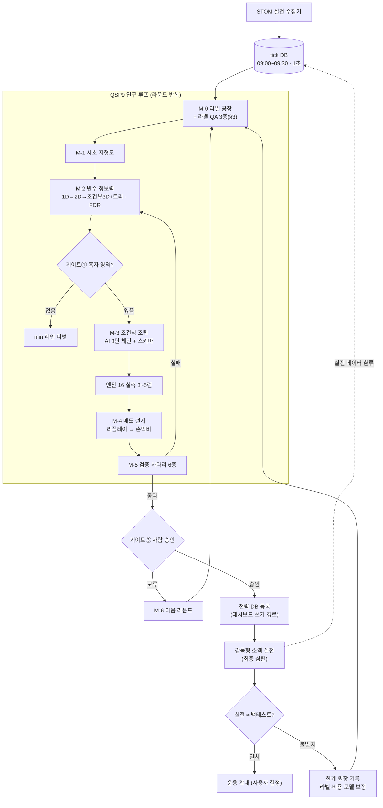

# QSP9 마스터 실행계획 v2 — 목적·전체 프로세스·라벨 명세·페이지 전체·AI 프롬프트

> 작성일: 2026-08-05 (v2 — 사용자 피드백 반영: 상한 참조 제거·라벨 명세 신설·전체 프로세스·페이지 전체 안내)
> 방법론 정본 = [QSP9 맵 퍼스트](./2026-08-04_qsp9_map_first_전문가_연구방법론.md)
> 안전 경계: 운영 DB 쓰기·실거래 반영·전체청산 이후 시세·홀드아웃 재학습·후보 자동 채택 금지

---

## 0. 🎯 목적 (한 문장)

**tick 시초 30분(진입 09:20까지)에서, 지도(라벨) 기반으로 신규 조건식을 발굴해
"홀드아웃 건당 실수익 > 0 · 손익비 ≥ 1.5 · 거래 ≥ 300건"을 통과시키고,
감독형 소액 실전에서 백테스트와 일치함을 확인하는 것.**

| 성공 단계 | 기준 |
|---|---|
| 1차 (연구) | 홀드아웃 건당 실수익 > 0 · 손익비 ≥ 1.5 · 홀드아웃 ≥ 300건 |
| 2차 (규모) | 건당 실수익 ≥ +500원 — **상한 없음. 좋으면 좋은 것이다** |
| 최종 (실전) | 감독형 소액 실전 성적이 백테스트와 정합 |

---

## 1. 📌 조건식의 역할 (개정 — 상한 참조 삭제)

| 역할 | 조건식 | 용도 |
|---|---|---|
| 지도 연구 (M-0~2) | **없음** | 조건식 독립적 라벨 연구 |
| 발굴 대상 (M-3) | **신규** `QSP9_M3_tick_*` | 지도의 흑자 영역을 문법으로 번역 |
| 매도 (M-4) | **신규** `QSP9_M4_tick_S_*` | 시간단계·상태 조건부·트레일링 |
| 비교 참조 | `ResearchTest_..._Wide` (건당 −5,241원) | 무차별 진입 대비 얼마나 나은지 확인용 |
| 문법 교사·정합 검증 | 902/905 실코드 | few-shot 예시 + 지도 자기 검증(§3 QA-2) — **성능 상한이 아니다** |

판정: 신규 전략은 쌍 비교가 아니라 **절대 기준**(§0 표) + Wide 대비 비교표.

---

## 2. 🗺️ 전체 프로세스 흐름도 (연구 → 승인 → 실전 → 환류)



병행 트랙 2개(그림 밖): **문서 트랙**(라운드 보고서·원장·한계 원장 — 매 단계 기록),
**UI 트랙**(§5 페이지 — 마일스톤 1·3·5에 병행 구현).

---

## 3. 🔬 라벨 명세 — "오류 없는 라벨"을 위한 함정 10가지와 대책

라벨이 틀리면 지도 전체가 틀린다. **이 절이 QSP9의 성패를 가른다.**

| # | 함정 | 왜 위험한가 | 대책 |
|---:|---|---|---|
| 1 | **체결 가정** | 그 초의 "현재가"로 실제 살 수 있었다는 보장이 없다 | 매수가 = 현재가 + 보수 버퍼(비용 0.21%에 슬리피지 내장) + **QA-1 라벨-엔진 정합 검사** |
| 2 | **거래 없는 초** | 체결이 없던 초의 가격은 낡은 값 — 그 시점 매매는 허구 | 초당거래대금 > 0 인 시점만 라벨 |
| 3 | **상한가·VI** | 상한가는 살 수 없고 VI 정지 중 가격은 멈춰 있다 | 상한가 근접·VI 부근 제외 플래그 (902/905의 `VI아래5호가` 관행 이식) |
| 4 | **겹침 표본** | t초와 t+1초의 라벨은 거의 같다 → 표본수가 부풀려져 **가짜 유의성** 생산 | (종목,일) 클러스터 통계 또는 보폭 h 솎아내기 — FDR 을 부풀리지 않기 |
| 5 | **horizon 자의성** | "잘 나오는 h"를 고르면 그 자체가 과최적 | h ∈ {30,60,120,300,close} **사전 고정** — 나중에 안 바꿈 |
| 6 | **고정 h의 한계** | 좋은 매도의 가치를 과소평가 | 라벨 2족: 고정 h(주 라벨) + 경로 MFE/MAE(모양 라벨). **"최적 청산" 라벨은 사후 정보라 금지** |
| 7 | **세션 경계** | 09:28 전체청산 뒤 시세는 쓸 수 없다 | t ≤ 09:20 · t+h ≤ 09:28 절단, close 라벨 = 092800 가격 |
| 8 | **수집 편향** | tick DB는 그날 STOM 이 수집한 종목만 있다 | 편향이 아니라 **정합** — 실전도 같은 수집기로 종목을 본다 (명시 기록) |
| 9 | **시장충격** | 100만원 베팅이 얇은 호가를 먹는다 | 유동성 하한 + M-3 엔진 실측(베팅 모델 내장)이 재검증 |
| 10 | **라벨 코드 버그** | 조용히 전체를 오염 | **QA 3종(아래)** |

### 라벨 QA 3종 (M-0 완료 조건)

| QA | 방법 | 통과 기준 |
|---|---|---|
| **QA-1 정합** | 와이드 그물 실거래 86,390건의 진입 시점 라벨 vs 엔진 실현 수익 대조 | 오차 분포 중앙값 ≈ 0, 치우침 없음 |
| **QA-2 자기 검증** | 902/905 창(09:02~05)이 지도에서 실제로 밝은가 | 사람 흑자 전략의 자리와 지도가 일치 |
| **QA-3 음성 대조군** | **하루 민 라벨**(어제 시점에 오늘 라벨)로 같은 랭킹 실행 | 정보력 ≈ 0 이어야 함 — 0 이 아니면 누출 있음 |

> **비유**: 새 저울(라벨)을 쓰기 전에 ① 아는 무게(실거래)를 올려보고 ② 아는 사람(902/905)을
> 재보고 ③ 빈 접시(민 라벨)가 0을 가리키는지 확인하는 것이다.

---

## 4. 📋 단계별 상세

| 단계 | 입력 → 출력 | 도구 | 게이트 | 예상 |
|---|---|---|---|---|
| **M-0** | tick DB 설계구간 → 일별 parquet (종목,초)×{fr_*, MFE/MAE, 스냅샷 변수, 제외 플래그} | 신규 `label_factory` (numpy 벡터화) | **라벨 QA 3종 전부 통과** | 1세션 |
| **M-1** | parquet → 분×상태 E[수익] 지도·파셋 히트맵 | 신규 집계 | QA-2 포함 | M-0와 동시 |
| **M-2** | parquet → 변수 랭킹·포켓 좌표(JSON) | `loss_profile` 부호 반전 + 얕은 트리 | 클러스터 통계·FDR q≤0.10 · **게이트① 흑자 영역?** | 0.5세션 |
| **M-3** | 포켓 JSON + 902/905 문법 → 신규 매수식 5~10 | AI 3단 체인(§6) + `region_proposer` | 설계 건당>0 · MFE/MAE≥1.3 · ≥2,000건 | 1세션+런 |
| **M-4** | 후보 거래 경로 → 신규 매도식 + 손익비 | `exit_counterfactual`·`sell_dsl_replay` | 손익비 ≥1.5 | 1세션 |
| **M-5** | 최종 후보 → 사다리 성적표 | v2 분할·전진분석·비용×1.5·고원·국면 절단 | **전부 통과** → 사람 승인 요청 | 0.5세션+런 |
| **M-6** | 라운드 원장 → 다음 라운드 지시서 | `generation_runner` | 3라운드 무개선=수렴 | 반복 |
| **실전** | 승인 후보 → 전략 DB 등록 → 감독형 소액 실전 | 대시보드 쓰기 경로 | 실전≈백테 정합 (사용자 판정) | 사용자 |

---

## 5. 🖥️ 페이지 전체 안내 (25종 = 기존 21 + 신규 3 + 강화 1)

### 계층 ① 지도 (탐색)

| # | 페이지 | QSP9 역할 |
|---:|---|---|
| 1 | 데이터 계약 | tick/min 경계 — **라벨 공장 상태 배지 추가** |
| **22** | **지형도** 🆕 | M-1 파셋 히트맵(3번째 변수 3분할 나란히) — 칸마다 표본수 병기 |
| 17 | 손실 프로파일러 | M-2 — **이익 포켓 모드**(부호 반전 토글) 강화 |
| 18 | 2D 포켓 지도 | M-2 — 동일 강화 |
| 7 | 회복 판별 인사이트 | 참고(변수 아이디어 원천) |

### 계층 ② 조립 (생성)

| # | 페이지 | QSP9 역할 |
|---:|---|---|
| **23** | **조립 작업대** 🆕 | M-3 — 랭킹 변수 팔레트 → 절 추가 시 라벨 지도 즉시 미리보기(표본수·건당 실수익, 엔진 0회) |
| 8 / 8b | 조건식 후보 / 매수 필터 | M-3 후보 목록·근거 |
| 19 | 제거 시뮬레이터 | M-3 사전 선별(순위용 — 실측 전이율 60~70% 명시) |
| 2 / 3 | 매수 해부 / 매도 해부 | M-3 실측 후보의 해부 |
| 4 | 거래 경로 | MFE/MAE 실측 |
| 5 / 6 | 매도식 추적 / 가상 매도 | M-4 매도 설계 |

### 계층 ③ 판정 (검증·운용)

| # | 페이지 | QSP9 역할 |
|---:|---|---|
| 9 | 후보 실행 콘솔 | 엔진 런 (3클릭) |
| 10 | 공식 pair | Wide 대비 비교표 |
| 11 | 채택 게이트 | M-5 — 절대 기준 판정 (2-job 분할) |
| **24** | **검증 사다리 현황판** 🆕 | M-5 — 6단계 체크리스트 자동 표시, `adoptable`=승인 요청 배지 |
| 21 | 구간 분할 진단 | 설계+홀드아웃=전체 검산 |
| 12 | 캘리브레이션 | 시뮬레이터 추정→실측 전이율 축적 |
| 20 | 세대 진행 곡선 | M-6 라운드 수렴 |
| 13 / 14 | History / 연구 원장 | 기록·감사 |
| 0 | 레인·단계 셸 | 전체 콘솔 |

UI 원칙 4개: 모든 수치에 표본수 병기 / 사람 승인 지점 명시 / 쉬운 용어(건당 실수익률·홀드아웃) /
미증명·차단·0건을 명시적 상태로 표시.

---

## 6. 🤖 AI 조건식 생성 프롬프트 — 6원칙 (재록)

| # | 원칙 | 구현 |
|---:|---|---|
| 1 | 증거 주입 | M-2 실측(랭킹·포켓 좌표·분위 경계·표본수)을 JSON 으로 프롬프트에 |
| 2 | 3단 체인 | 가설("왜 존재하는가" 1문단 필수) → DSL 번역 → 자기검증. 설명 없으면 폐기 |
| 3 | 스키마 출력 | AI 는 `{변수, 연산자, 분위값, 시간창}` 만 출력 — 코드가 DSL 조립 |
| 4 | 금지보다 예시 | 902/905 6층 문법 few-shot + 안티패턴(신저가 컷 −23,981원/건) 실측 병기 |
| 5 | 셀프 컨시스턴시 | 같은 증거로 N회 독립 생성 → 겹치는 절만 |
| 6 | 누출 가드 기계화 | `R_*`·`S_*`·미래 변수 차단은 프롬프트가 아니라 생성 후 정적 검사 |

역할 분담: 기계=노동·규율 집행 / AI=가설·번역·해부 / 사람=현상 타당성·채택.

---

## 7. ⚠️ 리스크

| 리스크 | 대응 |
|---|---|
| tick DB 스키마가 가정과 다름 | M-0 첫 작업 = 스키마 실사 (가정 금지) |
| 라벨 오염 | §3 함정 10 + QA 3종 — QA 실패 시 M-1 진행 금지 |
| 지도에 흑자 영역 없음 | 정상 결과 — min 레인 피벗 (게이트①) |
| 겹침 표본 가짜 유의성 | 클러스터 통계·솎아내기 (§3-4) |
| LLM 인증 전멸 | zero-LLM 규칙 기반 경로 자동 강등 |
| GitKraken stale lock | 0바이트·git.exe 부재 확인 후 제거 |
| 실전-백테 불일치 | 한계 원장 기록 → 라벨·비용 모델 보정 → 환류 (§2 흐름도) |

---

## 8. 📅 마일스톤

| # | 마일스톤 | 게이트 | UI 병행 |
|---:|---|---|---|
| 1 | M-0+M-1 (스키마 실사→라벨→지도) | **라벨 QA 3종** | 페이지 22 |
| 2 | M-2 랭킹·포켓 | 흑자 영역 존재? | 17·18 이익 모드 |
| 3 | M-3 후보·첫 엔진 | 설계 건당>0 후보 ≥1 | 페이지 23 |
| 4 | M-4 매도·손익비 | 손익비 ≥1.5 | — |
| 5 | M-5 사다리·승인 요청 | 사람 승인 | 페이지 24 |
| 6+ | M-6 라운드 반복 → 승인 시 실전 트랙 | 수렴 판정 / 실전 정합 | — |

---

## 9. 🤖 재개 마스터 프롬프트

방법론 문서 §8 프롬프트에 다음을 추가:

```text
실행계획 정본(v2): docs/research/quant_scoring_pipeline/2026-08-05_qsp9_마스터_실행계획.md
- 상한 참조 없음 — 902/905 는 문법 교사·QA-2 정합 검증용일 뿐. 좋으면 좋은 것.
- 라벨 명세 §3 필수 준수: 함정 10(체결 가정·스테일 초·상한가/VI·겹침 표본·h 사전 고정·
  라벨 2족·세션 절단·수집 정합·시장충격·QA) + 라벨 QA 3종(정합·자기 검증·음성 대조군)
  전부 통과 전에는 M-1 로 진행 금지.
- 전체 프로세스: 연구 루프 → 사람 승인 → 전략 DB 등록 → 감독형 소액 실전 →
  실전-백테 정합 확인 → 불일치 시 한계 원장 → 라벨 보정 환류.
- 페이지 전체 25종의 역할은 실행계획 §5. 신규는 22 지형도·23 조립 작업대·24 사다리 현황판.
```
