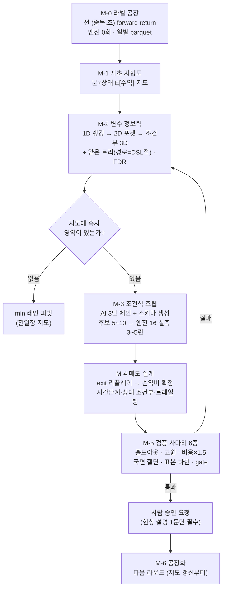

# QSP9 마스터 실행계획 — 목적·흐름도·조건식·UX/UI·AI 프롬프트 전략

> 작성일: 2026-08-05 · 성격: **실행계획 정본** (방법론 정본 = [QSP9 맵 퍼스트](./2026-08-04_qsp9_map_first_전문가_연구방법론.md))
> 안전 경계: 운영 DB 쓰기·실거래 반영·전체청산 이후 시세·홀드아웃 재학습·후보 자동 채택 금지

---

## 0. 🎯 목적 (한 문장)

**tick 시초 30분(진입은 09:20까지)에서, 지도(라벨) 기반으로 신규 조건식을 발굴해
"홀드아웃 건당 실수익 > 0 · 손익비 ≥ 1.5 · 거래 ≥ 300건"을 통과하는
사람 승인 후보를 만든다.**

| 성공 단계 | 기준 |
|---|---|
| 1차 (QSP9 목표) | 홀드아웃 건당 실수익 > 0 · 손익비 ≥ 1.5 · 홀드아웃 ≥ 300건 |
| 2차 | 건당 실수익 ≥ +500원 (2년 환산 수천만원 규모) |
| 최종 | 명예의 전당 수준 (스크린샷 판독값 벤치마크) |

---

## 1. 📌 어느 조건식으로 연구하는가 (역할 확정)

**핵심: M-0~M-2(지도 단계)는 조건식이 아예 필요 없다.** 조건식은 M-3에서 처음 등장한다.

| 단계 | 조건식 | 역할 |
|---|---|---|
| M-0~M-2 지도 | **없음** — tick DB 전 수집 종목 × 전 초 | 조건식 독립적 라벨 연구 |
| M-3 조립 | **신규 작성** `QSP9_M3_tick_<창>_<n>` 시리즈 | 지도의 흑자 영역을 DSL로 번역 |
| M-4 매도 | **신규 작성** `QSP9_M4_tick_S_<n>` | 902/905 건강 6규칙 구조 이식 |
| 참조 (하한) | `ResearchTest_Tick_B/S_090000_092800_Wide_20260419` | 무차별 진입의 성적 (건당 −5,241원) |
| 참조 (상한) | `Tick_B_902_905_Study_2` / `Tick_S_902_905_Study` | 사람 선별의 성적 (건당 +3,479원) |
| 문법 교사 | 902/905 실코드 (방법론 §2) | 6층 조립 문법 재사용 |

**판정 방식 변경점**: 기존 promotion-gate는 "기준선 대비 후보" 쌍 비교였다.
M-3 후보는 **신규 전략**이므로 쌍 비교가 아니라 **절대 기준**(§0 표)으로 판정하고,
참조 2종과의 비교표를 병기한다. lane_manifest 는 도구 호환을 위해 유지하되
QSP9 후보 판정은 standalone 게이트를 쓴다 (M-3 구현 시 확정).

---

## 2. 🗺️ 전체 흐름도



**게이트 3개**: ① M-2 뒤 "흑자 영역 존재?" (없으면 min 피벗 — 헛수고 차단)
② M-5 사다리 (기계 판정) ③ 사람 승인 (최종).

---

## 3. 📋 단계별 상세 (입력→출력→판정)

| 단계 | 입력 | 도구 | 출력 | 판정/게이트 | 예상 |
|---|---|---|---|---|---|
| **M-0** | tick DB 설계구간(20240304~20250822) | 신규 `label_factory` 모듈 (numpy 벡터화) | 일별 parquet: (종목,초)×{fr_30/60/120/300/close, 스냅샷 변수} | 검산: 표본수·비용 차감 확인, 홀드아웃 봉인 | 1세션 |
| **M-1** | M-0 parquet | 신규 지형도 집계 | 분×상태 E[수익] 지도 + 파셋 히트맵 | 902/905 창(09:02~05)이 지도에서 실제로 밝은지 (자기 검증) | M-0와 동시 |
| **M-2** | M-0 parquet | `loss_profile` 부호 반전 재사용 + 얕은 트리 | 변수 랭킹표·확정 포켓 좌표(JSON) | FDR q≤0.10 · **게이트: 흑자 영역 0이면 min 피벗** | 0.5세션 |
| **M-3** | M-2 포켓 JSON + 902/905 문법 | AI 3단 체인(§5) + `region_proposer` 삽입 | 신규 매수식 5~10 → 엔진 실측 3~5런 | 설계 건당>0 · MFE/MAE≥1.3 · ≥2,000건 | 1세션+런 |
| **M-4** | M-3 통과 후보의 거래 경로 | `exit_counterfactual`(giveback)·`sell_dsl_replay` | 신규 매도식 + 손익비 실측 | 손익비 ≥1.5 (승률 40%대 기준) | 1세션 |
| **M-5** | 최종 후보쌍 | v2 분할·전진분석·비용 스트레스 | 사다리 6종 성적표 | **전부 통과**해야 승인 요청 | 0.5세션+런 |
| **M-6** | 라운드 원장 | `generation_runner` 수렴 판정 | 다음 라운드 지시서 | 3라운드 무개선=수렴 | 반복 |

---

## 4. 🖥️ UX/UI 전략 — "지도 → 조립 → 판정" 3계층

대시보드 21페이지는 QSP1~7(거래 해부) 중심이었다. QSP9는 **연구자의 동선**을 따라 3계층으로 재편한다:

| 계층 | 페이지 | 내용 | 상태 |
|---|---|---|---|
| **① 지도(탐색)** | **22 지형도** (신규) | M-1 분×상태 파셋 히트맵 — 3번째 변수 3분할 나란히, 칸마다 표본수 병기 | 신규 |
| | 17~18 프로파일·포켓 | **이익 포켓 모드**(부호 반전 토글) 추가 | 소수정 |
| **② 조립(생성)** | **23 조립 작업대** (신규) | M-2 랭킹 변수 팔레트 → 절 추가 시 **라벨 지도에서 즉시 미리보기**(예상 표본수·건당 실수익, 엔진 0회) → 후보 저장 | 신규 |
| | 19 제거 시뮬레이터 | 추가(선별) 방향 지원 확장 | 소수정 |
| **③ 판정(검증)** | **24 검증 사다리 현황판** (신규) | 후보별 6단계 체크리스트 자동 표시 — 통과/실패/미실시 색 구분, `adoptable` 배지 = 승인 요청 표시 | 신규 |
| | 20~21 세대곡선·분할진단 | 그대로 | 유지 |

UI 원칙 4개:
1. **모든 수치에 표본수 병기** — 표본 없는 밝은 칸은 함정
2. **사람 승인 지점을 UI로 명시** — `adoptable`은 채택이 아니라 승인 요청 배지
3. 용어 통일 — "건당 실수익(률)", "홀드아웃" (OOS·순엣지 표기 금지)
4. 미증명·차단·0건을 회색이 아니라 **명시적 상태**로 표시 (숨기지 않기)

---

## 5. 🤖 AI 조건식 생성 프롬프트 고도화 — 6원칙

**진단**: 지금까지의 생성 프롬프트는 금지 규칙 나열형이었다. 규칙이 많을수록 AI는
보수적으로 좁게 생성한다. **규칙은 기계 게이트로 옮기고, 프롬프트에는 증거·문법·예시만 남긴다.**

| # | 원칙 | 구현 |
|---:|---|---|
| 1 | **증거 주입형** | 프롬프트에 M-2 실측을 구조화(JSON)로 주입 — 상위 변수 랭킹·확정 포켓 좌표·분위 경계값·표본수. AI의 일은 "발명"이 아니라 **"지도의 번역"** |
| 2 | **3단 체인** (역할 분리) | ① 가설: "이 엣지가 왜 존재하는가" 현상 설명 1문단 **필수** → ② 인코딩: DSL 번역 → ③ 자기검증: 체크리스트 대조. 현상 설명 못 하면 후보 폐기 |
| 3 | **스키마 출력** (자유 텍스트 금지) | AI가 파이썬 코드를 직접 쓰지 않는다 — 절 목록 `{변수, 연산자, 분위값, 시간창}` 구조화 출력 → **코드가 DSL 조립** (intent gate와 같은 방식). 문법 오류·누출 변수 원천 차단 |
| 4 | **금지보다 예시** | 902/905 6층 문법 few-shot + 안티패턴(신저가 컷 실측 −23,981원/건)을 실측 수치와 함께 제시 |
| 5 | **셀프 컨시스턴시** | 같은 증거로 N회 독립 생성 → **겹치는 절만** 채택 (우연한 조합 제거) |
| 6 | **누출 가드 기계화** | `R_*`·`S_*`·매도 뒤 회복·미래 최고최저 차단은 프롬프트 규칙이 아니라 **생성 후 정적 검사** (기존 intent gate 확장) |

기존 자산과의 관계: `region_proposer`(규칙 기반 생성)는 유지 — AI 생성기는 그 위의
**가설 계층**이다. LLM 인증 불가 시 zero-LLM 경로(규칙 기반만)로 자동 강등 (기존 경로 재사용).

---

## 6. 👥 역할 분담

| 역할 | 담당 | 예 |
|---|---|---|
| 노동 (격자·라벨·백테스트) | **기계** | M-0 벡터화, FDR, 엔진 런 |
| 가설·번역·해부 | **AI** | 3단 체인 생성, 결함 발견, 지도 해석 |
| 규율 집행 | **기계 게이트** | 누출 검사·표본 하한·사다리 6종 — 프롬프트가 아니라 코드 |
| 현상 타당성·채택 | **사람** | "이 엣지가 왜 존재하는가"에 대한 최종 판단, 승인 |

---

## 7. ⚠️ 리스크와 대응

| 리스크 | 대응 |
|---|---|
| 라벨 공장 데이터량(수천만 행) | 일별 parquet 증분 처리·설계 구간만·샘플링 검산 |
| tick DB 스키마가 가정과 다름 | M-0 착수 첫 작업 = 스키마·컬럼 실사 (합성 가정 금지) |
| 지도에 흑자 영역이 없음 | **정상 결과로 취급** — min 레인 피벗 (게이트 ①) |
| 슬리피지 과소평가 | 라벨은 0.21% + M-5 비용 ×1.5 스트레스 |
| LLM 생성 경로 인증 전멸 | zero-LLM 규칙 기반 경로로 자동 강등 (기존 자산) |
| GitKraken stale lock | 0바이트·git.exe 부재 확인 후 제거 (반복 확인됨) |
| 다중검정 거짓 발견 | FDR q≤0.10 · 셀프 컨시스턴시 · 고원 검사 |

---

## 8. 📅 마일스톤 (세션 단위)

| # | 마일스톤 | 산출물 | 게이트 |
|---:|---|---|---|
| 1 | M-0+M-1 구현·실측 | 라벨 parquet + 지형도 첫 화면(파셋) | 표본수 검산·902/905 창 자기 검증 |
| 2 | M-2 랭킹·포켓 | 변수 랭킹표·포켓 JSON | **흑자 영역 존재?** |
| 3 | M-3 후보·첫 엔진 | 신규 매수식 5~10 실측 | 설계 건당>0 후보 ≥1 |
| 4 | M-4 매도·손익비 | 매수+매도 완성 후보 | 손익비 ≥1.5 |
| 5 | M-5 사다리·승인 요청 | 성적표 + 비교표(하한/상한 참조) | 사람 승인 |
| 6+ | M-6 라운드 반복 | 라운드 원장 | 수렴 판정 |

UI(페이지 22~24)는 마일스톤 1·3·5에 각각 병행 구현한다 (지도 없이는 지형도 페이지도 없다).

---

## 9. 🤖 재개 마스터 프롬프트

방법론 문서 §8 프롬프트를 그대로 쓰되, 첫 줄 뒤에 다음을 추가:

```text
실행계획 정본: docs/research/quant_scoring_pipeline/2026-08-05_qsp9_마스터_실행계획.md
- 조건식 역할: M-0~2 조건식 무관 / M-3 신규 QSP9_M3_* / 참조 하한=Wide·상한=902/905
- 판정: QSP9 후보는 쌍 비교가 아니라 절대 기준(건당>0·손익비1.5·300건) + 참조 비교표
- UI: 페이지 22 지형도(파셋)·23 조립 작업대·24 검증 사다리 — 마일스톤 1·3·5에 병행
- AI 생성: 증거 주입·3단 체인·스키마 출력·예시 우선·셀프 컨시스턴시·누출 가드 기계화
```
